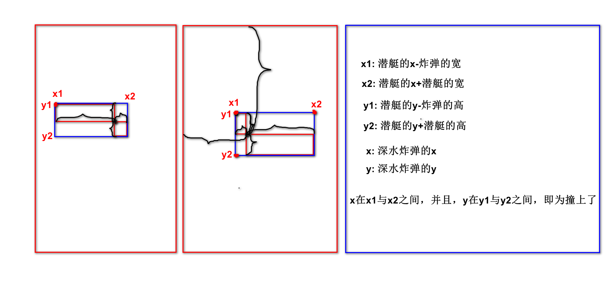

# 面向对象第八天：

## 潜艇游戏第一天：

1. 设计6个类，设计World类并测试

## 潜艇游戏第二天：

1. 给6个类添加构造方法，并测试

## 潜艇游戏第三天：

1. 设计SeaObject超类，6个类继承SeaObject
2. 给SeaObject设计两个构造方法，6个派生类分别调用
3. 设计潜艇数组、水雷数组、深水炸弹数组，并测试

## 潜艇游戏第四天：

1. 在6个类中重写move()移动
2. 给类中成员添加访问控制修饰符
3. 设计Images图片类

## 潜艇游戏第五天：

1. 将窗口的宽和高设计为常量，适当地方做修改

2. 画窗口：在World类中---共3步，不要求掌握，Ctrl C/V

   - import JFrame和JPanel
   - 设计World类继承JPanel
   - CV大法

3. 画海洋图、画对象

   ```java
   1)想画对象需要去获取对象的图片，每个对象都能获取图片，
     意味着获取图片行为为共有的行为，所以设计在SeaObject中，
     每个对象获取图片的行为都是不一样的，所以设计为抽象方法
     ----在SeaObject中设计getImage()获取对象的图片
   2)在6个派生类中重写getImage()获取对象的图片
     ----重写getImage()
   3)因为只有活着的对象才需要画到窗口中，所以需要设计对象的状态，
     每个对象都有状态，意味着状态为共有属性，所以设计在SeaObject中，
     状态一般设计为常量，同时设计state变量表示当前状态
     ----在SeaObject中设计LIVE、DEAD常量，state变量表示当前状态
     后期的业务中还需要判断状态，每个对象都得判断状态，
     意味着判断状态行为为共有的行为，所以设计在SeaObject中，
     每个对象判断状态的行为都是一样的，所以设计为普通方法
     ----在SeaObject中设计isLive()、isDead()判断对象的状态
   4)数据都有了就可以开画了，每个对象都能画，
     意味着画对象的行为为共有行为，所以设计在SeaObject中，
     每个对象画的行为都是一样的，所以设计为普通方法
     ----在SeaObject中设计paintImage()画对象
   5)画对象的行为做好了，在窗口World中调用即可:
     5.1)准备对象
     5.2)重写paint()画方法  
   ```

## 潜艇游戏第六天：

1. 潜艇入场：

   - 潜艇对象是由窗口产生的，所以在World类中设计nextSubmarine()生成潜艇对象

   - 潜艇入场为定时发生的，所以在run()中调用submarineEnterAction()实现潜艇入场

     在submarineEnterAction()中：

     ​	每400毫秒，获取潜艇对象obj，submarines扩容，将obj装到末尾

     > 注意: 在run中调用submarineEnterAction()后，调用repaint()重画

2. 水雷入场：

   - 水雷是由水雷潜艇发射出来的，所以在MineSubmarine中shootMine()生成水雷对象

   - 水雷入场为定时发生的，所以在run()中调用mineEnterAction()实现水雷入场

     在mineEnterAction()中：

     ​	每1秒钟，......(暂时搁置，周三时讲)

3. 海洋对象移动：

   - 海洋对象移动为共有的行为，所以在SeaObject中设计抽象方法move()实现海洋对象移动，在派生类重写move()

   - 海洋对象移动为定时发生的，所以在run()中调用moveAction()实现海洋对象移动

     在moveAction()中：

     ​	遍历所有潜艇潜艇move()，遍历所有水雷水雷move()，遍历所有深水炸弹深水炸弹move()

## 潜艇游戏第七天：

1. 深水炸弹入场：

   - 深水炸弹是战舰发射出来的，所以在Battleship中设计shoot()实现发射深水炸弹

   - 深水炸弹入场为事件触发的，所以在侦听器中重写keyReleased()键盘抬起事件，在keyReleased()中判断若抬起的是空格键：---不需要掌握

     ​	则获取炸弹对象obj，bombs扩容，obj装末尾

2. 战舰移动：

   - 战舰移动为战舰的行为，所以在Battleship中设计moveLeft()左移、moveRight()右移

   - 战舰移动为事件触发的，在重写keyReleased()中：

     ​	判断若抬起的是左键头，则调用moveLeft()左移

     ​	判断若抬起的是右键头，则调用moveRight()右移

3. 删除越界的海洋对象：

   - 在SeaObject中设计isOutOfBounds()检测潜艇是否越界

     在Bomb中重写isOutOfBounds()检测深水炸弹是否越界

     在Mine中重写isOutOfBounds()检测水雷是否越界

   - 删除越界的海洋对象为定时发生的，所以在run()在调用outOfBoundsAction()删除越界的海洋对象

     在outOfBoundsAction()中：

     ​	遍历所有潜艇/水雷/深水炸弹，判断若对象越界了：

     ​		则将越界对象替换为最后一个元素，缩容

4. 设计EnemyScore得分接口，侦察潜艇与鱼雷潜艇实现得分接口

   设计EnemyLife得命接口，水雷潜艇实现得命接口

## 潜艇游戏第八天：

1. 水雷入场：后半段

   - 水雷是由水雷潜艇发射出来的，所以在MineSubmarine中shootMine()生成水雷对象

   - 水雷入场为定时发生的，所以在run()中调用mineEnterAction()实现水雷入场

     在mineEnterAction()中：

     ​	每1秒钟，遍历所有潜艇，判断若是水雷潜艇则强转为水雷潜艇类型，获取水雷对象obj，mines扩容，将obj装到末尾

2. 深水炸弹与潜艇的碰撞：

   - 在SeaObject中设计isHit()检测碰撞、goDead()对象去死

     在Battleship中设计addLife()增命

   - 深水炸弹与潜艇的碰撞为定时发生的，所以在run()中调用bombBangAction()实现深水炸弹与潜艇的碰撞

     在bombBangAction()中：

     ​	遍历炸弹得炸弹，遍历潜艇得潜艇，判断若都活着并且还撞上了：

     ​		潜艇去死、炸弹去死

     ​		判断若被撞潜艇为分，则强转为EnemyScore，得分

     ​        判断若被撞潜艇为命，则强转为EnemyLife，获取命，战舰增命

3. 画分和画命：

   - 在Battleship中设计getLife()获取命数
   - 在World的paint()中：画分和画命


```java
//-----------复用性好、扩展性好、维护性好
           
//被撞潜艇为ObserveSubmarine--调用侦察潜艇的getScore()----10
//被撞潜艇为TorpedoSubmarine--调用鱼雷潜艇的getScore()----40
//被撞潜艇为NuclearSubmarine--调用核潜艇的getScore()------80
if(s instanceof EnemyScore){ //适用于所有实现EnemyScore接口的
    EnemyScore es = (EnemyScore)s;
    score += es.getScore();
}
//被撞潜艇为MineSubmarine------调用水雷潜艇的getLife()------1
//被撞潜艇为NuclearSubmarine---调用核潜艇的getLife()--------3
if(s instanceof EnemyLife){ //适用于所有实现EnemyLife接口的
    EnemyLife el = (EnemyLife)s;
    int num = el.getLife();
    ship.addLife(num);
}
           

//----------复用性差、扩展性差、维护性差----垃圾代码
if(s instanceof ObserveSubmarine){
     ObserveSubmarine os = (ObserveSubmarine)s;
     score += os.getScore();
} 
if(s instanceof TorpedoSubmarine){
     TorpedoSubmarine ts = (TorpedoSubmarine)s;
     score += ts.getScore(); 
}
if(s instanceof MineSubmarine){
     MineSubmarine ms = (MineSubmarine)s;
     int num = ms.getLife();
     ship.addLife(num);
}
if(s instanceof NuclearSumbarine){
     NuclearSumbarine ns = (NuclearSumbarine)s;
     score += ns.getScore();
     int num = ns.getLife();
     ship.addLife(num);
}

```


## 回顾：

1. 接口：

   ​	引用数据类型，interface定义，只能包含常量和抽象方法

   ​	不能被实例化，需要被实现，实现类：必须重写所有抽象方法

   ​	一个类可以实现多个接口，用逗号分隔，若又继承又实现时应先继承后实现

   ​	接口可以继承接口

   ​	意义：封装部分派生类所共有的属性和行为----实现多继承

   ​			    是一个标准、是一种规范


## 笔记：

1. 多态：

   - 表现：

     - 同一个对象被造型为不同的类型时，有不同的功能

       --对象的多态：我、你、水......------所有对象都是多态的(明天体会)

     - 同一类型的引用指向不同的对象时，有不同的实现

       --行为的多态：cut(),move(),getImage()--所有抽象方法都是多态的

   - 向上造型/自动类型转换：--------------------代码复用

     - 超类型的引用指向派生类的对象
     - 能点出来什么，看引用的类型
     - 能造型成为的数据类型有：超类+所实现的接口

   - 强制类型转换，成功的条件只有如下两种：

     - 引用所指向的对象，就是该类型
     - 引用所指向的对象，实现了该接口或继承了该类

   - 强转时若不符合如上条件，则发生ClassCastException类型转换异常

     建议：在强转之前先通过instanceof来判断引用的对象是否是该类型

   ```java
   public class MultiTypeDemo {
       public static void main(String[] args) {
           Aoo o = new Boo();
           Boo o1 = (Boo)o;     //引用o所指向的对象，就是Boo类型
           Inter o2 = (Inter)o; //引用o所指向的对象，实现了Inter接口
           //Coo o3 = (Coo)o; //运行时ClassCastException类型转换异常
           if(o instanceof Coo){ //false
               Coo o4 = (Coo)o;
           }else{
               System.out.println("o不是Coo类型");
           }
           /*
           System.out.println(o instanceof Boo);   //true
           System.out.println(o instanceof Inter); //true
           System.out.println(o instanceof Coo);   //false
            */
       }
   }
   
   interface Inter{ }
   class Aoo{ }
   class Boo extends Aoo implements Inter{ }
   class Coo extends Aoo{ }
   ```


## 精华笔记：

1. 多态：

   - 表现：

     - 同一个对象被造型为不同的类型时，有不同的功能

       --对象的多态：我、你、水......------所有对象都是多态的(明天体会)

     - 同一类型的引用指向不同的对象时，有不同的实现

       --行为的多态：cut(),move(),getImage()--所有抽象方法都是多态的

   - 向上造型/自动类型转换：--------------------代码复用

     - 超类型的引用指向派生类的对象
     - 能点出来什么，看引用的类型
     - 能造型成为的数据类型有：超类+所实现的接口

   - 强制类型转换，成功的条件只有如下两种：

     - 引用所指向的对象，就是该类型
     - 引用所指向的对象，实现了该接口或继承了该类

   - 强转时若不符合如上条件，则发生ClassCastException类型转换异常

     建议：在强转之前先通过instanceof来判断引用的对象是否是该类型


## 补充：

1. 接口可以继承多个接口：

   ```java
   interface Inter1{
       void show();
   }
   interface Inter2{
       void test();
   }
   interface Inter3 extends Inter1,Inter2{
       void say();
   } 
   ```

2. 何时需要强转？

   - 想访问的属性/行为在超类中没有，必须强转，强转之前先instanceof判断

3. ArrayIndexOutOfBoundsException：数组下标越界异常

   NullPointerException：空指针异常

   ClassCastException：类型转换异常

4. 


抽象是由什么关键字来修饰的：

​	abstract


