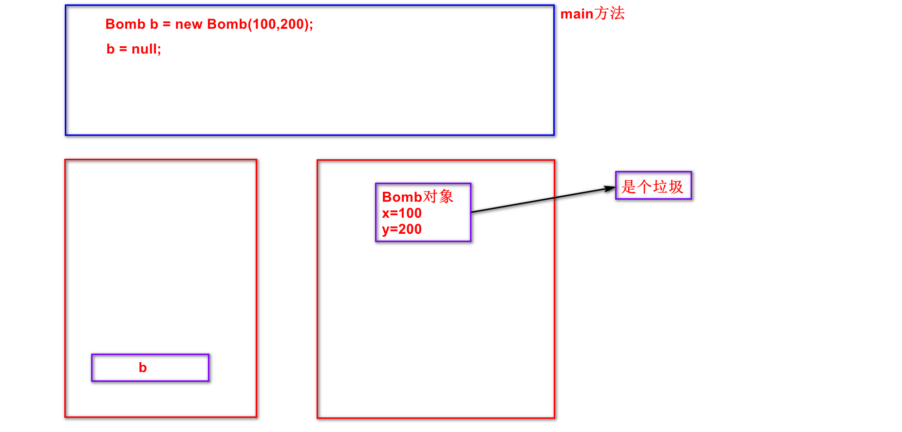
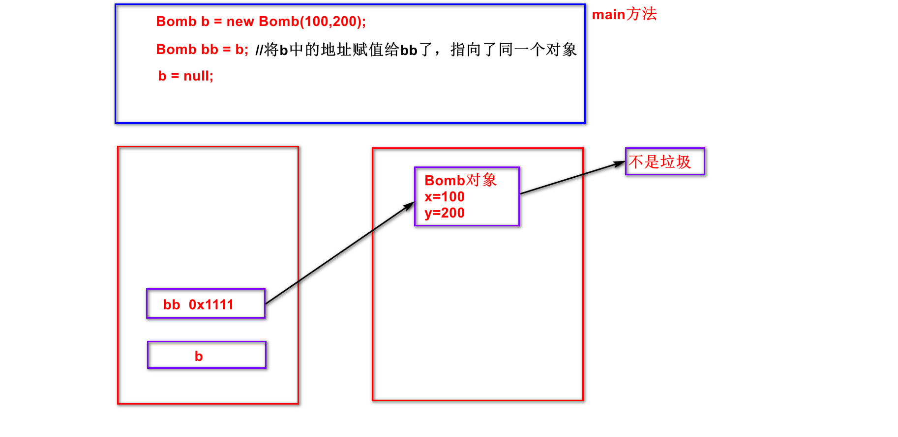
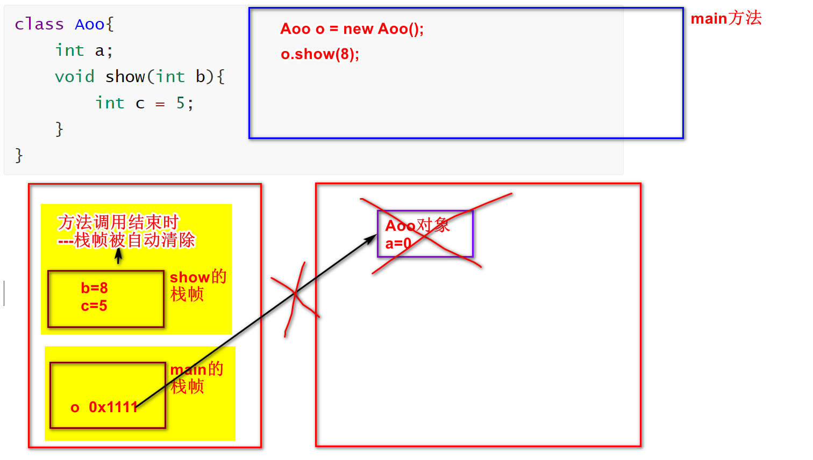
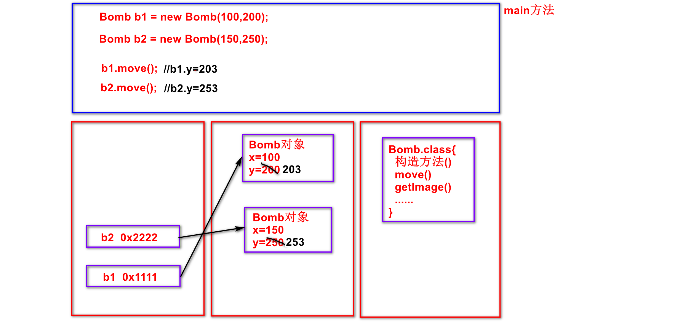

# 面向对象第九天：

## 潜艇游戏第一天：

1. 设计6个类，设计World类并测试

## 潜艇游戏第二天：

1. 给6个类添加构造方法，并测试

## 潜艇游戏第三天：

1. 设计SeaObject超类，6个类继承SeaObject
2. 给SeaObject设计两个构造方法，6个派生类分别调用
3. 设计潜艇数组、水雷数组、深水炸弹数组，并测试

## 潜艇游戏第四天：

1. 在6个类中重写move()移动
2. 给类中成员添加访问控制修饰符
3. 设计Images图片类

## 潜艇游戏第五天：

1. 将窗口的宽和高设计为常量，适当地方做修改

2. 画窗口：在World类中---共3步，不要求掌握，Ctrl C/V

   - import JFrame和JPanel
   - 设计World类继承JPanel
   - CV大法

3. 画海洋图、画对象

   ```java
   1)想画对象需要去获取对象的图片，每个对象都能获取图片，
     意味着获取图片行为为共有的行为，所以设计在SeaObject中，
     每个对象获取图片的行为都是不一样的，所以设计为抽象方法
     ----在SeaObject中设计getImage()获取对象的图片
   2)在6个派生类中重写getImage()获取对象的图片
     ----重写getImage()
   3)因为只有活着的对象才需要画到窗口中，所以需要设计对象的状态，
     每个对象都有状态，意味着状态为共有属性，所以设计在SeaObject中，
     状态一般设计为常量，同时设计state变量表示当前状态
     ----在SeaObject中设计LIVE、DEAD常量，state变量表示当前状态
     后期的业务中还需要判断状态，每个对象都得判断状态，
     意味着判断状态行为为共有的行为，所以设计在SeaObject中，
     每个对象判断状态的行为都是一样的，所以设计为普通方法
     ----在SeaObject中设计isLive()、isDead()判断对象的状态
   4)数据都有了就可以开画了，每个对象都能画，
     意味着画对象的行为为共有行为，所以设计在SeaObject中，
     每个对象画的行为都是一样的，所以设计为普通方法
     ----在SeaObject中设计paintImage()画对象
   5)画对象的行为做好了，在窗口World中调用即可:
     5.1)准备对象
     5.2)重写paint()画方法  
   ```

## 潜艇游戏第六天：

1. 潜艇入场：

   - 潜艇对象是由窗口产生的，所以在World类中设计nextSubmarine()生成潜艇对象

   - 潜艇入场为定时发生的，所以在run()中调用submarineEnterAction()实现潜艇入场

     在submarineEnterAction()中：

     ​	每400毫秒，获取潜艇对象obj，submarines扩容，将obj装到末尾

     > 注意: 在run中调用submarineEnterAction()后，调用repaint()重画

2. 水雷入场：

   - 水雷是由水雷潜艇发射出来的，所以在MineSubmarine中shootMine()生成水雷对象

   - 水雷入场为定时发生的，所以在run()中调用mineEnterAction()实现水雷入场

     在mineEnterAction()中：

     ​	每1秒钟，......(暂时搁置，周三时讲)

3. 海洋对象移动：

   - 海洋对象移动为共有的行为，所以在SeaObject中设计抽象方法move()实现海洋对象移动，在派生类重写move()

   - 海洋对象移动为定时发生的，所以在run()中调用moveAction()实现海洋对象移动

     在moveAction()中：

     ​	遍历所有潜艇潜艇move()，遍历所有水雷水雷move()，遍历所有深水炸弹深水炸弹move()

## 潜艇游戏第七天：

1. 深水炸弹入场：

   - 深水炸弹是战舰发射出来的，所以在Battleship中设计shoot()实现发射深水炸弹

   - 深水炸弹入场为事件触发的，所以在侦听器中重写keyReleased()键盘抬起事件，在keyReleased()中判断若抬起的是空格键：---不需要掌握

     ​	则获取炸弹对象obj，bombs扩容，obj装末尾

2. 战舰移动：

   - 战舰移动为战舰的行为，所以在Battleship中设计moveLeft()左移、moveRight()右移

   - 战舰移动为事件触发的，在重写keyReleased()中：

     ​	判断若抬起的是左键头，则调用moveLeft()左移

     ​	判断若抬起的是右键头，则调用moveRight()右移

3. 删除越界的海洋对象：

   - 在SeaObject中设计isOutOfBounds()检测潜艇是否越界

     在Bomb中重写isOutOfBounds()检测深水炸弹是否越界

     在Mine中重写isOutOfBounds()检测水雷是否越界

   - 删除越界的海洋对象为定时发生的，所以在run()在调用outOfBoundsAction()删除越界的海洋对象

     在outOfBoundsAction()中：

     ​	遍历所有潜艇/水雷/深水炸弹，判断若对象越界了：

     ​		则将越界对象替换为最后一个元素，缩容

4. 设计EnemyScore得分接口，侦察潜艇与鱼雷潜艇实现得分接口

   设计EnemyLife得命接口，水雷潜艇实现得命接口

## 潜艇游戏第八天：

1. 水雷入场：后半段

   - 水雷是由水雷潜艇发射出来的，所以在MineSubmarine中shootMine()生成水雷对象

   - 水雷入场为定时发生的，所以在run()中调用mineEnterAction()实现水雷入场

     在mineEnterAction()中：

     ​	每1秒钟，遍历所有潜艇，判断若是水雷潜艇则强转为水雷潜艇类型，获取水雷对象obj，mines扩容，将obj装到末尾

2. 深水炸弹与潜艇的碰撞：

   - 在SeaObject中设计isHit()检测碰撞、goDead()对象去死

     在Battleship中设计addLife()增命

   - 深水炸弹与潜艇的碰撞为定时发生的，所以在run()中调用bombBangAction()实现深水炸弹与潜艇的碰撞

     在bombBangAction()中：

     ​	遍历炸弹得炸弹，遍历潜艇得潜艇，判断若都活着并且还撞上了：

     ​		潜艇去死、炸弹去死

     ​		判断若被撞潜艇为分，则强转为EnemyScore，得分

     ​        判断若被撞潜艇为命，则强转为EnemyLife，获取命，战舰增命

3. 画分和画命：

   - 在Battleship中设计getLife()获取命数
   - 在World的paint()中：画分和画命

## 潜艇游戏第九天：

1. 水雷与战舰的碰撞：

   - 在Battleship中设计subtractLife()减命

   - 水雷与战舰的碰撞为定时发生的，所以在run()中调用mineBangAction()实现水雷与战舰的碰撞

     在mineBangAction()中：

     ​	遍历所有水雷得水雷，判断若都活着并且还撞上了：

     ​		水雷去死、战舰减命

2. 检测游戏结束：

   - 借助Battleship类的getLife()方法

   - 检测游戏结束为定时发生的，所以在run()中调用checkGameOverAction()检测游戏结束

     在checkGameOverAction()中：

     ​	判断若战舰的命数<=0，表示游戏结束，则将当前状态修改为GAME_OVER游戏结束状态

3. 画状态：

   - 在World中设计RUNNING、GAME_OVER状态常量，state变量表示当前状态
   - 在paint()中设计：
     - 游戏结束状态时，画游戏结束图
     - 运行状态时，画海洋图、对象们、分和命


## 回顾：

1. 多态：

   - 表现：

     - 同一个对象被造型为不同类型时，有不同的功能

       ---对象多态：我、你、水......-----------------所有对象都是多态的

     - 同一类型的引用在指向不同的对象时，有不同的实现

       ---行为多态：cut()、move、getImage()--所有抽象方法都是多态的

   - 向上造型：

     - 超类型的引用指向派生类的对象
     - 能点出来什么，看引用的类型
     - 能造型成为的数据类型有：超类+所实现的接口

   - 强制类型转换，成功的条件只有如下两种：

     - 引用所指向的对象，就是该类型
     - 引用所指向的对象，实现了该接口或继承了该类

   - 强转若不符合如上条件，则发生ClassCastException类型转换异常

     建议：在强转之前先通过instanceof判断引用的对象是否是该类型


## 笔记：

1. 内存管理：由JVM管理的

   - 堆：

     - 存储new出来的对象(包括实例变量)

     - 垃圾：没有任何引用所指向的对象

       垃圾回收器(GC)不定时到内存堆中清扫垃圾，回收的过程中透明的(看不到的)，不一定一发现垃圾就立刻回收，通过调用System.gc()建议虚拟机尽快调度GC来回收

     - 实例变量的生命周期：

       ​	创建对象时存储在堆中，对象被回收时一并被回收

     - 内存泄漏：不再使用的对象没有被及时的回收，严重的泄漏会导致系统的崩溃，建议：不再使用的对象应及时将引用设置为null

     

   

   - 栈：

     - 存储正在调用的方法中的局部变量(包括方法的参数)

     - 调用方法时，会为该方法在栈中分配一块对应的栈帧，栈帧中存储局部变量(包括方法的参数)，方法调用结束时，栈帧被自动清除，局部变量一并被清除。

     - 局部变量的生命周期：

       ​	调用方法时存储在栈中，方法调用结束时与栈帧一并被清除

     

   - 方法区：

     - 存储.class字节码文件(包括静态变量、所有方法)
     - 方法只有一份，通过this来区分具体的调用对象

     

   

   

   ## 面向对象三大特征总结：

   1. 封装：

      - 类：封装对象的属性和行为
      - 方法：封装的是具体的业务逻辑实现
      - 访问控制修饰符：封装的是具体的访问权限

   2. 继承：

      - 作用：代码复用

      - 超类：所有派生类所共有的属性和行为

        接口：部分派生类所共有的属性和行为

        派生/实现类：派生类所特有的属性和行为

      - 单一继承、多接口实现，具有传递性

   3. 多态：

      - 行为多态：所有抽象方法都是多态的(通过重写来表现)

        对象多态：所有对象都是多态的(通过向上造型为表现)

      - 重写、向上造型、强制类型转换、instanceof判断


## 精华笔记：

1. 内存管理：由JVM管理的

   - 堆：

     - 存储new出来的对象(包括实例变量)

     - 垃圾：没有任何引用所指向的对象

       垃圾回收器(GC)不定时到内存堆中清扫垃圾，回收的过程中透明的(看不到的)，不一定一发现垃圾就立刻回收，通过调用System.gc()建议虚拟机尽快调度GC来回收

     - 实例变量的生命周期：

       ​	创建对象时存储在堆中，对象被回收时一并被回收

     - 内存泄漏：不再使用的对象没有被及时的回收，严重的泄漏会导致系统的崩溃，建议：不再使用的对象应及时将引用设置为null

   - 栈：

     - 存储正在调用的方法中的局部变量(包括方法的参数)

     - 调用方法时，会为该方法在栈中分配一块对应的栈帧，栈帧中存储局部变量(包括方法的参数)，方法调用结束时，栈帧被自动清除，局部变量一并被清除。

     - 局部变量的生命周期：

       ​	调用方法时存储在栈中，方法调用结束时与栈帧一并被清除

   - 方法区：

     - 存储.class字节码文件(包括静态变量、所有方法)
     - 方法只有一份，通过this来区分具体的调用对象


## 补充：

1. 实例变量和局部变量的区别：

   - 实例变量：
     - 写在类中、方法外
     - 创建对象时存储在堆中，对象被回收时一并被回收
     - 有默认值
   - 局部变量：
     - 写在方法中
     - 调用方法时存储在栈中，方法调用结束时与栈帧一并被清除
     - 没有默认值

   ```java
   Aoo o = new Aoo();-------------a=0
   o.show(5);---------------------b=5
   
   class Aoo{
       int a;
       void show(int b){
           int c;
           System.out.println(a); //0
           System.out.println(b); //5
           System.out.println(c); //发生编译错误
       }
   }
   ```

2. 面试题：

   - 问：java是值传递还是引用传递？
   - 答：java只有值传递，基本类型传递的是具体的数，引用类型传递的是具体的地址

3. 文档注释：

   - 为功能性注释，只在三个地方使用，分别是类上、方法上和常量上

   ```java
   //文档注释是功能性注释，只在三个地方使用，分别是类上、方法上和常量上
   /**
    * 在类上使用时用于说明当前类的设计目的和整体功能介绍
    * 例如: 此类用于演示java文档注释
    *
    * @author 作者WKJ
    */
   public class ApiDocDemo {
       /**
        * sayHi方法中使用的问候语
        */
       public static final String INFO = "你好！";
   
       /**
        * 为指定用户添加问候语
        * @param name 指定用户的名字
        * @return 含有问候语的字符串
        */
       public String sayHi(String name){
           return INFO+name;
       }
   }
   ```

4. getter/setter：

   ```java
   class Student{
       private String name;
       private int age;
   
       public String getName(){ //getter获取
           return name;
       }
       public void setName(String name){ //setter设置
           this.name = name;
       }
       public int getAge(){ //getter获取
           return age;
       }
       public void setAge(int age){ //setter设置
           this.age = age;
       }
   }
   
   //getter和setter的演示
   public class GetterSetterDemo {
       public static void main(String[] args) {
           Student zs = new Student();
           zs.setName("zhangsan");
           zs.setAge(25);
           System.out.println(zs.getName());
           System.out.println(zs.getAge());
   
           Student ls = new Student();
           ls.setName("lisi");
           ls.setAge(24);
           System.out.println(ls.getName());
           System.out.println(ls.getAge());
       }
   }
   ```


潜艇游戏---------------共300到400行代码

不要求：特别特别熟练得写下来

最基本要求：坑坑巴巴写出来就行、哪怕能看着笔记写出来

面向对象要求：复用性


这个项目我还有一些地方没有搞懂，搁置它


