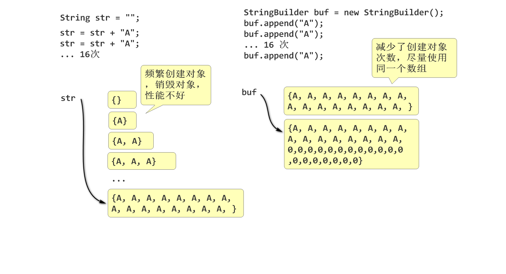

# Java 核心API

## StringBuilder

String 类型的连接性能不好，Java提供了StringBuilder解决字符串连接性能问题。

简单理解 StringBuilder性能好！（重点！）

```java
String s1 = "ABC";
String s2 = "def";
String s3 = s1 + s2;
```

字符串连接性能测试：

```java
String str = "";
long t1 = System.currentTimeMillis();
for(int i=0; i<50000; i++){
    str = str + "A";
}
long t2 = System.currentTimeMillis();
System.out.pritnln(t2 - t1);
```

StringBuilder 用于提升String字符串的连接性

- StringBuilder称为可变字符串
- StringBuilder内部也是字符数组， 其API可以直接修改其内部数组的内容
- 当数组容量不足时候， 会自动扩容
- 运算期间会尽力减少创建数组的数量。

```java
package string;

public class StringBuilderDemo03 {
    public static void main(String[] args) {
        /*
         * 测试StringBuilder的连接性能
         */
        StringBuilder buf = new StringBuilder();
        long t1 = System.currentTimeMillis();
        for (int i =0; i<50000; i++){
            buf.append("A");
        }
        long t2 = System.currentTimeMillis();
        System.out.println(t2-t1);
    }
}
```




StringBuilder API 

```java
buf-> char[]{A, C, B, 0, 0, 0, 0, 0, 0, 0, 0...0}
//           0  1  2  3  4  5
StringBuilder buf = new StringBuilder();
buf.append("A") 
   .append("A") 
   .append("A")
   .append("B") 
   .insert(1,"C")
   .delete(2,4);
Stirng str = buf.toString();
```

- append() 追加， 在StringBuilder的后面添加字符，当容量满了，会自动扩容， 扩容规则 1倍+2；
- insert(位置，字符) 插入字符;
- delete(开始位置， 结束位置)： 删除一定范围的字符，包括开始，不包括结束
- StringBuilder的API返回的大多是当前对象，可以连续使用.调用方法。
- toString() 方法可以讲StringBuilder转换为String 

## 正则表达式

用于检测、测试字符串规则的表达式. 

经常用于检测字符串是否符合特定的规则，在网站上经常用于检测用户输入数据是否符合规范：

- 检测 用户名 是否为 8~10 数字 英文（大小写）
- 检测 电话号码是否符合规则
- 检测 邮箱地址是否符合规则 
- 等

### 正则HelloWorld

最简单的正则表达式："HelloWorld" 表示

- 一共有10个字符
- 出现的顺序必须是 HelloWorld

- Java 提供了正则API， 用于检测一个字符串是否符合，正则规则
  - boolean matchs(正则) 检测当前字符串是否符合正则规则 

```
正则规则 rule = "HelloWorld"
字符串： s1 = "HelloKitty"; 
字符串： s2 = "HelloWorld";
// s1 s2 中那个字符串符合 rule 约定的规则？
boolean b1 = s1.matches(rule); //false
boolean b2 = s2.matches(rule); //true
```

```java
package string;

public class RegDemo05 {
    public static void main(String[] args) {
        /*
         * 测试正则表达式
         */
        //定义正则表达式
        String rule = "HelloWorld";
        //定义被检测的字符串
        String s1 = "HelloKitty";
        String s2 = "HelloWorld";
        //检测 s1 是否符合规则
        boolean b1 = s1.matches(rule);
        //检测 s2 是否符合规则
        boolean b2 = s2.matches(rule);
        System.out.println(b1);
        System.out.println(b2);
    }
}
```

### 字符集

匹配一个有效字符范围。

语法:

```java
[123456]
```

意义：

- 匹配一个字符
- 其有效范围： 1 2 3 4 5 6 中的某一个

正则规则例子：

```java
Hello[123456]
```

- 匹配6个字符
- 前5个必须是Hello
- 第6个字符，必须 1 2 3 4 5 6 中的一个

如， 可以匹配的字符串：

- "Hello1"
- "Hello2"
- "Hello3"
- ...
- "Hello6"
- "Hello7" 不可以匹配！
- “HelloA” 不可以

正则例子： 我[草去艹]

### 字符范围

| 规则               | 正则表达式                   | 范围     |
| ------------------ | ---------------------------- | -------- |
| 匹配 0~9 一个字符  | [0123456789]                 | [0-9]    |
| 匹配A-Z一个字符    | [ABCDEFGHIJKLMNOPQRSTUVWXYZ] | [A-Z]    |
| 匹配a-z一个字符    | ...                          | [a-z]    |
| 匹配a-zA-Z一个字符 |                              | [a-zA-Z] |

栗子： 

```
Hello[1-6]
```

### 预定义字符集

| 规则               | 正则         | 预定义字符集 | 栗子         |
| ------------------ | ------------ | ------------ | ------------ |
| 匹配一个数字       | [0-9]        | \d           | Hello\d      |
| 匹配一个单词字符   | [a-zA-Z0-9_] | \w           | A\w          |
| 匹配一个空白字符   |              | \s           | Hello\sWorld |
| 匹配任意一个字符   |              | .            | A.           |
| 匹配一个非数字     |              | \D           |              |
| 匹配一个非空白     |              | \S           |              |
| 匹配一个非单词字符 |              | \W           |              |

栗子, 网站上规则 用户名规则是6个单词字符：

正则规则： \w\w\w\w\w\w

java String: `"\\w\\w\\w\\w\\w\\w"`

测试案例：

```java
package string;

public class RegDemo07 {
    public static void main(String[] args) {
        /*
         * 测试 用户名规则：6个单词字符组成
         * - \ 在java字符串中需要进行转义为 \\
         */
        //正则表达式:  
        String reg = "\\w\\w\\w\\w\\w\\w";
        System.out.println(reg);
        //被检查的字符串
        String s1 = "Jerry1"; //可以通过检查
        String s2 = "Tom-12"; //不可以通过检查
        String s3 = "Andy";   //不可以通过检查
        System.out.println(s1.matches(reg));
        System.out.println(s2.matches(reg));
        System.out.println(s3.matches(reg));
    }
}
```

### 数量词

约定左侧元素出现的次数。

栗子:

```java
\w\w\w\w\w\w  等价  \w{6}  
```

语法：

```
X{n}  规定左侧X出现n次
X{n,m} 规定左侧X出现最少n次， 最多m次
X{0,n} 规定左侧X出现0到n次 
X{n,}  规定左侧X出现最少n次
X?   和 X{0,1} 等价，X可以没有或者有一个
X+   和 X{1,} 等价，X至少有一个，多了随意，简称：一个以上
X*   和 X{0,} 等价，X至少有0个，多了随意 简称：0个以上
```

栗子：

- 网站的用户名是 8~16个单词字符： \w{8,16}
- 网站的密码是单词字符， 最少8个， 多了不限: \w{8,} 
- 匹配Hello World，中间至少有一个空白： Hello\s+World
  - 不能匹配 ：  "HelloWorld"
  - 不能匹配： "Hello World!"
  - 能匹配： "Hello World"
  - 能匹配： "Hello  World"
  - 能匹配： "Hello   World"

### 特殊字符转义

如何匹配字符 [ ] ? + * . , 使用 \特殊字符， 进行转义！

```
\. 匹配点 
\[ 匹配 [
\? 匹配 ?
\* 匹配 *
\+ 匹配 +
\\ 匹配 \
... 
```

如下正则的意义：匹配 `www.tedu.cn` 域名

-  www.tedu.cn  匹配：
  - www.tedu.cn  通过
  - wwwAteduAcn 通过
  - www-tedu-cn 通过

- `www\.tedu\.cn` 匹配
  - www.tedu.cn 通过
  - wwwAteduAcn 不通过
  - www-tedu-cn 不通过

案例：如何检查一个字符串是否为正确的IPv4地址

正确IP：

"192.168.1.25" "192.168.199.1" "10.0.0.20" "8.8.8.8"

错误的IP：

"10-10-10-20" "192点168点5点25"

正则：`\d{1,3}\.\d{1,3}\.\d{1,3}\.\d{1,3}`

### 分组

讲一组规则作为整体进行处理

栗子正则：

1. `\d{1,3}\.\d{1,3}\.\d{1,3}\.\d{1,3}`
2. `(\d{1,3}\.)(\d{1,3}\.)(\d{1,3}\.)\d{1,3}`

3. `(\d{1,3}\.){3}\d{1,3}`

```java
package string;

public class RegDemo11 {
    public static void main(String[] args) {
        /*
         * 检查IP地址是否符合规则
         */
        //定义正则规则
        //String reg = "\\d{1,3}\\.\\d{1,3}\\.\\d{1,3}\\.\\d{1,3}";
        String reg = "\\d{1,3}(\\.\\d{1,3})(\\.\\d{1,3})(\\.\\d{1,3})";
        //String reg = "(\\d{1,3}\\.){3}\\d{1,3}"; //测试分组
        //定义被检查的字符串
        String ip1 = "192.168.2.70";
        String ip2 = "10.0.0.20";
        String ip3 = "8.8.8.8";
        //定义错误的被检查字符串
        String ip4 = "192点168点2点70";
        String ip5 = "192-168-2-70";
        //检查
        System.out.println(ip1.matches(reg));
        System.out.println(ip2.matches(reg));
        System.out.println(ip3.matches(reg));
        System.out.println(ip4.matches(reg));
        System.out.println(ip5.matches(reg));
    }
}
```

栗子2：

1. `\d{1,3}\.\d{1,3}\.\d{1,3}\.\d{1,3}`
2. `\d{1,3}(\.\d{1,3})(\.\d{1,3})(\.\d{1,3})` 

3.  `\d{1,3}(\.\d{1,3}){3}`

区别：

```
(\d{1,3}\.){3}\d{1,3}  (分组){3} 分组的整体出现3次
\d{1,3}\.{3}\d{1,3}   \.{3} .必须出现2次,可以匹配 “192...168”
```

### java 正则API

- matches 检查字符串是否整体符合正则表达式规则
- split 劈开
- replaceAll 全部替换

### Split 劈开字符串(重要)

将一个字符串劈开为几个子字符串：

- "192.168.5.140" 劈开为 "192" "168" "5" "140"
- "1, Tom, 110, tom@tedu.cn" 劈开为 "1"  "Tom"  "110"  "tom@tedu.cn"

使用：

```
str 存储的是被劈开的字符串
正则 用于匹配劈开的位置点， 如： , 或者 \.
返回值 是劈开以后的数组，每个元素是 劈开的子字符串段落
      劈开以后，匹配的位置就没有了
String[] arr = str.split(正则);
```

案例：

```java
String str = "1, Tom, 110, tom@tedu.cn";
//             ,    ,    ,
//  arr=     "1" " Tom" " 110" " tom@tedu.cn"
String[] arr = str.split(",");
for(int i=0; i<arr.length; i++){
    System.out.println(arr[i]);
}
```

### replaceAll

replace:  替换

all：全部

将正则表达式匹配到的字符，都替换为新字符串

例子： 

我草疫情又严重了，我去，又要做核算了。

需要替换为 `***疫情又严重了，***，又要做核算了。`

代码：

```java
Scanner scanner = new Scanner(System.in);
System.out.print("请输入:");
String str = scanner.nextLine();
//String str = "我草疫情又严重了，我去，又要做核算了。";
// str.replaceAll("正则", 替换字符串);
String s = str.replaceAll("我[去草靠艹]", "***");
System.out.println(s);
```


## Object


## 包装类


