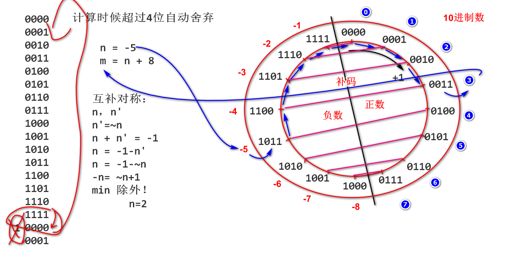

# 二进制

## 什么是2进制

逢2进1的计数规则(重要)

2进制
规则：逢2进1
数字：0 1 
权：128 64 32 16 8 4 2 1
基数：2


10进制计数规则

10进制
规则：逢10进1
数字：0 1 2 3 4 5 6 7 8 9
权：万 千 百 十 个
基数：10


计算机为啥是2进制？便宜！！！成本优势明显！！！

如何将2进制转换为10进制：将1位置对应权值累加求和

```
00000000 00000000 00000000 00000000
00000000 00000000 00000000 00000001 = 1
00000000 00000000 00000000 00000010 = 2
00000000 00000000 00000000 00000011 = 2+1 = 3
00000000 00000000 00000000 00000100 = 4
00000000 00000000 00000000 00000101 = 4+1 = 5
00000000 00000000 00000000 00000110 = 4+2 = 6
00000000 00000000 00000000 00000111 = 4+2+1=7
00000000 00000000 00000000 00001000 = 8
00000000 00000000 00000000 00001001 = 8+1=9
00000000 00000000 00000000 00001010 = 8+2=10
00000000 00000000 00000000 00001011 = 8+2+1=11
00000000 00000000 00000000 00001100
00000000 00000000 00000000 00001101
00000000 00000000 00000000 00001110
00000000 00000000 00000000 00001111
00000000 00000000 00000000 00010000
...
00000000 00000000 00000000 00011001 = 16+8+1=25
...
00000000 00000000 00000000 01101000 = 64+32+8=104
...
```

```java
package binary;

public class Demo01 {
    public static void main(String[] args) {
        /*
         * 如何查看整数的2进制存储情况
         * - java 编译时候，将数字编译为2进制数字
         * - 运行期间变量中存储的是2进制数
         * - 输出变量时候，Java利用API方法，将2进制转换为10进制字符串
         *   利用valueOf方法转换！
         * - Integer.toBinaryString(n) 将整数n在内存中2进制情况显示出来
         */
        int n = 50; //n=110010
        System.out.println(n); //利用valueOf转换2进制为10进制字符串输出
        System.out.println(Integer.toBinaryString(n));

        System.out.println(Integer.toBinaryString(104));
        /*
         * 输出0~200的2进制， 手工计算20个数的10进制值，编程验证
         */
        for(int i=0; i<200; i++){
            System.out.println(Integer.toBinaryString(i));
        }
    }
}
```

## 什么是16进制

逢16进1的计数规则。

16进制用途：16进制用于缩写2进制。

- 2进制书写非常繁琐
- 16进制的基数是2进制的基数4次方， 2进制每4位数可以缩写为1个16进制数。

```java
package binary;

public class Demo02 {
    public static void main(String[] args) {
        /*
         * 2进制与16进制
         * - Java7 提供了2进制字面量前缀 0b
         *   可以在数字中添加下划线，不影响数值
         * - 2进制直接书写非常繁琐
         * - 16进制缩写2进制就非常方便
         *   从2进制的最低位开始， 每4位数缩写为1位16进制数
         * - 0x是16进制的前缀
         * - 计算内部没有10进制，没有16进制，只有2进制！
         */
        int n = 0b11_0010;//32+16+2=50
        System.out.println(n);
        n = 0b0001_1001_1111_0001_0100_0011_1111_0101;
        //    1    9    f    1    4    3    f    5
        System.out.println(Integer.toBinaryString(n));
        n = 0x19f143f5;
        System.out.println(Integer.toBinaryString(n));
        long l = 0b10111111111111111111111111111111111111L;
    }
}
```

## 补码

计算中一种表示有符号数编码，其核心思想就是将固定位数2进制分一般作为负数。

如何将固定位数2进制分一半作为负数？

- 以4位2进制数讲解如何设计补码
- 计算时候保持4位不变， 多余位自动溢出
- 最高位称为符号位，0是正数，1是负数




```java
package binary;

public class Demo03 {
    public static void main(String[] args) {
        /*
         * 补码
         * max 最大
         * value 值
         * Integer 整数
         */
        int n = -3;
        System.out.println(Integer.toBinaryString(n));
        int max = Integer.MAX_VALUE;
        int min = Integer.MIN_VALUE;
        System.out.println(max);
        System.out.println(min);
        System.out.println(Integer.toBinaryString(max));
        System.out.println(Integer.toBinaryString(min));
        System.out.println(Integer.toBinaryString(-1));
        System.out.println(Long.toBinaryString(-1L));
    }
}
```

手工计算负数的值: 计算这个数比-1少0位置的权。

```
11111111111111111111111111111111 = -1
11111111111111111111111111111101 = -1-2=-3
11111111111111111111111111111001 = -1-2-4=-7
11111111111111111111111111111000 = -1-1-2-4=-8
11111111111111111111111101101011 = -1-4-16-128=-149
11111111111111111111111101101100 = -1-1-2-16-128=-148
```

```
package binary;

public class Demo04 {
    public static void main(String[] args) {
        /*
         * 负数的编码
         * 实验： 输出-200到0的2进制编码（补码）
         *    随机选取20个数，手动计算10进制值
         *    利用Java程序验算计算结果。
         */
        for(int i=-200; i<0; i++){
            System.out.println(Integer.toBinaryString(i));
        }
    }
}
```

long类型负数补码

```
1111111111111111111111111111111111111111111111111111111111111111 = -1
1111111111111111111111111111111111111111111111111111111111100110 =-26
```

互补对称现象：-n = ~n+1

```java
-7    = 11111111 11111111 11111111 11111001 = -1-2-4=-7
~-7   = 00000000 00000000 00000000 00000110 = 2+4 = 6
~-7+1 = 00000000 00000000 00000000 00000111 = 1+2+4=7
    
54    =00000000 00000000 00000000 00110110= 2+4+16+32=54
~54   =11111111 11111111 11111111 11001001=-1-2-4-16-32=-55
~54+1 =11111111 11111111 11111111 11001010=-1-1-4-16-32=-54
```

代码：

```java
public class Demo05 {
    public static void main(String[] args) {
        /*
         * 验证补码的互补对称现象 -n=~n+1
         */
        System.out.println(54);
        System.out.println(Integer.toBinaryString(54));
        System.out.println(~54);
        System.out.println(Integer.toBinaryString(~54));
        System.out.println(~54+1);
        System.out.println(Integer.toBinaryString(~54+1));
    }
}
```

## 2进制运算

运算符号：

```java
~ 取反
& 与
| 或运算
>>> 右移位运算
>> 数学右移位运算
<< 左移位运算
```

### `&` 与运算

运算规则：逻辑乘法 有0则0

```java
0 & 0 -> 0
0 & 1 -> 0
1 & 0 -> 0
1 & 1 -> 1
```

运算时候将两个2进制数对其位，对应位置进行与运算

栗子：

```java
        1   7    9   d    5   d    9   e 
n   =   00010111 10011101 01011101 10011110
m   =   00000000 00000000 00000000 11111111  8位掩码
k=n&m   00000000 00000000 00000000 10011110
```

如上运算的意义：k中存储的是n的最后8位数，如上运算叫掩码（mask）运算。m称为mask（掩码），一般从低位开始1的个数称为掩码的位数。

代码：

```java
int n = 0x179d5d9e;
int m = 0xff;
int k = n & m;
```

```java
package binary;

import java.util.ArrayList;

public class Demo06 {
    public static void main(String[] args) {
        /*
         * 掩码运算
         */
        int n = 0x179d5d9e;
        //4位掩码：0xf 0b1111 15
        //6位掩码：0x3f 0b111111 63
        //8位掩码：0xff 0b11111111 255
        int m = 0xff; //4位 6位 8位 16位
        int k = n & m;
        System.out.println(Integer.toBinaryString(n));
        System.out.println(Integer.toBinaryString(m));
        System.out.println(Integer.toBinaryString(k));

    }
}
```

### `>>>` 右移位运算

运算规则， 将2进制数整体向右移动，低位自动溢出舍弃，高位补0

```
n    =   01100111 11010111 10001111 01101101
m=n>>>1  001100111 11010111 10001111 0110110
k=n>>>2  0001100111 11010111 10001111 011011
g=n>>>8  00000000 01100111 11010111 10001111 
b3 = (n>>>8) & 0xff;
```

代码：

```java
int n = 0x67d78f6d;
int m = n>>>1;
int k = n>>>2;
int g = n>>>8;
int b3 = (n>>>8) & 0xff;
//按照2进制输出 n m k g b3
```

### | 或运算

基本运算规则：逻辑加法, 有1则1

```java
0 | 0 -> 0
0 | 1 -> 1
1 | 0 -> 1
1 | 1 -> 1
```

运算时候两个2进制数对齐位，对应位进行或运算

栗子：

```java
n  =     00000000 00000000 00000000 11011101
m  =     00000000 00000000 10011101 00000000
k=n|m    00000000 00000000 10011101 11011101
```

上述计算的意义： 两数错位合并

代码：

```java
int n = 0xdd;
int m = 0x9d00;
int k = n | m;
//检查 n m k 的2进制
```

### `<<` 左移位运算

2进制数字整体向左移动，高位自动溢出，低位补0

栗子：

```java
n  =    00100000 11101111 00110101 10010000
m=n<<1  0100000 11101111 00110101 100100000
k=n<<2  100000 11101111 00110101 1001000000
g=n<<8  11101111 00110101 10010000 00000000
```

代码：

```java
int n = 0x20ef3590;
int m = n<<1;
int k = n<<2;
int g = n<<8;
//按照2进制输出 n m k g
```

### 移位运算的数学意义

栗子：

```
      16 8 4 2 1
           1 0 1 = 5
         1 0 1   = 10    向左移动1位  *2
       1 0 1     = 20    向左移动2位  *2*2
```

代码：

```java
int n = 5;
System.out.println(n<<1); //10
System.out.println(n<<2); //20
System.out.println(n<<3); //40
//...
```

### `>>>` 和 `>>` 的区别

- `>>>` 逻辑右移位：数字向右移动，低位自动溢出，高位补0, 结果没有数学意义。如果仅仅将数位向右移动，不考虑数学意义，则使用`>>>`
- `>>` 数学右移位：数学向右移动，低位自动溢出，正数高位补0，负数高位补1,  移动一次数学除以2，小方向取整数。如果是替代数学 /2, 使用数学右移位。

栗子, 使用负数比较运算结果：

```
n  =   11111111 11111111 11111111 11001100=-1-1-2-16-32=-52
m=n>>1 111111111 11111111 11111111 1100110=-1-1-8-16=-26
k=n>>2 1111111111 11111111 11111111 110011=-1-4-8=-13
g=n>>3 11111111111 11111111 11111111 11001=-1-2-4=-7
n>>>1  011111111 11111111 11111111 1100110=max-25没有数学意义
```

程序：

```java
int n = -52; //0xffffffcc;
int m = n>>1;
int k = n>>2;
int g = n>>3;
int x = n>>>1;
//输出n m k g x 
```

### 将一个整数拆分为4个字节

栗子

```java
            b1       b2       b3       b4
n   =    00010111 10011101 01011101 10011110
b1  =    00000000 00000000 00000000 00010111 
b2  =    00000000 00000000 00000000 10011101
b3  =    00000000 00000000 00000000 01011101  
b4  =    00000000 00000000 00000000 10011110
```

代码：n =-1   n=-3   n=max  n=min

```java
int n = 0x179d5d9e;
int b1 = (n >>> 24) & 0xff;
int b2 = (n >>> 16) & 0xff;
int b3 = (n >>> 8) & 0xff;
int b4 = n & 0xff;
//验证：按照二进制输出 n b1 b2 b3 b4
//n=-1 时候按照10进制输出是啥结果？
```

### 将4个字节合并为一个整数

```java
b1  =    00000000 00000000 00000000 00010111 
b2  =    00000000 00000000 00000000 10011101
b3  =    00000000 00000000 00000000 01011101  
b4  =    00000000 00000000 00000000 10011110

b1<<24   00010111 00000000 00000000 00000000 
b2<<16   00000000 10011101 00000000 00000000 
b3<<8    00000000 00000000 01011101 00000000 
b4       00000000 00000000 00000000 10011110

n = (b1<<24) | (b2<<16) | (b3<<8) | b4;
```

代码：

```java
int b1 = 0x17;
int b2 = 0x9d;
int b3 = 0x5d;
int b4 = 0x9e;
int n = (b1<<24) | (b2<<16) | (b3<<8) | b4;
//按照2进制输出 b1 b2 b3 b3 n
```

## 作业

1.  将一个long整数拆分为8个字节
2. 将8个字节合并为一个long整数
3. 学有余力的同学，扩展学习 UTF-8 编码


