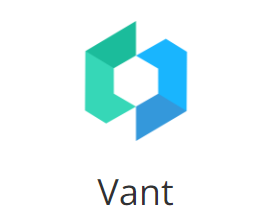
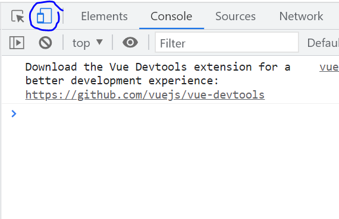
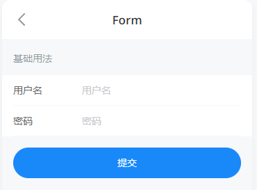

张皓岚

微信:Jtzhanghl

第五阶段:

1.Vant     1天

2.微服务概念和框架的搭建   5天

3.酷鲨商城前台业务            11天

# Vant概述

## 什么是Vant



Vant 是一个**轻量、可靠的移动端组件库**，于 2017 年开源。

目前 Vant 官方提供了 [Vue 2 版本](https://vant-contrib.gitee.io/vant/v2)、[Vue 3 版本](https://vant-contrib.gitee.io/vant)和[微信小程序版本](http://vant-contrib.gitee.io/vant-weapp)，并由社区团队维护 [React 版本](https://github.com/3lang3/react-vant)和[支付宝小程序版本](https://github.com/ant-move/Vant-Aliapp)。

课程中使用Vant 2.x版本可以浏览网站

https://youzan.github.io/vant/v2/#/zh-CN/

## 为什么要使用Vant

ElementUI是开发电脑浏览器页面的组件库

而Vant是开发移动端浏览器\App的组件库,

酷鲨商城前台使用使用移动端开发,所以Vant更合适

## Vant的特性

- 🚀 性能极佳，组件平均体积小于 1KB（min+gzip）
- 🚀 65+ 个高质量组件，覆盖移动端主流场景
- 💪 使用 TypeScript 编写，提供完整的类型定义
- 💪 单元测试覆盖率超过 90%，提供稳定性保障
- 📖 提供完善的中英文文档和组件示例

* .......

# 第一个Vant程序

## 创建Vue项目

我们可以参考第四阶段创建Vue项目的笔记

在E盘下创建一个文件夹(vue-home)

打开Dos命令窗口,使用下面命令创建Vue

```
C:\Users\TEDU>e:

E:\>cd vue-home

E:\vue-home>vue create demo-vant
```

具体选项参考之前的笔记

## 添加\安装Vant支持

项目创建完毕后,并不直接支持vant

我们需要将Vant的内容添加\安装到当前Vue项目

首先要进入当前vue项目的文件夹

```
E:\vue-home>cd demo-vant
```

然后运行安装\添加Vant支持的npm命令

```
E:\vue-home\demo-vant>npm i vant@latest-v2 -S
```

安装结束后可能有一下警告,可以无视掉

看到的提示可能是

```
added 5 packages in 3s
```

然后我们使用Idea打开这个项目

## 添加引用

项目打开后找到src\main.js

添加Vant引用

```js
import Vant from 'vant'
import 'vant/lib/index.css'

Vue.use(Vant)
```

下面就可以使用Vant了

启动项目的命令

在idea提供的Terminal中敲入代码即可

npm run serve

启动之后可以在localhost:8080中访问

注意切换为移动端界面

以Google浏览器为例按F12进入调试模式后点击移动端调试即可



git地址

https://gitee.com/jtzhanghl/vant-cgb2112.git

## 表单组件

使用表单组件实现登录页面

是Vant直接提供的组件



先添加引用

引用之后 main.js文件内容为

```js
import Vue from 'vue'
import App from './App.vue'
import router from './router'
import store from './store'
import Vant from 'vant'
import 'vant/lib/index.css'
import { Form } from 'vant';
import { Field } from 'vant';

Vue.use(Form);
Vue.use(Field);
Vue.use(Vant)
Vue.config.productionTip = false
// 略
```

向vue文件中复制文档中提供的代码

注意复制的位置

我们以AboutView.vue为例

代码如下

```html
<template>
  <div class="about">
    <van-form @submit="onSubmit">
      <van-field
          v-model="username"
          name="用户名"
          label="用户名"
          placeholder="用户名"
          :rules="[{ required: true, message: '请填写用户名' }]"
      />
      <van-field
          v-model="password"
          type="password"
          name="密码"
          label="密码"
          placeholder="密码"
          :rules="[{ required: true, message: '请填写密码' }]"
      />
      <div style="margin: 16px;">
        <van-button round block type="info" native-type="submit">提交</van-button>
      </div>
    </van-form>
  </div>
</template>
<script>
export default {
  data() {
    return {
      username: '',
      password: '',
    };
  },
  methods: {
    onSubmit(values) {
      console.log('submit', values);
    },
  },
};
</script>
```

然后直接访问about页面即可

## area省市区选择

我们在手机app上经常需要选择省市区

Vant直接提供了这个组件

我们创建AreaView.vue文件

在启动编写代码如下

```html
<template>
  <div>
    <van-area title="标题" :area-list="areaList" />
  </div>
</template>
<script>
const areaList = {
  province_list: {
    110000: '北京市',
    120000: '天津市',
  },
  city_list: {
    110100: '北京市',
    120100: '天津市',
  },
  county_list: {
    110101: '东城区',
    110102: '西城区',
    // ....
  },
};
export default{
  data(){
    return{areaList};
  }
}

</script>
```

别忘了要设置路由才能访问这个页面

router文件夹下的index.js文件中添加路由代码

```js
const routes = [
  {
    path: '/',
    name: 'home',
    component: HomeView
  },
  {
    path: '/about',
    name: 'about',
    // route level code-splitting
    // this generates a separate chunk (about.[hash].js) for this route
    // which is lazy-loaded when the route is visited.
    component: () => import(/* webpackChunkName: "about" */ '../views/AboutView.vue')
  },
  {
    path: '/area',
    name: 'area',
    component: () => import('../views/AreaView.vue')
  }
]
```

然后可以通过输入路径

localhost:8080/area访问这个页面

但是我们现在只能访问我们数组中定义的少数省市区

怎么才能想文档中显示所有省市区呢

需要引用官方提供的一个地址列表

dos(Terminal中也可以)运行安装命令

```
E:\vue-home\demo-vant>npm i @vant/area-data
```

这样就安装了所有省市区的数据到当前的项目

我们只需要修改js代码,让arealist引用这个数据内容即可

```html
<script>
import {areaList} from '@vant/area-data'

export default{
  data(){
    return{areaList};
  }
}

</script>
```

## 商品列表页

我们在开发酷鲨商城的过程中

移动端需要很多页面,商品列表页面是比较常见的页面之一

我们以商品列表页为例

带领大家开发一个页面

### 创建页面和路由配置

router/index.js添加路由信息

```js
{
  path: '/list',
  name: 'list',
  component: () => import('../views/ListView.vue')
}
```

创建ListView.vue

代码如下

```html
<template>
  <div>
    <van-row>
      <van-col span="8">综合</van-col>
      <van-col span="8">销量</van-col>
      <van-col span="8">价格</van-col>
    </van-row>
    <van-card
        num="1"
        price="268.00"
        desc="超10000人的信任"
        title="酷鲨牌鼠标键盘套装"
        thumb="https://img01.yzcdn.cn/vant/ipad.jpeg"
    >
      <template #tags>
        <van-tag type="danger">自营</van-tag>
        <van-tag plain type="danger">酷鲨物流</van-tag>
      </template>
      <template #footer>
        <van-button size="mini">按钮</van-button>
        <van-button size="mini">按钮</van-button>
      </template>
    </van-card>
    <van-card
        num="1"
        price="268.00"
        desc="超10000人的信任"
        title="酷鲨牌鼠标键盘套装"
        thumb="https://img01.yzcdn.cn/vant/ipad.jpeg"
    >
      <template #tags>
        <van-tag type="danger">自营</van-tag>
        <van-tag plain type="danger">酷鲨物流</van-tag>
      </template>
      <template #footer>
        <van-button size="mini">按钮</van-button>
        <van-button size="mini">按钮</van-button>
      </template>
    </van-card>
  </div>
</template>

<script>
export default {
  name: "ListView"
}
</script>
```


## 添加事件调用的参考代码

```html
<template>
  <div>
    <van-area title="标题" :area-list="areaList"
      @confirm="showName"/>
  </div>
</template>
<script>
import {areaList} from '@vant/area-data'

export default{
  data(){
    return{areaList};
  },
  methods:{
    showName:function(msg){
      console.log(msg[0].code+""+msg[0].name);
      console.log(msg[1].code+""+msg[1].name);
      console.log(msg[2].code+""+msg[2].name);
    }
  }
}

</script>
```


# 服务器项目进化

服务器最先出现时

一般都是以静态页面为主的

主要功能就是信息的呈现和输出

后来开始有动态网页

也就是数据库的支持,实现了登录,注册等基本功能

修改页面内容直接修改数据库就可以了

现在有更多的用户参与贡献和分享内容了!

微博,抖音,大众点评,淘宝等

一旦这样的交互增加,就需要更多的服务器性能

包括CPU,服务器内存,服务器硬盘等

互联网高并发,大数据量的营销活动

都是服务器性能的提升创造的可能性

# Java服务器项目分类

现在市面上使用java开发的服务器项目可以分为两大类

1.企业级应用

一般指一个企业或机构内部使用的网站或服务器应用程序

包括的领域不限于:商业,企事业单位,医疗,军事,政府,金融等

这个类型的项目访问的人群是比较固定,不是对全国乃至全世界开放的

使用人数比较少,所以对网站的性能要求并不太高

但是,企业级应用一般会有比较复杂的权限设置和比较上的业务流程

2.互联网应用

一般指对全国乃至全世界开放的网站或服务器程序

京东,淘宝,饿了么,美团,高德,抖音,qq音乐,爱奇艺,微博

它们对网站性能的要求是非常高的

即使并发量非常大,程序还要对请求迅速的做出响应

对性能要求可以归纳为下面3个特征

* 高并发
* 高可用
* 高性能

一般情况下,互联网项目业务比较简单,但是对性能要求高

## java项目分类小结

我们在开发企业级应用时,因为对性能要求不是很高

可以使用传统的单体项目来完成开发

如果是互联网应用,那么追求性能,就必须使用微服务的结构来实现项目

* 企业级应用使用单体项目结构的情况比较多
* 互联网应用使用微服务项目结构的情况比较多

# 微服务概述

## 什么是微服务

微服务的概念是由Martin Fowler（**马丁·福勒**）在2014年提出的


微服务是由以单一应用程序构成的小服务，自己拥有自己的行程与轻量化处理，服务依业务功能设计，以全自动的方式部署，与其他服务使用 HTTP API 通信。同时服务会使用最小的规模的集中管理能力，服务可以用不同的编程语言与数据库等组件实现。

简单来说,微服务就是将一个大型项目的各个业务代码,拆分成互不干扰的小项目,而这些小项目专心完成自己的功能,而且可以调用别的微服务的方法,从而完成整体功能

京东\淘宝这样的大型互联网应用程序,基本每个操作都是一个单独的微服务在支持:

* 登录服务器
* 搜索服务器
* 商品信息服务器
* 购物车服务器
* 订单服务器
* 支付服务器
* 物流服务器

* .....

## 为什么需要微服务


微服务框架搭建项目完成版git路径:

https://gitee.com/jtzhanghl/csmall-cgb2112.git

单体项目就像左侧的小饭馆一样

不能很好的支持高并发,高可用,高性能

但是服务器数量少,成本低,适合小型的单体项目

微服务项目就像右侧的大餐厅

能够支持大量请求同事发生,也能针对性能的不足进行扩展和优化

万一有服务器的损坏也不会影响整体功能

但是服务器数量多,成本高,适合要求"三高"的互联网项目

## 怎么搭建微服务项目

在微服务概念提出之前(2014年之前),每个厂商都有自己的高性能解决方案

但是Martin Fowler（**马丁·福勒**）提出了微服务的标准之后,为了技术统一和兼容性,很多企业开始支持这个标准

我们自己想要搭建马丁·福勒标准的微服务项目,全都通过自己的力量来编写是不现实的,必须通过现成的框架和遵循微服务项目的结构和格式

当今程序员要想大家一个微服务架构的程序,首选SpringCloud这个工具

# 创建csmall项目

我们在真正开始学习微服务知识之前

先创建一个能够添加微服务功能的项目结构

这个项目的创建是有业务依托的

## 业务概述

我们实现一个提交订单的业务

当前状态为用户勾选了购物车中的某些商品

在用户点击"提交订单"时,项目要进行的相关业务流程

大致步骤如下

1. 减少sku在数据库中的库存数
2. 删除用户勾选的购物车中的商品信息
3. 实例化订单,赋值订单信息,并新增到订单表

上面3个步骤是不同的3个模块的功能

减少库存是库存模块

删除购物车中商品是购物车模块内容

生成订单是订单模块的功能

明显是3个模块需要协作的业务

我们就使用这个业务学习微服务框架的搭建及使用

# 创建父项目

创建项目名称为csmall

首先删除src文件夹,因为这个项目不会编写代码

其次,pom文件有大量配置

这些配置我们会在今后的学习过程中逐一讲解,现在在将它赋值到父项目的pom.xml中,

最终的pom文件为:

```xml
<?xml version="1.0" encoding="UTF-8"?>
<project xmlns="http://maven.apache.org/POM/4.0.0" xmlns:xsi="http://www.w3.org/2001/XMLSchema-instance"
         xsi:schemaLocation="http://maven.apache.org/POM/4.0.0 https://maven.apache.org/xsd/maven-4.0.0.xsd">
    <modelVersion>4.0.0</modelVersion>
    <parent>
        <groupId>org.springframework.boot</groupId>
        <artifactId>spring-boot-starter-parent</artifactId>
        <version>2.5.13</version>
        <relativePath/> <!-- lookup parent from repository -->
    </parent>
    <groupId>cn.tedu</groupId>
    <artifactId>csmall</artifactId>
    <version>0.0.1-SNAPSHOT</version>
    <name>csmall</name>
    <description>Demo project for Spring Boot</description>
    <packaging>pom</packaging>
    <modules>

    </modules>
    <properties>
        <java.version>1.8</java.version>
        <spring-cloud.version>2020.0.3</spring-cloud.version>
        <spring-cloud-alibaba.version>2.2.2.RELEASE</spring-cloud-alibaba.version>
        <spring-boot.version>2.5.4</spring-boot.version>
        <spring-boot-configuration-processor.version>2.3.0.RELEASE</spring-boot-configuration-processor.version>
        <spring-security-jwt.version>1.0.10.RELEASE</spring-security-jwt.version>
        <mybatis-spring-boot.version>2.2.0</mybatis-spring-boot.version>
        <mybaits-plus.version>3.4.1</mybaits-plus.version>
        <pagehelper-spring-boot.version>1.4.0</pagehelper-spring-boot.version>
        <mysql.version>8.0.26</mysql.version>
        <lombok.version>1.18.20</lombok.version>
        <knife4j-spring-boot.version>2.0.9</knife4j-spring-boot.version>
        <spring-rabbit-test.version>2.3.10</spring-rabbit-test.version>
        <spring-security-test.version>5.5.2</spring-security-test.version>
        <fastjson.version>1.2.45</fastjson.version>
        <druid.version>1.1.20</druid.version>
        <jjwt.version>0.9.0</jjwt.version>
        <seata-server.version>1.4.2</seata-server.version>
    </properties>
    <dependencies>
        <dependency>
            <groupId>org.projectlombok</groupId>
            <artifactId>lombok</artifactId>
        </dependency>
    </dependencies>
    <!-- 依赖管理 -->
    <dependencyManagement>
        <dependencies>
            <!--seata-all-->
            <dependency>
                <groupId>io.seata</groupId>
                <artifactId>seata-all</artifactId>
                <version>${seata-server.version}</version>
            </dependency>
            <!-- Lombok -->
            <dependency>
                <groupId>org.projectlombok</groupId>
                <artifactId>lombok</artifactId>
                <version>${lombok.version}</version>
            </dependency>
            <!-- MySQL -->
            <dependency>
                <groupId>mysql</groupId>
                <artifactId>mysql-connector-java</artifactId>
                <version>${mysql.version}</version>
                <scope>runtime</scope>
            </dependency>
            <!-- Alibaba Druid -->
            <dependency>
                <groupId>com.alibaba</groupId>
                <artifactId>druid</artifactId>
                <version>${druid.version}</version>
            </dependency>
            <!-- MyBatis Spring Boot：数据访问层MyBatis编程 -->
            <dependency>
                <groupId>org.mybatis.spring.boot</groupId>
                <artifactId>mybatis-spring-boot-starter</artifactId>
                <version>${mybatis-spring-boot.version}</version>
            </dependency>
            <!-- MyBatis Plus Spring Boot：MyBatis增强 -->
            <dependency>
                <groupId>com.baomidou</groupId>
                <artifactId>mybatis-plus-boot-starter</artifactId>
                <version>${mybaits-plus.version}</version>
            </dependency>
            <!-- MyBatis Plus Generator：代码生成器 -->
            <dependency>
                <groupId>com.baomidou</groupId>
                <artifactId>mybatis-plus-generator</artifactId>
                <version>${mybaits-plus.version}</version>
            </dependency>
            <!-- PageHelper Spring Boot：MyBatis分页 -->
            <dependency>
                <groupId>com.github.pagehelper</groupId>
                <artifactId>pagehelper-spring-boot-starter</artifactId>
                <version>${pagehelper-spring-boot.version}</version>
            </dependency>
            <!-- Spring Boot：基础框架 -->
            <dependency>
                <groupId>org.springframework.boot</groupId>
                <artifactId>spring-boot-starter</artifactId>
                <version>${spring-boot.version}</version>
            </dependency>
            <!-- Spring Boot Web：WEB应用 -->
            <dependency>
                <groupId>org.springframework.boot</groupId>
                <artifactId>spring-boot-starter-web</artifactId>
                <version>${spring-boot.version}</version>
            </dependency>
            <!-- Spring Boot Freemarker：MyBaits Plus Generator的辅助项 -->
            <dependency>
                <groupId>org.springframework.boot</groupId>
                <artifactId>spring-boot-starter-freemarker</artifactId>
                <version>${spring-boot.version}</version>
            </dependency>
            <!-- Spring Boot Validation：验证请求参数 -->
            <dependency>
                <groupId>org.springframework.boot</groupId>
                <artifactId>spring-boot-starter-validation</artifactId>
                <version>${spring-boot.version}</version>
            </dependency>
            <!-- Spring Boot Security：认证授权 -->
            <dependency>
                <groupId>org.springframework.boot</groupId>
                <artifactId>spring-boot-starter-security</artifactId>
                <version>${spring-boot.version}</version>
            </dependency>
            <!-- Spring Boot Oauth2：认证授权 -->
            <dependency>
                <groupId>org.springframework.boot</groupId>
                <artifactId>spring-boot-starter-oauth2-client</artifactId>
                <version>${spring-boot.version}</version>
            </dependency>
            <!-- Spring Boot配置处理器 -->
            <dependency>
                <groupId>org.springframework.boot</groupId>
                <artifactId>spring-boot-configuration-processor</artifactId>
                <version>${spring-boot-configuration-processor.version}</version>
            </dependency>
            <!-- Spring Security JWT -->
            <dependency>
                <groupId>org.springframework.security</groupId>
                <artifactId>spring-security-jwt</artifactId>
                <version>${spring-security-jwt.version}</version>
            </dependency>
            <!-- Knife4j Spring Boot：在线API -->
            <dependency>
                <groupId>com.github.xiaoymin</groupId>
                <artifactId>knife4j-spring-boot-starter</artifactId>
                <version>${knife4j-spring-boot.version}</version>
            </dependency>
            <!-- Spring Boot Data Redis：缓存 -->
            <dependency>
                <groupId>org.springframework.boot</groupId>
                <artifactId>spring-boot-starter-data-redis</artifactId>
                <version>${spring-boot.version}</version>
            </dependency>
            <!-- Spring Boot Data MongoDB：缓存 -->
            <dependency>
                <groupId>org.springframework.boot</groupId>
                <artifactId>spring-boot-starter-data-mongodb</artifactId>
                <version>${spring-boot.version}</version>
            </dependency>
            <!-- Spring Boot Data Elasticsearch：文档搜索 -->
            <dependency>
                <groupId>org.springframework.boot</groupId>
                <artifactId>spring-boot-starter-data-elasticsearch</artifactId>
                <version>${spring-boot.version}</version>
            </dependency>
            <!-- Spring Boot AMQP：消息队列 -->
            <dependency>
                <groupId>org.springframework.boot</groupId>
                <artifactId>spring-boot-starter-amqp</artifactId>
                <version>${spring-boot.version}</version>
            </dependency>
            <!-- Spring Boot Actuator：健康监测 -->
            <dependency>
                <groupId>org.springframework.boot</groupId>
                <artifactId>spring-boot-starter-actuator</artifactId>
                <version>${spring-boot.version}</version>
            </dependency>
            <!-- Spring Cloud家族 -->
            <dependency>
                <groupId>org.springframework.cloud</groupId>
                <artifactId>spring-cloud-dependencies</artifactId>
                <version>${spring-cloud.version}</version>
                <type>pom</type>
                <scope>import</scope>
            </dependency>
            <!-- Spring Cloud Alibaba -->
            <dependency>
                <groupId>com.alibaba.cloud</groupId>
                <artifactId>spring-cloud-alibaba-dependencies</artifactId>
                <version>${spring-cloud-alibaba.version}</version>
                <type>pom</type>
                <scope>import</scope>
            </dependency>
            <!-- Alibaba FastJson -->
            <dependency>
                <groupId>com.alibaba</groupId>
                <artifactId>fastjson</artifactId>
                <version>${fastjson.version}</version>
            </dependency>
            <!-- JJWT -->
            <dependency>
                <groupId>io.jsonwebtoken</groupId>
                <artifactId>jjwt</artifactId>
                <version>${jjwt.version}</version>
            </dependency>
            <!-- Spring Boot Test：测试 -->
            <dependency>
                <groupId>org.springframework.boot</groupId>
                <artifactId>spring-boot-starter-test</artifactId>
                <version>${spring-boot.version}</version>
                <scope>test</scope>
            </dependency>
            <!-- Spring Rabbit Test：消息队列测试 -->
            <dependency>
                <groupId>org.springframework.amqp</groupId>
                <artifactId>spring-rabbit-test</artifactId>
                <version>${spring-rabbit-test.version}</version>
                <scope>test</scope>
            </dependency>
            <!-- Spring Security Test：Security测试 -->
            <dependency>
                <groupId>org.springframework.security</groupId>
                <artifactId>spring-security-test</artifactId>
                <version>${spring-security-test.version}</version>
                <scope>test</scope>
            </dependency>
            <!--seata整合springboot-->
            <dependency>
                <groupId>io.seata</groupId>
                <artifactId>seata-spring-boot-starter</artifactId>
                <version>${seata-server.version}</version>
            </dependency>
        </dependencies>
    </dependencyManagement>


</project>
```

随课程进行一直更新的项目git地址

https://gitee.com/jtzhanghl/csmall-class-cgb2112.git

完整微服务架构

https://gitee.com/jtzhanghl/csmall-cgb2112.git

Vant项目(包含今天笔记)

https://gitee.com/jtzhanghl/vant-cgb2112.git

## 创建通用项目commons

删除test测试文件集

删除resources配置文件夹

删除SpringBoot启动类

这些都用不到

下面将父子关系配置

```xml
<?xml version="1.0" encoding="UTF-8"?>
<project xmlns="http://maven.apache.org/POM/4.0.0" xmlns:xsi="http://www.w3.org/2001/XMLSchema-instance"
         xsi:schemaLocation="http://maven.apache.org/POM/4.0.0 https://maven.apache.org/xsd/maven-4.0.0.xsd">
    <modelVersion>4.0.0</modelVersion>
    <parent>
        <groupId>cn.tedu</groupId>
        <artifactId>csmall</artifactId>
        <version>0.0.1-SNAPSHOT</version>
    </parent>
    <groupId>cn.tedu</groupId>
    <artifactId>csmall-commons</artifactId>
    <version>0.0.1-SNAPSHOT</version>
    <name>csmall-commons</name>
    <description>Demo project for Spring Boot</description>
    <dependencies>
        <!--在线api文档-->
        <dependency>
            <groupId>com.github.xiaoymin</groupId>
            <artifactId>knife4j-spring-boot-starter</artifactId>
        </dependency>
        <!-- Spring Boot Web：WEB应用 -->
        <dependency>
            <groupId>org.springframework.boot</groupId>
            <artifactId>spring-boot-starter-web</artifactId>
            <exclusions>
                <exclusion>
                    <groupId>org.springframework.boot</groupId>
                    <artifactId>spring-boot-starter</artifactId>
                </exclusion>
                <exclusion>
                    <groupId>org.springframework.boot</groupId>
                    <artifactId>spring-boot-starter-json</artifactId>
                </exclusion>
                <exclusion>
                    <groupId>org.springframework.boot</groupId>
                    <artifactId>spring-boot-starter-tomcat</artifactId>
                </exclusion>
            </exclusions>
        </dependency>
    </dependencies>

</project>
```

 创建java类

pojo.cart.dto.CartAddDTO

```java
@ApiModel(value="购物车新增DTO")
@Data
public class CartAddDTO implements Serializable {
    @ApiModelProperty(value="商品编号",name="commodityCode",example ="PC100")
    private String commodityCode;
    @ApiModelProperty(value="商品单价",name="price",example = "100")
    private Integer price;
    @ApiModelProperty(value="商品个数",name="count",example = "5")
    private Integer count;
    @ApiModelProperty(value="用户ID",name="userId",example = "UU100")
    private String userId;
}
```

pojo.cart.model.Cart

```Java
@Data
public class CartT implements Serializable {
    private Integer id;
    private String commodityCode;
    private Integer price;
    private Integer count;
    private String userId;
}
```


