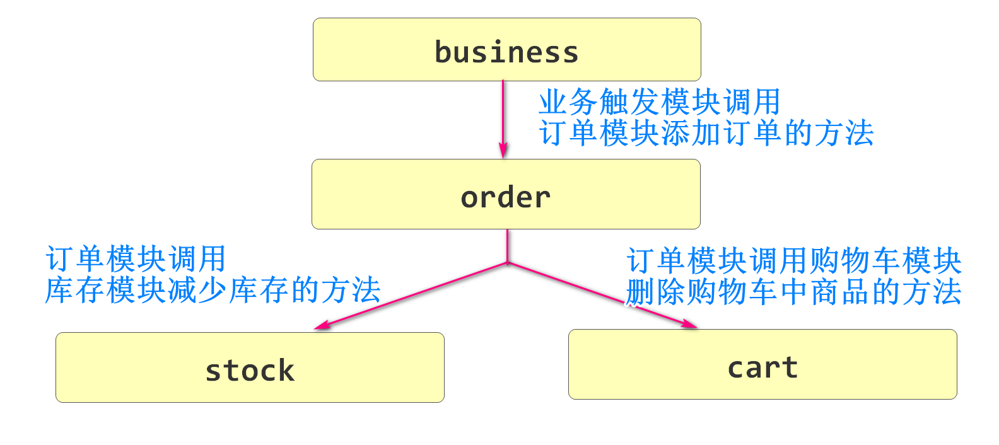

# SpringCloud

## 什么是SpringCloud

SpringCloud是由Spring提供的一套能够快速搭建微服务架构程序的框架集

SpringCloud本身不是一个框架,而是一系列框架的统称

SpringCloud就是为了搭建微服务架构才出现的

有人将SpringCloud称之为"Spring全家桶",广义上代指所有Spring的产品

## SpringCloud的内容

**内容的提供者角度**

* Spring自己编写的框架和软件
* Netflix(奈非):早期提供了很多微服务组件
* alibaba(阿里巴巴):新版本SpringCloud推荐使用(使用频率迅速提升)

**从功能上分类**

* 微服务的注册中心
* 微服务间的调用
* 微服务的分布式事务
* 微服务的限流
* 微服务的网关
* .......

# Nacos注册中心

## 什么是Nacos

Nacos是Spring Cloud Alibaba提供的一个软件

这个软件具有微服务注册中心的功能

也就是当前微服务架构中的所有微服务项目都需要到Nacos注册才能成为这个微服务项目的一部分


Nacos是一个能够接收所有微服务项目信息的组件

只有将信息"注册"到Nacos,这个项目才会成为微服务架构中的一个组成部分

下面我们就来学习如何安装和启动Nacos

> 前提
>
> 需要当前计算机安装并配置java环境变量
>
> 因为Nacos是java开发的,所以要运行必须配置java环境变量

Nacos 下载路径

https://github.com/alibaba/nacos/releases/download/1.4.3/nacos-server-1.4.3.zip

国外网站,下载困难可以多试几次

或直接向项目经理老师索取

## Nacos心跳机制

> 常见面试题

Nacos系统内置周期性的检查和报告工作,称之为"心跳"

客户端或服务器会周期的检查状态,运行固定代码,保证能够检测模块的运行

Nacos实例的心跳又分类两种

* 临时实例心跳
* 永久实例心跳

在后面的配置中,如果采用默认配置,当前实例就是永久实例

```yaml
spring:
  application:
    name: xxxx
  cloud:
    nacos:
      discovery:
        ephemeral: false # 默认false实例为永久实例。true：临时; false：永久
      	server-addr: localhost:8848
```

临时实例基于心跳方式做健康检测

永久实例是Nacos主动探测健康状态

**临时实例**

客户端(各个模块)每隔5秒自动向Nacos发送心跳包

包中包含微服务名称,ip地址,port(端口号),集群名称等信息

Nacos接收到信息后,判断当前Nacos中是否包含这个包中的信息

* 如果不包含,证明这是一个新的实例,进行注册操作
* 如果存在,记录本次心跳时间,设置为健康状态

整体流程有个别名:"心跳续约"

**永久实例**

永久实例是Nacos周期性向客户端进行检测

Nacos每隔15秒向客户端发送一个检测请求,如果第一个15秒客户端没有给出响应,就会被标记为"非健康状态"

如果两个连续的15秒(一共30秒)都没有响应,就会从注册列表中剔除这个服务

整体流程有个别名:"心跳检测"

## 安装启动Nacos

我们下载了Nacos软件

将压缩包解压(注意不要有中文路径或空格)

打开解压得到的文件夹后打卡bin目录会有如下内容


startup.cmd是windows系统启动Nacos的命令

shutdown.cmd是windows系统停止Nacos的命令

> .sh结尾的文件是linux和mac系统的启动和停止文件

启动Nacos不能直接双击startup.cmd

而需要打开dos窗口来执行

Win+R输入cmd


启动命令中 standalone是表示本次启动以单机模式运行

如果不指定会默认以集群模式运行,无法完成功能

```
startup.cmd -m standalone
```

如果运行成功会显示8848端口

打开浏览器输入地址

http://localhost:8848/nacos


如果首次访问没有响应,可以尝试从新解压和运行,再访问

登录系统

用户名密码都是nacos

进入后会看到列表后台

注意不要关闭doc窗口,一旦关闭,nacos就停止了

## 将项目注册到Nacos的配置

要注册到Nacos的项目添加如下配置即可

添加pom.xml文件依赖

```xml
<dependency>
    <groupId>com.alibaba.cloud</groupId>
    <artifactId>spring-cloud-starter-alibaba-nacos-discovery</artifactId>
</dependency>
```

application-dev.yml文件添加配置

```yaml
spring:
  application:
    name: nacos-business # 定义当前服务名称
  cloud:
    nacos:
      discovery:
        server-addr: localhost:8848 # 指定正在运行的Nacos服务器的位置
```

上面配置中nacos-business是当前服务名称,每个不同功能模块名称要不同

nacosip地址和端口号根据实际情况编写

我们启动business,在nacos的服务列表中观察

出现信息表示一切正常

可以复制项目然后修改端口号,启动同名服务的项目,这样服务列表中就会出现多个实例

实际开发中,一般情况都会有多个实例去分担同一个服务

## 使用Idea启动Nacos

每次开机都需要启动Nacos

启动Nacos使用dos窗口太麻烦了

我们可以使用Idea简化这个过程


点击ok确定之后

项目的启动项中就会出现Nacos的启动项了

# Dubbo概述

要想学习Dubbo,我们先要了解RPC的概念

## 什么是RPC

RPC是Remote Procedure Call 翻译为:远程过程调用

它是为了实现两个不再一起的服务器\计算机,实习相互调用方法的解决方案

RPC主要包含了2个部分的内容

* 序列化协议
* 通信协议

为了大家更下方便的理解PRC的概念有下面的图


上面是在家中,老婆调用老公洗碗方法的调用流程

如果换成远程调用如下图


**通信协议**

当老婆在外面时,就需要借助通讯工具通知老公来完成什么操作

在这个流程中通信修协议就指老婆使用什么方式通知老公要洗碗

可以是手机,也可以写信,可以飞鸽传书


**序列化协议**指传输信息的内容是什么格式,双方都要能够理解这个格式

例如老婆说中文,老公要理解中文,其他语言也一样

发送信息是序列化的过程,接收信息是反序列化的过程

这样他们才能明确调用的目的

这样的流程就是我们生活中的RPC使用的场景

## 什么是Dubbo

理解了RPC之后再学习Dubbo就容易接受了

Dubbo是一套RPC框架。既然是框架，我们可以在框架结构高度，定义Dubbo中使用的通信协议，使用的序列化框架技术，而数据格式由Dubbo定义，我们负责配置之后直接通过客户端调用服务端代码。 

Dubbo中默认的通信协议是Dubbo自己写的协议,

序列化协议使用的就是我们之前用过的json

但是我们也要知道,通信协议和序列化协议是可以通过配置文件修改的

上面章节我们使用的生活中老婆和老公的例子

在程序中是什么样的模型呢

发起调用的一方从当前项目的业务层,调用被调用一方的业务层方法

也可能是发起调用的一方从控制层,调用被调用一方的业务层方法

总的来说,被调用的方法一定是业务逻辑层方法

Dubbo框架的优点之一就是没有破坏controller->service->mapper的运行流程

## Dubbo的发展历程


## Dubbo特性

因为Dubbo内置了序列化协议和通信协议,所有会有下面的特征

* 采用NIO单一长链接
* 优秀的高并发处理性能
* 编写简单,提升开发效率

## Dubbo的注册与服务的发现

我们后面使用Dubbo实现远程调用必须有Nacos的支持

服务发现，即消费端自动发现服务地址列表的能力，是微服务框架需要具备的关键能力，借助于自动化的服务发现，微服务之间可以在无需感知对端部署位置与 IP 地址的情况下实现通信。

服务的消费者就是服务的调用者(老婆)

服务的生产者就是服务的提供者(老公)

Dubbo调用远程服务,无需指定IP地址端口号,只需要知道它的服务名称即可

一个服务名称可能有多个运行的实例,任何一个空闲都可以提供服务


> 常见面试题:Dubbo的注册发现流程

1.首先服务的提供者启动服务到注册中心注册,包括各种ip端口信息,Dubbo会同时注册该项目提供的远程调用的方法

2.服务的消费者(使用者)注册到注册中心,订阅发现

3.当有新的远程调用方法注册到注册中心时,注册中心会通知服务的消费者有哪些新的方法,如何调用的信息

4.RPC调用,在上面条件满足的情况下,服务的调用者无需知道ip和端口号,只需要服务名称就可以调用到服务提供者的方法

## Dubbo的使用

首先了解调用流程



下面我们来添加Dubbo的依赖和支持

### stock模块

stock模块中要创建一个新的项目csmall-stock-service

删除test\删除resources\删除SpringBoot启动类

这个项目就是一个保存业务逻辑层接口的项目

pom文件也要父子相认

```xml
<?xml version="1.0" encoding="UTF-8"?>
<project xmlns="http://maven.apache.org/POM/4.0.0" xmlns:xsi="http://www.w3.org/2001/XMLSchema-instance"
         xsi:schemaLocation="http://maven.apache.org/POM/4.0.0 https://maven.apache.org/xsd/maven-4.0.0.xsd">
    <modelVersion>4.0.0</modelVersion>
    <parent>
        <groupId>cn.tedu</groupId>
        <artifactId>csmall-stock</artifactId>
        <version>0.0.1-SNAPSHOT</version>
    </parent>
    <groupId>cn.tedu</groupId>
    <artifactId>csmall-stock-service</artifactId>
    <version>0.0.1-SNAPSHOT</version>
    <name>csmall-stock-service</name>
    <description>Demo project for Spring Boot</description>
    <dependencies>
        <dependency>
            <groupId>cn.tedu</groupId>
            <artifactId>csmall-commons</artifactId>
            <version>0.0.1-SNAPSHOT</version>
        </dependency>
    </dependencies>

</project>
```

复制IStockService到当前项目

```java
public interface IStockService {
    void reduceCommodityCount(StockReduceCountDTO stockReduceCountDTO);
}
```

在stock模块中再创建一个字项目csmall-stock-webapi

删除test文件夹

然后复制原stock的依赖到webapi然后添加dubbo的依赖

pom.xml文件如下

```xml
<?xml version="1.0" encoding="UTF-8"?>
<project xmlns="http://maven.apache.org/POM/4.0.0" xmlns:xsi="http://www.w3.org/2001/XMLSchema-instance"
         xsi:schemaLocation="http://maven.apache.org/POM/4.0.0 https://maven.apache.org/xsd/maven-4.0.0.xsd">
    <modelVersion>4.0.0</modelVersion>
    <parent>
        <groupId>cn.tedu</groupId>
        <artifactId>csmall-stock</artifactId>
        <version>0.0.1-SNAPSHOT</version>
    </parent>
    <groupId>cn.tedu</groupId>
    <artifactId>csmall-stock-webapi</artifactId>
    <version>0.0.1-SNAPSHOT</version>
    <name>csmall-stock-webapi</name>
    <description>Demo project for Spring Boot</description>
    <dependencies>
        <!--web实例-->
        <dependency>
            <groupId>org.springframework.boot</groupId>
            <artifactId>spring-boot-starter-web</artifactId>
        </dependency>
        <!--mybatis整合springboot-->
        <dependency>
            <groupId>org.mybatis.spring.boot</groupId>
            <artifactId>mybatis-spring-boot-starter</artifactId>
        </dependency>
        <!--alibaba 数据源德鲁伊-->
        <dependency>
            <groupId>com.alibaba</groupId>
            <artifactId>druid</artifactId>
        </dependency>
        <!--mysql驱动-->
        <dependency>
            <groupId>mysql</groupId>
            <artifactId>mysql-connector-java</artifactId>
        </dependency>
        <!--all-common依赖-->
        <dependency>
            <groupId>cn.tedu</groupId>
            <artifactId>csmall-commons</artifactId>
            <version>0.0.1-SNAPSHOT</version>
        </dependency>
        <!--在线api文档-->
        <dependency>
            <groupId>com.github.xiaoymin</groupId>
            <artifactId>knife4j-spring-boot-starter</artifactId>
        </dependency>
        <!--  Nacos注册依赖 -->
        <dependency>
            <groupId>com.alibaba.cloud</groupId>
            <artifactId>spring-cloud-starter-alibaba-nacos-discovery</artifactId>
        </dependency>
        <!-- Dubbo依赖 -->
        <dependency>
            <groupId>com.alibaba.cloud</groupId>
            <artifactId>spring-cloud-starter-dubbo</artifactId>
        </dependency>
        <!-- 添加csmall-stock-service的依赖 -->
        <dependency>
            <groupId>cn.tedu</groupId>
            <artifactId>csmall-stock-service</artifactId>
            <version>0.0.1-SNAPSHOT</version>
        </dependency>
    </dependencies>

</project>
```

csmall-stock二级父项目pom文件也要修改为父项目的格式

```xml
<?xml version="1.0" encoding="UTF-8"?>
<project xmlns="http://maven.apache.org/POM/4.0.0" xmlns:xsi="http://www.w3.org/2001/XMLSchema-instance"
         xsi:schemaLocation="http://maven.apache.org/POM/4.0.0 https://maven.apache.org/xsd/maven-4.0.0.xsd">
    <modelVersion>4.0.0</modelVersion>
    <parent>
        <groupId>cn.tedu</groupId>
        <artifactId>csmall</artifactId>
        <version>0.0.1-SNAPSHOT</version>
    </parent>
    <groupId>cn.tedu</groupId>
    <artifactId>csmall-stock</artifactId>
    <version>0.0.1-SNAPSHOT</version>
    <name>csmall-stock</name>
    <description>Demo project for Spring Boot</description>

    <packaging>pom</packaging>
    <modules>
        <module>csmall-stock-service</module>
        <module>csmall-stock-webapi</module>
    </modules>
</project>
```

将原csmall-stock的application.yml和application-dev.yml复制到csmall-stock-webapi项目的resources文件夹下

在application-dev.yml添加dubbo的依赖

```yaml
spring:
  application:
    name: nacos-stock # 定义当前服务名称
  cloud:
    nacos:
      discovery:
        server-addr: localhost:8848 # 指定正在运行的Nacos服务器的位置
  datasource:
    url: jdbc:mysql://localhost:3306/csmall_db?useSSL=false&useUnicode=true&characterEncoding=utf-8&serverTimezone=Asia/Shanghai&allowMultiQueries=true
    username: root
    password: root
dubbo:
  application:
    name: nacos-stock  # 一般情况下会和spring.application.name设置一样的值,默认也是这个值,可以省略
  protocol:
    port: -1  # 设置dubbo服务调用的端口 设置-1表示自动生成,生成规则是从20880开始递增
    name: dubbo  # 端口名称固定dubbo即可
  registry:
    address: nacos://localhost:8848  # 表示当前Dubbo的注册中心类型是Nacos,地址是后面的内容
  consumer:
    check: false # 设置false表示服务启动时,不检查标定的可调用的远程服务是否存在,避免报错
```

将csmall-stock中所有java类(除了业务逻辑层接口)都复制到webapi项目中

完成一些必要的包配置的变化

Knife4jConfiguration:

```java
/**
 * 【重要】指定Controller包路径
 */
private String basePackage = "cn.tedu.csmall.stock.webapi.controller";
```

MyBatisConfiguration

```java
@Configuration
@MapperScan("cn.tedu.csmall.stock.webapi.mapper")
public class MyBatisConfiguration {
}
```

StockServiceImpl

```java
// ↓↓↓↓↓↓↓↓
@DubboService
@Service
@Slf4j
public class StockServiceImpl implements IStockService {
    @Autowired
    private StockMapper stockMapper;
    @Override
    public void reduceCommodityCount(StockReduceCountDTO stockReduceCountDTO) {
        log.info("控制层调用减少商品库存--开始");
        stockMapper.updateStockCountByCommodityCoud(stockReduceCountDTO.getCommodityCode(),stockReduceCountDTO.getReduceCount());
        log.info("商品减库存入库--结束");
    }
}
```

CsmallStockWebapiApplication启动类

```java
@SpringBootApplication
// ↓↓↓↓↓↓↓↓
@EnableDubbo
public class CsmallStockWebapiApplication {

    public static void main(String[] args) {
        SpringApplication.run(CsmallStockWebapiApplication.class, args);
    }
}
```

删除stock模块的src

### cart模块

操作步骤和stock模块一致


# 随笔


2012年阿里停止更新dubbo之后

还出现了一个dubboX框架

由当当网发布并维护


