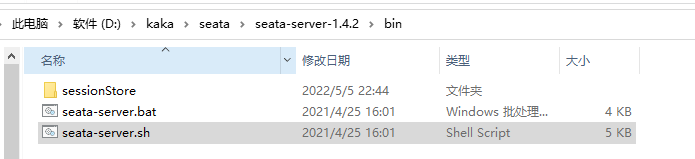
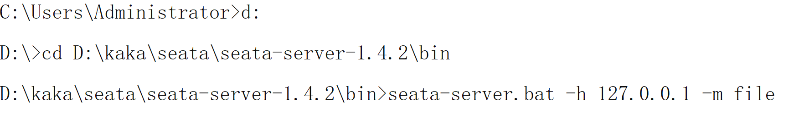
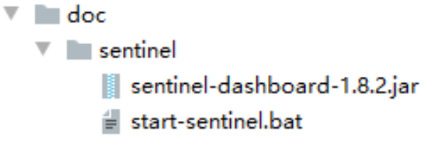

# 续Dubbo

## 修改order模块

上次课完成了cart和stock模块的修改

下面修改order模块

大体操作一致

只是csmall-order-webapi项目pom文件需要添加stock和cart的业务逻辑层依赖

```xml
<!--   Dubbo依赖     -->
<dependency>
    <groupId>com.alibaba.cloud</groupId>
    <artifactId>spring-cloud-starter-dubbo</artifactId>
</dependency>
<dependency>
    <groupId>cn.tedu</groupId>
    <artifactId>csmall-order-service</artifactId>
    <version>0.0.1-SNAPSHOT</version>
</dependency>
<!-- 因为order模块要调用stock和cart的功能  -->
<!-- 所以我们要添加stock和cart的业务逻辑层接口项目(service)的依赖  -->
<dependency>
    <groupId>cn.tedu</groupId>
    <artifactId>csmall-cart-service</artifactId>
    <version>0.0.1-SNAPSHOT</version>
</dependency>
<dependency>
    <groupId>cn.tedu</groupId>
    <artifactId>csmall-stock-service</artifactId>
    <version>0.0.1-SNAPSHOT</version>
</dependency>
```

还有就是业务逻辑层的实现有修改

之前order模块只是单纯的添加订单信息到数据库

现在我们要在添加订单到数据库之前先删除库存和购物车中的信息

```java
@DubboService
@Service
@Slf4j
public class OrderServiceImpl implements IOrderService {
    @Autowired
    private OrderMapper orderMapper;
    // 当前业务逻辑层要调用库存模块的减少库存方法
    @DubboReference
    private IStockService dubboStockService;
    // 当前业务逻辑层要调用购物车模块的删除购物车中商品的方法
    @DubboReference
    private ICartService dubboCartService;

    @Override
    public void orderAdd(OrderAddDTO orderAddDTO) {
        // 这里新增订单要先减少库存(要调用stock项目的方法)
        // dubbo远程调用,减少库存
        // 实例化减少库存需要的对象
        StockReduceCountDTO stockReduceCountDTO=new StockReduceCountDTO();
        // 赋值减少库存数
        stockReduceCountDTO.setReduceCount(orderAddDTO.getCount());
        // 赋值减少商品编号
        stockReduceCountDTO.setCommodityCode(orderAddDTO.getCommodityCode());
        // 执行减少库存
        dubboStockService.reduceCommodityCount(stockReduceCountDTO);
        // 再删除购物车中的商品(要调用cart项目的方法)
        dubboCartService.deleteUserCart(orderAddDTO.getUserId(),
                                        orderAddDTO.getCommodityCode());
        // 实例化订单对象
        Order order=new Order();
        // 同名属性复制
        BeanUtils.copyProperties(orderAddDTO,order);
        orderMapper.insertOrder(order);
        log.info("新增订单完成!{}",order);
    }
}
```

别忘了添加@EnableDubbo

```java
@SpringBootApplication
// ↓↓↓↓↓↓↓↓↓↓↓↓
@EnableDubbo
public class CsmallOrderWebapiApplication {

    public static void main(String[] args) {
        SpringApplication.run(CsmallOrderWebapiApplication.class, args);
    }

}
```

## business调用

business模块是整个业务的起点

它是单纯的服务的消费者,所以不需要再创建两个子项目了

只需要添加dubbo依赖调用order的业务逻辑层方法即可

```xml
<!--  Dubbo依赖 -->
<dependency>
    <groupId>com.alibaba.cloud</groupId>
    <artifactId>spring-cloud-starter-dubbo</artifactId>
</dependency>
<dependency>
    <groupId>cn.tedu</groupId>
    <artifactId>csmall-order-service</artifactId>
    <version>0.0.1-SNAPSHOT</version>
</dependency>
```

application-dev.yml

```yml
spring:
  application:
    name: nacos-business # 定义当前服务名称
  cloud:
    nacos:
      discovery:
        server-addr: localhost:8848 # 指定正在运行的Nacos服务器的位置
dubbo:
  protocol:
    port: -1  # 设置dubbo服务调用的端口 设置-1表示自动生成,生成规则是从20880开始递增
    name: dubbo  # 端口名称固定dubbo即可
  registry:
    address: nacos://localhost:8848  # 表示当前Dubbo的注册中心类型是Nacos,地址是后面的内容
  consumer:
    check: false # 设置false表示服务启动时,不检查标定的可调用的远程服务是否存在,避免报错
```

在business模块的业务逻辑层调用order的添加订单的方法

BusinessServiceImpl修改代码如下

```java
@Service
@Slf4j
public class BusinessServiceImpl implements IBusinessService {

    @DubboReference
    private IOrderService dubboOrderService;

    @Override
    public void buy() {

        OrderAddDTO orderAddDTO=new OrderAddDTO();
        orderAddDTO.setCommodityCode("PC100");
        orderAddDTO.setUserId("UU100");
        orderAddDTO.setCount(5);
        orderAddDTO.setMoney(500);
        log.info("要新增的订单信息为:{}",orderAddDTO);
        // 远程调用新增订单的方法
        dubboOrderService.orderAdd(orderAddDTO);
    }
}
```

别忘了添加@EnableDubbo

```java
@SpringBootApplication
//  ↓↓↓↓↓↓↓↓↓↓
@EnableDubbo
public class CsmallBusinessApplication {

    public static void main(String[] args) {
        SpringApplication.run(CsmallBusinessApplication.class, args);
    }

}
```

启动所有4个项目

进入20000端口测试business模块发起业务调用

如果能够顺利新增订单,表示一切ok

# Seata概述

## 什么是Seata

Seata官方文档

https://seata.io/zh-cn/

是阿里巴巴提供的SpringCloud组件

Seata 是一款开源的分布式事务解决方案，致力于在微服务架构下提供高性能和简单易用的分布式事务服务

## 为什么需要Seata

> 事务的4个特性:ACID特性

* 原子性
* 一致性
* 隔离性
* 永久性

其中最重要的原子性能保证整体业务运行中所有操作要么都成功,要么都失败

分布式事务和之前学习的Spring声明式事务不同

它不是一个项目的数据库操作,所以不能简单的通过一个数据库事务就完成

每个项目都有自己的数据库事务,那么要想在多个事务的提交过程中再添加支持他们事务就需要Seata

**Seata将为用户提供了 AT、TCC、SAGA 和 XA 事务模式,为用户打造一站式的分布式解决方案。**

## Seata的运行原理

这里以AT模式为例讲解原理


上面的结构和我们的课程中类似,可以方便理解

当account操作失败时,要让已经操作完成的order撤销操作

也要让stroage撤销操作

不是使用分布式事务非常难以处理

Seata的At模式格式如下,来解决这个问题


Seata构成

* 事务协调器TC
* 事务管理器TM
* 资源管理器RM

AT模式运行过程

1.事务的发起方(TM)会向事务协调器(TC)申请一个全局事务id,并保存

2.Seata会管理事务中所有相关的参与方的数据源,将数据操作之前和之后的镜像都保存在undo_log表中,这个表是seata框架规定的,方便提交(commit)或回滚(roll back)

3.事务的发起方(TM)会连同全局id一起通过远程调用运行资源管理器(RM)中的方法

4.资源管理器(RM)接收到全局id,并运行指定的方法,将运行的状态同步到事务协调器(TC)

5.如果运行整体没有发生异常,发起方(TM)会通过事务协调器通知所有分支,将本次事务所有对数据库的影响真正生效,

如果任何一个参与者发生异常,那么都会通知事务协调器,再由事务协调器通知有分支,根据undo_log表中保存的信息,撤销(回滚)即将正式影响数据库的数据

## 除AT模式外的其他模式简介

Seata将为用户提供了 AT、TCC、SAGA 和 XA 事务模式

AT模式只能用于数据库操作事务

如果事务中有的参与者操作的不是关系型数据库(例如操作Redis)

那么AT模式就不能生效了

**TCC模式**

这个模式可以实现对数据库之外的信息存储媒介进行回滚操作

只不过这个回滚需要我们自己编写代码

需要为每个业务编写Prepare\Commit\Rollback方法

Prepare编写常规准备,如果整个业务运行无异常运行Commit,如果有异常会自动运行Rollback

缺点是每个业务都需要编写3个对应的方法,代码有冗余,而且业务入侵量大

**SAGA模式**

一般用于修改老版本代码

不用编写像TCC模式那么多的方法

但是需要手动编写每个参与者的方向回滚的业务逻辑层代码类

开发量大

**XA 模式**

XA是适用于支持XA协议的数据库,使用的比较少

## 下载Seata

 https://github.com/seata/seata/releases

https://github.com/seata/seata/releases/download/v1.4.2/seata-server-1.4.2.zip

## 配置Seata支持

cart\stock\order模块的pom文件添加下面支持

```xml
<!--   Seata和SpringBoot整合依赖     -->
<dependency>
    <groupId>io.seata</groupId>
    <artifactId>seata-spring-boot-starter</artifactId>
</dependency>
<!--  Seata 完成分布式事务的两个相关依赖(Seata会自动使用其中的资源)  -->
<dependency>
    <groupId>com.github.pagehelper</groupId>
    <artifactId>pagehelper-spring-boot-starter</artifactId>
</dependency>
<dependency>
    <groupId>com.alibaba</groupId>
    <artifactId>fastjson</artifactId>
</dependency>
```

上述模块还要修改yml文件

application-dev.yaml

```yaml
seata:
  tx-service-group: csmall_group # 分组
  service:
    vgroup-mapping:
      csmall_group: default # 默认at模式
    grouplist: 
      default: localhost:8091
```

配置中,同一个事务的多个参与者必须在同一个名称的分组下

同时制定相同的seata-server的ip和端口

business模块配置更简单

pom文件只加一个依赖

```xml
<!--   Seata和SpringBoot整合依赖     -->
<dependency>
    <groupId>io.seata</groupId>
    <artifactId>seata-spring-boot-starter</artifactId>
</dependency>
```

application-dev.yaml和之前的一样

```yaml
seata:
  tx-service-group: csmall_group # 分组
  service:
    vgroup-mapping:
      csmall_group: default # 默认at模式
    grouplist:
      default: localhost:8091
```

当前项目模型中,business是事务的发起者

发起者组织事务开始

必须由特定的注解标记业务逻辑层方法(@GlobalTrancsational)

在这个方法运行时会激活Seata的分布式事务管理流程

```java
@Service
@Slf4j
public class BusinessServiceImpl implements IBusinessService {

    @DubboReference
    private IOrderService dubboOrderService;

    // 下面的注解是激活seata分布式事务管理 并开始运行的标记注解
    @GlobalTransactional
    @Override
    public void buy() {

        OrderAddDTO orderAddDTO=new OrderAddDTO();
        orderAddDTO.setCommodityCode("PC100");
        orderAddDTO.setUserId("UU100");
        orderAddDTO.setCount(5);
        orderAddDTO.setMoney(500);
        log.info("要新增的订单信息为:{}",orderAddDTO);
        // 远程调用新增订单的方法
        dubboOrderService.orderAdd(orderAddDTO);
        // 下面来编写代码随机抛出异常
        // 注意这个位置发生异常的话,实际上前面已经运行完毕了orderAdd方法
        // 我们需要观察随机发生异常时,各个表中的数据 是否能够回滚到方法运行之前的状态
        if(Math.random()<0.5){
            // 手动抛出自定义异常
            throw new CoolSharkServiceException(ResponseCode.INTERNAL_SERVER_ERROR,"发送随机异常");
        }
    }
}
```

## 启动Seata





启动所有4个服务

运行knife4j测试

测试business模块,如果能够运行出现成功或出现异常的提示信息

并在数据库中呈现正常运行或回滚的效果,表示一切正常

在windows系统中运行seata可能出现不稳定的情况,重启seata即可解决

# Sentinel

## 什么是Sentinel

Sentinel也是阿里巴巴提供的SpringCloud组件

Sentinel英文意思"哨兵\门卫"

随着微服务的流行，服务和服务之间的稳定性变得越来越重要。Sentinel 以流量为切入点，从流量控制、熔断降级、系统负载保护等多个维度保护服务的稳定性。

## Sentinel特征

* 丰富的应用场景

  双11,秒杀,12306抢火车票

* 完备的实时状态监控

  可以支持显示当前项目各个服务的运行和压力状态,分析出每台服务器处理的秒级别的数据

* 广泛的开源生态

  很多技术可以和Sentinel进行整合,SpringCloud,Dubbo,而且依赖少配置简单

* 完善的SPI扩展

  Sentinel支持程序设置各种自定义的规则

## 下载地址

https://github.com/alibaba/Sentinel/releases

可以直接运行发送给大家的bat文件



## 基本配置和限流效果

我们先在库存模块进行限流测试

以stock-webapi库存模块为例

添加依赖pom文件如下

```xml
<!--   Sentinel整合SpringCloud     -->
<dependency>
    <groupId>com.alibaba.cloud</groupId>
    <artifactId>spring-cloud-starter-alibaba-sentinel</artifactId>
</dependency>
```

application-dev.yml配置Sentinel支持

```yml
spring:
  application:
    name: nacos-stock # 定义当前服务名称
  cloud:
    nacos:
      discovery:
        server-addr: localhost:8848 # 指定正在运行的Nacos服务器的位置
    sentinel:
      transport:
        dashboard: localhost:8080  # Sentinel仪表台的ip:端口
        port: 8721  # 是localhost的8721 这个端口真正参与当前项目的限流措施
```

其中port: 8721这个端口号每个项目都不能一样

配置准备工作完毕

下面要使用注解标记限流的控制层方法

在stock-wenapi中的StockController类中控制器方法前添加注解

代码如下

```java
@PostMapping("/reduce/count")
@ApiOperation("商品库存减少")
// ↓↓↓↓↓↓↓↓↓↓↓↓
@SentinelResource
public JsonResult reduceCommodityCount(StockReduceCountDTO stockReduceCountDTO){
    stockService.reduceCommodityCount(stockReduceCountDTO);
    return JsonResult.ok("商品减少库存完成!");
}
```

运行控制器方法之后

Sentinel的仪表台就能设置这个控制方法的限流规则了

QPS是每秒请求数

并发线程数是同时方法这个方法的线程数量

超出的部分都会被Sentinel限流,快速失败


# 单词

Reference:引用

A(Application)P(Programma)I(Interface)

S(Sentinel)P(Programma)I(Interface)


