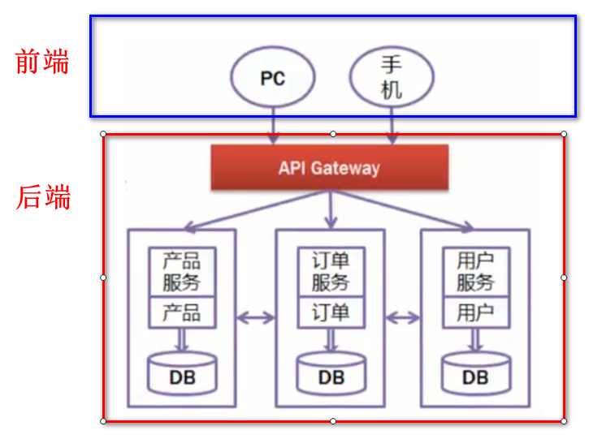
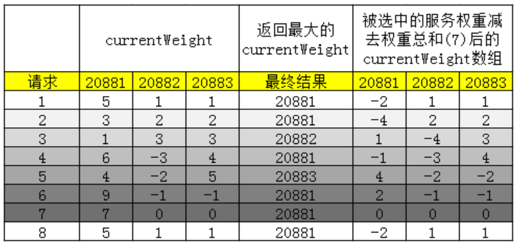
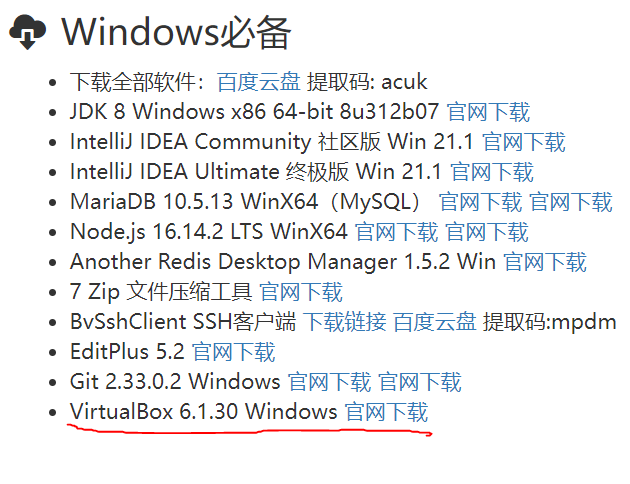
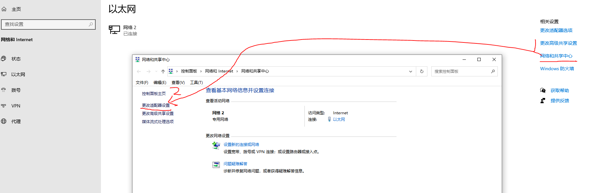
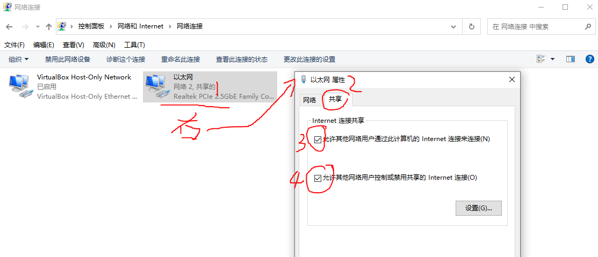

# 续 Sentinel

## 流控与降级

上次课我们实现了流控

但是在被流控时,没有对应的提示

我们可以在控制器方法中,按照固定格式给出被限流请求的提示信息

除此之外

Sentinel还支持服务降级

具体写法如下

StockController

```java
@RestController
@RequestMapping("/base/stock")
@Api(tags="库存模块")
public class StockController {
    @Autowired
    private IStockService stockService;

    @PostMapping("/reduce/count")
    @ApiOperation("商品库存减少")
    // 标记当前控制层方法被Sentinel管理限流
    // blockHandler配置当请求被限流时 运行哪个方法
    // fallback配置当控制器方法运行异常时,运行哪个方法
    @SentinelResource(value = "reduceCommodityCount",
            blockHandler = "blockError",fallback = "fallbackError")
    public JsonResult reduceCommodityCount(StockReduceCountDTO stockReduceCountDTO){
        stockService.reduceCommodityCount(stockReduceCountDTO);
        if(Math.random()<0.5){
            throw new CoolSharkServiceException(ResponseCode.INTERNAL_SERVER_ERROR,"随机异常");
        }
        return JsonResult.ok("商品减少库存完成!");
    }
    //  Sentinel规定的限流相应的方法有如下要求
    //  1.必须是public的方法
    //  2.返回值类型必须和控制器方法一致
    //  3.参数必须在控制方法的一样的前提下,在参数列表最后添加一个BlockException
    //  4.方法名必须和上面blockHandler指定的一致
    public JsonResult blockError(StockReduceCountDTO stockReduceCountDTO,
                                 BlockException e){
        return JsonResult.failed(ResponseCode.BAD_REQUEST,"服务器繁忙,请稍后再试");
    }
    // 当控制器方法运行发送异常时,Sentinel支持服务降级
    // 我们可以在这个方法中对用户的请求进行一些补救
    // 方法格式和上面限流方法一致,只是不必须添加BlockException参数
    public JsonResult fallbackError(StockReduceCountDTO stockReduceCountDTO){
        return JsonResult.failed(ResponseCode.BAD_REQUEST,"库存修改失败,可降级");
    }
}
```

**blockHandler**

- 属性值是流控后调用的方法名称
- 流控处理方法返回值和资源方法返回值一致
- 流控处理方法参数和资源方法一致的同时,可以接收额外参数BlockException
- 流控处理方法一定要在资源方法同一个类内,如果不在同一个类,使用blockHandlerClass属性

**fallback**

- 属性值是降级处理方法名称
- 降级处理方法返回值和资源方法返回值一致
- 降级处理方法参数和资源方法一致的同时,可以接收额外参数BlockException
- 降级处理方法一定要在资源方法同一个类内,如果不在同一个类,使用fallbackClass属性

**blockHandler和fallback的区别**

两者都是不能正常调用资源返回值的顶替处理逻辑.

blockHander只能处理BlockException 流控限制之后的逻辑.

fallback处理的是资源调用异常的降级逻辑.

**business模块流控和降级**

首先添加pom文件依赖

```xml
<!--   Sentinel整合SpringCloud     -->
<dependency>
    <groupId>com.alibaba.cloud</groupId>
    <artifactId>spring-cloud-starter-alibaba-sentinel</artifactId>
</dependency>
```

再添加yml配置

```yaml
spring:
  application:
    name: nacos-business # 定义当前服务名称
  cloud:
    nacos:
      discovery:
        server-addr: localhost:8848 # 指定正在运行的Nacos服务器的位置
    sentinel:
      transport:
        dashboard: localhost:8080  # Sentinel仪表台的ip:端口
        port: 8722  # 是localhost的8722 这个端口真正参与当前项目的限流措施
```

注意端口号修改为8722,不能和别的项目冲突

控制器代码修改

```java
@RestController
@RequestMapping("/base/business")
@Api(tags = "购买业务开始模块")
public class BusinessController {

    @Autowired
    private IBusinessService businessService;

    @PostMapping("/buy") //    localhost:20000/base/business/buy
    @ApiOperation("发起购买")
    @SentinelResource(value = "buy",
                blockHandler = "blockError",fallback = "fallbackError")
    public JsonResult buy(){
        //  调用业务逻辑层方法,业务逻辑层方法没有返回值
        businessService.buy();
        return JsonResult.ok("购买完成");
    }
    public JsonResult blockError(BlockException e){
        return JsonResult.failed(ResponseCode.BAD_REQUEST,"服务器忙!");
    }
    public JsonResult fallbackError(){
        return JsonResult.failed(ResponseCode.BAD_REQUEST,"服务降级");
    }


}
```

启动各个服务

打开Sentinel仪表台,设置限流后观察运行效果

# Spring Gateway 网关

## 奈非框架简介

早期奈非公司提供的框架受到了很多微服务开发者的欢迎

它提供的组件几乎包含了所有微服务架构搭建的需要

eureka注册中心(Nacos)

ribbon+feign微服务间调用(Dubbo)

hystrix流控(Sentinel)

zuul网关(Gateway)

近几年奈非公司项目更新慢,跟不上需求,所以很多开发结构转向阿里

## 什么是网关

所谓网关,就是请求到当前微服务项目,当前项目为访问者提供的统一入口

网关可以将多个项目模块微服务程序混乱的调用关系变得简单

下面的图片表示变化


右侧具有网关组件的结构更加的清晰

任何请求访问到网关,再由网关分析路由到指定的服务器运行

路由的近义词就是"分配"

## Spring Gateway简介 

我们使用SpringGateway作为当前项目的网关组件

Spring Gateway是Spring自己开发的,也是SpringCloud中的组件之一

我们可以在Spring官网找到Gateway,看到最新信息

https://docs.spring.io/spring-cloud-gateway/docs/current/reference/html/

## 简单网关演示

git获得项目

https://gitee.com/jtzhanghl/gateway-demo.git

保证Nacos正常运行的前提下

启动beijing和shanghai项目

输入路径测试:http://localhost:9002/sh/show

能够显示表示服务启动成功

下面要完成路由配置

gateway项目yml文件添加配置如下

```yml
server:
  port: 9000
spring:
  application:
    name: gateway
  cloud:
    nacos:
      discovery:
        server-addr: localhost:8848
    gateway:
      routes:   # gateway配置路由信息开始
        # spring.cloud.gateway.routes[0].predicates[0]
        - id: gateway-shanghai
          uri: lb://shanghai
          predicates:
            - Path=/sh/**
        - id: gateway-beijing # 设置路由的id,和其他任何名称没有关联,只是不能和其他路由id重名即可
          # uri表示设置路由的目标
          # lb是LoadBalance(负载均衡)的缩写 beijing是注册到nacos的服务名称
          uri: lb://beijing
          # predicates是断言 所谓断言就是判断一个条件,如果满足的话就做某些指定的操作
          predicates:
            # Path表示判断是否满足路径条件,如果访问当前网关项目的路径是/bj/**,
            # name本次访问网关的路由目标就是uri指定的路径
            - Path=/bj/**
            # http://localhost:9001/bj/show
```

## 内置断言

所谓断言就是判断一个条件,如果满足的话就做某些指定的操作

predicates的意思就是断言

我们前面章节中使用的Path是内置断言的一种,指定满足某些路径特征时访问某些资源

predicates参数也是支持数组的,Path只是数组的一个元素而已,我们可以添加更多其他含义的内置断言

内置断言就是SpringGateway框架提供的断言规则,他们有

* after
* before
* between
* cookie
* header
* host
* method
* path
* query
* remoteaddr

### 时间相关

after,before,between

在指定时间之前,之后,之间访问,满足这个时间条件能够访问指定资源

为了方便获得一个时间格式我们可以使用这个方法

```
ZonedDateTime.now()// 获得系统当前时间
```

判断时间必须在xxx之后

```yml
- id: gateway-shanghai
  uri: lb://shanghai
  predicates:
    - Path=/sh/**
    - After=2022-05-07T15:32:03.138+08:00[Asia/Shanghai]
```

判断时间必须在xxx之前

```yml
- id: gateway-shanghai
  uri: lb://shanghai
  predicates:
    - Path=/sh/**
    - Before=2022-05-07T15:32:03.138+08:00[Asia/Shanghai]
```

判断时间必须在xxx与xxx之间

```yml
- id: gateway-shanghai
  uri: lb://shanghai
  predicates:
    - Path=/sh/**
    - Between=2022-05-07T15:32:03.138+08:00[Asia/Shanghai],2022-05-07T15:42:03.138+08:00[Asia/Shanghai]
```

### 要求指定参数

Query断言,要求必须有指定参数才能访问指定资源

```yml
- id: gateway-shanghai
  uri: lb://shanghai
  predicates:
    - Path=/sh/**
    - Query=name
```

## Gateway过滤器

SpringGateway除了断言选项之外还提供了网关专业过滤器

在请求经过网关是,对请求进行一些操作

filters是添加过滤器的属性,也是支持数组赋值的

我们下面尝试一个将请求中添加参数信息的过滤器

```yml
- id: gateway-shanghai
  uri: lb://shanghai
  predicates:
    - Path=/sh/**
  filters:
    - AddRequestParameter=age,18
```

在shanghai项目的Controller中获得这个参数

```java
@GetMapping("/show")
public String show(Integer age){

    return "这里是上海！"+age;
}
```

重启网关和shanghai的服务

通过网关访问shanghai的控制器方法,就能输出参数信息了!

其他内置过滤器和自定义过滤器的使用,同学们可以查阅相关文档自己了解

## 动态路由

如果一个微服务项目有很多模块

每个模块都手动配置路由规则的话,随着模块的增加,工作量也会越来越大

今后对这个路由配置文件的维护会非常的麻烦

我们希望SpringGateway能够自动的,动态的从Nacos中获得当前注册到微服务项目的模块

无需配置文件,给定固定格式就可以路由到这个模块

这就是动态路由配置

它的配置非常简单

```yaml
server:
  port: 9000
spring:
  application:
    name: gateway
  cloud:
    nacos:
      discovery:
        server-addr: localhost:8848
    gateway:
      discovery:
        locator:
          # 开启动态路由,网关会自动从Nacos注册列表中寻找指定的服务器名称,路由到该项目
          enabled: true
```

localhost:9000/[服务名称]/bj/show

# 开发csmall网关

## 创建gateway网关项目

先父子相认

删除test文件夹

pom文件

```xml
<?xml version="1.0" encoding="UTF-8"?>
<project xmlns="http://maven.apache.org/POM/4.0.0" xmlns:xsi="http://www.w3.org/2001/XMLSchema-instance"
         xsi:schemaLocation="http://maven.apache.org/POM/4.0.0 https://maven.apache.org/xsd/maven-4.0.0.xsd">
    <modelVersion>4.0.0</modelVersion>
    <parent>
        <groupId>cn.tedu</groupId>
        <artifactId>csmall</artifactId>
        <version>0.0.1-SNAPSHOT</version>
    </parent>
    <groupId>cn.tedu</groupId>
    <artifactId>gateway</artifactId>
    <version>0.0.1-SNAPSHOT</version>
    <name>gateway</name>
    <description>Demo project for Spring Boot</description>
    <dependencies>
        <!-- web实例 -->
        <dependency>
            <groupId>org.springframework.boot</groupId>
            <artifactId>spring-boot-starter-web</artifactId>
        </dependency>
        <!--  Nacos注册依赖 -->
        <dependency>
            <groupId>com.alibaba.cloud</groupId>
            <artifactId>spring-cloud-starter-alibaba-nacos-discovery</artifactId>
        </dependency>
        <dependency>
            <groupId>org.springframework.cloud</groupId>
            <artifactId>spring-cloud-starter-gateway</artifactId>
        </dependency>
        <dependency>
            <groupId>org.springframework.cloud</groupId>
            <artifactId>spring-cloud-starter-loadbalancer</artifactId>
        </dependency>
        <dependency>
            <groupId>com.github.xiaoymin</groupId>
            <artifactId>knife4j-spring-boot-starter</artifactId>
        </dependency>
    </dependencies>

</project>
```

yml文件配置

```yaml
server:
  port: 10000
spring:
  application:
    name: gateway-server
  cloud:
    nacos:
      discovery:
        server-addr: localhost:8848
    gateway:
      discovery:
        locator:
          # 网关开启动态路由
          enabled: true
  main:
    web-application-type: reactive
```

cn.tedu.gateway.config

SwaggerProvider类

```java
@Component
public class SwaggerProvider implements SwaggerResourcesProvider {
    /**
     * 接口地址
     */
    public static final String API_URI = "/v2/api-docs";
    /**
     * 路由加载器
     */
    @Autowired
    private RouteLocator routeLocator;
    /**
     * 网关应用名称
     */
    @Value("${spring.application.name}")
    private String applicationName;

    @Override
    public List<SwaggerResource> get() {
        //接口资源列表
        List<SwaggerResource> resources = new ArrayList<>();
        //服务名称列表
        List<String> routeHosts = new ArrayList<>();
        // 获取所有可用的应用名称
        routeLocator.getRoutes().filter(route -> route.getUri().getHost() != null)
                .filter(route -> !applicationName.equals(route.getUri().getHost()))
                .subscribe(route -> routeHosts.add(route.getUri().getHost()));
        // 去重，多负载服务只添加一次
        Set<String> existsServer = new HashSet<>();
        routeHosts.forEach(host -> {
            // 拼接url
            String url = "/" + host + API_URI;
            //不存在则添加
            if (!existsServer.contains(url)) {
                existsServer.add(url);
                SwaggerResource swaggerResource = new SwaggerResource();
                swaggerResource.setUrl(url);
                swaggerResource.setName(host);
                resources.add(swaggerResource);
            }
        });
        return resources;
    }
}
```

cn.tedu.gateway.controller

SwaggerController类

```java
@RestController
@RequestMapping("/swagger-resources")
public class SwaggerController {
    @Autowired(required = false)
    private SecurityConfiguration securityConfiguration;
    @Autowired(required = false)
    private UiConfiguration uiConfiguration;
    private final SwaggerResourcesProvider swaggerResources;
    @Autowired
    public SwaggerController(SwaggerResourcesProvider swaggerResources) {
        this.swaggerResources = swaggerResources;
    }
    @GetMapping("/configuration/security")
    public Mono<ResponseEntity<SecurityConfiguration>> securityConfiguration() {
        return Mono.just(new ResponseEntity<>(
                Optional.ofNullable(securityConfiguration).orElse(SecurityConfigurationBuilder.builder().build()), HttpStatus.OK));
    }
    @GetMapping("/configuration/ui")
    public Mono<ResponseEntity<UiConfiguration>> uiConfiguration() {
        return Mono.just(new ResponseEntity<>(
                Optional.ofNullable(uiConfiguration).orElse(UiConfigurationBuilder.builder().build()), HttpStatus.OK));
    }
    @GetMapping("")
    public Mono<ResponseEntity> swaggerResources() {
        return Mono.just((new ResponseEntity<>(swaggerResources.get(), HttpStatus.OK)));
    }
}
```

cn.tedu.gateway.filter

SwaggerHeaderFilter类

```java
@Component
public class SwaggerHeaderFilter extends AbstractGatewayFilterFactory {
    private static final String HEADER_NAME = "X-Forwarded-Prefix";

    private static final String URI = "/v2/api-docs";

    @Override
    public GatewayFilter apply(Object config) {
        return (exchange, chain) -> {
            ServerHttpRequest request = exchange.getRequest();
            String path = request.getURI().getPath();
            if (!StringUtils.endsWithIgnoreCase(path,URI )) {
                return chain.filter(exchange);
            }
            String basePath = path.substring(0, path.lastIndexOf(URI));
            ServerHttpRequest newRequest = request.mutate().header(HEADER_NAME, basePath).build();
            ServerWebExchange newExchange = exchange.mutate().request(newRequest).build();
            return chain.filter(newExchange);
        };
    }
}
```

启动所有服务

应该最后启动网关项目

然后可以通过下面的路径访问各个knife4j页面

http://localhost:9000/nacos-cart/doc.html

http://localhost:9000/nacos-order/doc.html

http://localhost:9000/nacos-business/doc.html

http://localhost:9000/nacos-stock/doc.html

如果有各种报错先重启所有服务包括seata,Sentinel等

然后可以先使用之前的路径测试

如果之前的测试没有问题,使用网关就有问题,就是网关项目的配置问题


## SpringMvc和SpringGateway冲突问题

我们常用的依赖

```xml
<!-- web实例 -->
<dependency>
    <groupId>org.springframework.boot</groupId>
    <artifactId>spring-boot-starter-web</artifactId>
</dependency>
```

和

```xml
<dependency>
    <groupId>org.springframework.cloud</groupId>
    <artifactId>spring-cloud-starter-gateway</artifactId>
</dependency>
```

默认是冲突的

原因是SpringMvc依赖自带了Tomcat服务器

而SpringGateway依赖自带了Netty服务器

当项目启动时,会两个服务器软件就冲突了

导致错误

我们可以在yml文件中添加下面配置解决

```yml
spring:
  main:
    web-application-type: reactive
```


# 负载均衡



## 负载均衡基本概念

要让集群中的服务器按照最合适的比例运行访问者的请求

所谓的合适比例,每个服务器都忙而不乱

因为服务器的性能不可能都一样,所以可以根据测试结果为每个服务器分配不同的权重

我们之前学习的网关有负载均衡

我们之前学习的Dubbo内置了负载均衡

这些算法都是封装在框架中的,我们不需要会编写,但是最好了解基本思路

## 策略算法

以Dubbo包含的负载均衡算法为例,我们简单了解一下

Dubbo内置4种负载均衡算法

* **randomloadbalance:随机分配策略(默认)**

* roundRobinLoadbalance:权重平均分配
* leastactiveLoadbalance:活跃度自动感知分配
* consistanthashLoadbalance:一致性hash算法分配

### 随机分配策略


随机生成一个数字,这个数字在哪个区域内,负责这个区域的服务器运行

大数据量下,可以实现较为平均的分配

但是容易出现小概率连续的请求随机到一台性能弱的服务器上,导致服务崩溃

### 权重平均分配

早期Dubbo2.6.4之前按照权重的分配连续运行,有性能问题的

现在Dubbo2.7之后的版本更新的"**平滑加权算法**"优化了这个算法



## 活跃度自动感知分配

自动记录运行时间,按运行时间比例分配任务数,

如果服务器运行一个业务时间长,那么负载均衡会向这个服务器发送更少的请求

## 一致性hash算法

根据参数信息进行hash运算

以后每个相同的hash值都会指定固定的服务器

也可以根据权重调整每台服务器负载的请求数量


# 虚拟机

doc.canglaoshi.org



安装过程正常

配置网络共享






