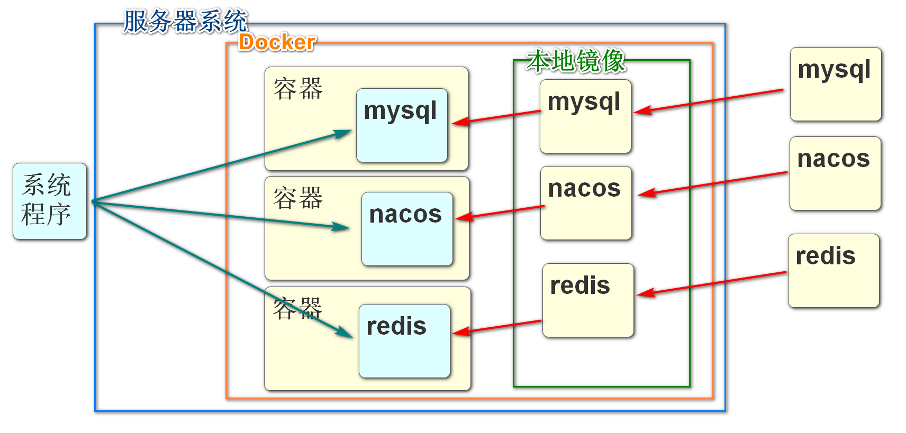

# 虚拟机镜像加载和配置

解压RockyLinux_8.5_VBM.7z

获得1.78GB的文件及

打开这个文件夹


双击蓝色图标

会自动开启virtualbox虚拟机,并加载当前镜像

必须保证当前镜像文件所在全部路径都没有中文

选中镜像,点击设置

修改usb设置


设置网络桥连


# 启动虚拟机

上面配置完成之后

可以启动虚拟机

启动虚拟机之后,等待出现登录页面

用户名密码默认都是rockylinux

登录之后,我们的用户是rockylinux用户

这个用户并不是系统最高权限的用户

我们需要登录系统最高权限的用户root才能畅通无阻的配置和安装系统软件

输入

```
sudo su -
```

就能切换到root用户

然后为root用户设置一个密码,方便今后登录

```
passwd
```

可以进入设置密码的流程

设置完成之后,我们尝试连接网络

```
ping www.baidu.com
```

如果能够有周期响应表示当前虚拟机可以使用网络

如果没有响应,尝试重新调整网卡网络共享配置和虚拟机的网卡桥接配置

虚拟机启动后,如果想使用宿主机访问,必须有一个ip地址

```
ifconfig
```

或

```
ifconfig | more 
```

分页显示

Ctrl+C可以随时退出当前运行的程序 返回到命令符

这个命令可以查看当前虚拟机网络情况

查看自己的ip

比如

```
192.168.0.125
```

记住这个ip

# 客户端连接Linux

无论是虚拟机还是实际的物理服务器

我们想远程的控制这个机器的话,都需要使用可以专门连接服务器,并向服务器发送指令的客户端

市面上有很多可以连接linux远程服务器的客户端软件

我们给大家介绍的


属于免费软件中比较易用的


输入记录的ip地址

端口号22

输入用户名

输入密码

# Docker 概述

## 什么是Docker

Docker是一个用来开发、运输和运行应用程序的开放平台。使用Docker可以将应用程序与基础结构分离，以便快速交付软件。使用Docker，您可以以管理应用程序的方式管理基础架构。通过利用Docker的方法快速传送、测试和部署代码，可以显著减少编写代码和在生产中运行代码之间的延迟。


## 为什么使用Docker

* 更快速的应用交付和部署：

传统的应用开发完成后，需要提供一堆安装程序和配置说明文档，安装部署后需根据配置文档进行繁杂的配置才能正常运行。Docker化之后只需要交付少量容器镜像文件，在正式生产环境加载镜像并运行即可，应用安装配置在镜像里已经内置好，大大节省部署配置和测试验证时间。

* 更便捷的升级和扩缩容：

随着微服务架构和Docker的发展，大量的应用会通过微服务方式架构，应用的开发构建将变成搭乐高积木一样，每个Docker容器将变成一块“积木”，应用的升级将变得非常容易。当现有的容器不足以支撑业务处理时，可通过镜像运行新的容器进行快速扩容，使应用系统的扩容从原先的天级变成分钟级甚至秒级。

* 更简单的系统运维：

应用容器化运行后，生产环境运行的应用可与开发、测试环境的应用高度一致，容器会将应用程序相关的环境和状态完全封装起来，不会因为底层基础架构和操作系统的不一致性给应用带来影响，产生新的BUG。当出现程序异常时，也可以通过测试环境的相同容器进行快速定位和修复。

* 更高效的计算资源利用：

Docker是内核级虚拟化，其不像传统的虚拟化技术一样需要额外的Hypervisor [管理程序] 支持，所以在一台物理机上可以运行很多个容器实例，可大大提升物理服务器的CPU和内存的利用率。



## Docker相关资料

Docker官网：http://www.docker.com

Docker Hub官网（镜像仓库）：https://hub.docker.com

所有步骤，均参考官方文档：https://docs.docker.com/engine/install/centos/

安装docker

* 设置docker仓库，并且从仓库安装所需内容。
* 下载RPM安装包，手动更新安装。
* 为测试和开发环境使用自定义脚本安装。

三种方式中,从仓库安装是最简单的

但是需要虚拟机有网络环境

我们使用的rockylinux支持yum命令

> yum命令就像手机中的应用商店一样

安装yum-utils包,实现方便的安装各种"应用商店"中包含的程序

```
yum install -y yum-utils
```

指定docker仓库路径

```
yum-config-manager \
    --add-repo \
    https://download.docker.com/linux/centos/docker-ce.repo
```

## 安装\启动Docker引擎

上面的准备工作完成,下面开始安装Docker环境

也是使用yum命令

```
yum -y install docker-ce docker-ce-cli containerd.io
```

运行后,当前linux系统就具备了启动Docker的环境

使用下面的命令启动Docker

```
systemctl start docker
```

## 测试Docker

Docker软件有一个专用的测试镜像

```
docker run hello-world
```

看到下面的信息

> Hello from Docker!
> This message shows that your installation appears to be working correctly.

表示docker一切正常

## docker名词解释

* 容器（container）

首先需要了解什么是容器，容器就是一个进程，内部是独立运行的一个或者是一组应用。它可以被启动、开始、停止、删除。每个容器都是相互隔离的，保证安全的平台。

* 镜像（image）

镜像（Image）就是一个只读的模板文件。镜像可以用来创建 Docker 容器，一个镜像可以创建很多容器。 就好似 Java 中的 类和对象，类就是镜像，容器就是对象！也可以把镜像看成是模具，而镜像创建出来的容器就是通过这个模具创建的一个一个的实际产品。

* 宿主机（host）

宿主机就是我们调用命令使用镜像创建容器的服务器。

* 镜像仓库（repository）

一个用来容纳多个镜像的仓库，可以链接仓库获取你想要的内部镜像，一般一个镜像仓库中包含多个不同tag的镜像。

* 镜像服务器（registry）

镜像仓库占用的服务器，这里注意一个镜像服务器未必只有一个仓库，可以有很多仓库，每个仓库又保管的是不同镜像。

* 客户端（docker-client）

调用docker命令，操作镜像，容器的进程。只要能链接宿主机，操作docker的进程都是docker-client。

# Docker基础命令

## Docker命令格式

Docker命令的语法结构

```
docker 子命令 [选项]
```

docker都有哪些子命令呢,我们可以使用docker的helper子命令查看

```
docker --help
```

如果想查询具体的子命令的使用方式

```
docker 子命令 --help
```

我们最常用的子命令之一:启动docker容器的run的相关帮助可以

```
docker run --help
```

当然也可以吃查询官方文档或百度了解更多内容

https://docs.docker.com/reference/

## images命令

docker images命令主要能完成查看当前本地镜像库的内容

```
docker images
```

这个命令的返回结果显示：

* REPOSITORY:镜像仓库名，也叫作镜像名。
* TAG：标签，常用版本号标识仓库，如果是latest就是最新版本。
* IMAGE ID：镜像id。
* CREATED:创建镜像时间。
* SIZE:大小。

调用docker images的常用选项如下：

* -a：显示所有信息。

* -q：只显示镜像id，这个在批量操作镜像文件时比较常见

## search命令

我们在从网络中拉去镜像之前,需要先搜索正确的镜像名称

借助search命令

```
docker search mysql
```

这个命令的返回结果显示：

* NAME:镜像名称。

* DESCRIPTION:镜像描述。

* STARS：镜像星级，越高表示越热，使用人越多。

* OFFICIAL:是否官方镜像。

* AUTOMATED：是否支持自动化部署。

## pull命令

当我们搜索到想要下载拉取的镜像后

就可以使用pull命令,从镜像服务器下载拉取镜像到本地仓库

```
docker pull mysql
```

下载默认是最新版本

如果想指定版本号(版本号官方文档可查)

```
docker pull mysql:5.7.35
```

## rmi命令

当本地系统中的镜像较多时,可以删除不适用的镜像,节省空间

使用rmi命令,删除时指定的是镜像id

所以一般都会先使用docker images查看要删除的镜像id 然后复制

```
docker rmi feb5d9fea6a5
```

删除运行中的镜像会报错 如果需要强制删除这个镜像加-f选项

```
docker rmi feb5d9fea6a5 -f
```

rmi命令的选项：

* -f:强制删除这个镜像，无论是否正在使用。

## run命令

docker run 可以指定本地仓库的镜像文件启动,创建新的容器然后运行

要注意一个镜像是可以创建多个容器启动,然后运行的

```
docker run --name mysql -d -p 3306:3306 -e MYSQL_ROOT_PASSWORD=123456 -v /root/data:/var/lib/mysql mysql:5.7.35
```

1: --name mysql:该容器启动后的名字：（自定义命名）如果没有设置，系统会自动设置一个，毕竟如果开启太多的容器，记不住就很尴尬，建议加上见名知意。

2：-d 代表后台启动该服务

3：-p 3306(这是liunx的端口号，我习惯说成宿主机，如果我们想要远程服务的话，访问的端口就是这个端口):3306（docker容器的端口，每一个容器都是独立的，可理解成操作系统层面的系统），访问这个端口就是先通过远程访问宿主机的端口，再映射到docker容器的端口访问mysql。

4：-e MYSQL_ROOT_PASSWORD=123456  这是说mysql启动需要的开机密码，默认的账号是root ，密码就是上面设置的：123456

5：-v  /root/data:/var/lib/mysql  /root/data/:这是宿主机的数据存放路径（你也可以自定义），   /var/lib/mysql:这是mysql容器存放数据的地方。也是为了同步数据，防止，容器被删除以后，数据就不存在了。

6：启动成功后就返回一个容器ID

## ps命令

当容器启动后,我们在宿主机输入docker ps可以查看当前正在运行的容器列表

```
docker ps
```

* container id：容器id，很多操作容器命令都需要用到的参数。

* image：容器创建使用的镜像。

* command：容器中在运行的进程或者命令。

* created：创建时间。

* status：容器状态。

* ports：容器的端口映射情况，这里没有用到端口。

* names：容器的名字，启动没有指定--name选项，会默认使用一个名字。

**ps命令中常见的选项如下：**

* -a：显示所有容器，如果不加只显示正在启动运行的容器，停止的不会显示。
* -l：显示最近的启动创建的容器。
* -n=[数字]：显示最近n个容器。
* -q：只显示容器id。经常和-a一起使用，获得当前宿主机所有容器id参数集合。

## stop\rm命令

当前正在启动的容器如果想停止就使用stop命令

如果想删除容器,就stop命令停止之后执行rm命令

注意:**这里rm删除的是容器,不是本地镜像,和rmi命令要区分**

首先使用docker ps命令查询所有正在运行的容器

```
docker stop [容器id]
```

```
docker rm [容器id]
```

rm的选项有：

-f:强制删除容器，无论是否运行，如果不加，运行的容器无法删除。


课堂作业 自己安装运行一个redis


```
docker run -itd --name redis-test -p 6379:6379 redis
```

```
docker exec -it redis redis-cli
```


# Elasticsearch概述

## 什么是Elasticsearch

elastic:富有弹性的

search:搜索

简称ES

也是一个由java开发的软件

它不是微服务的组件,和Springcloud无关,单体项目也能使用

是一个能够高效的实现从大量数据中根据关键字检索出结果的数据库软件

本质上,启动这个软件就是启动了一个java项目

我们要操作这个软件就是向这个项目发送各种请求,(访问这个项目的控制器)

这个项目会根据我们请求的url来调用不同接口实现对数据库的增删改查

ES也是将数据保存在硬盘上的

## Elasticsearch特点

Elasticsearch软件是一个基于Lucene开发的一个搜索引擎软件

Lucene是一个提供了搜索引擎核心功能的API

我们要操作的Elasticsearch相当于一个使用Lucene做CPU的计算机

市面上Elasticsearch是一个相对功能强大性能优秀的全文搜索引擎

和它功能类似的软件还有

solr/MongoDB

## 为什么需要Elasticsearch

我们之前查询都依靠mysql(oracle/sqlserver/mariadb/DB2)这样的关系型数据库

关系型数据库查询的效率有一个非常不理想的情况

就是带前模糊条件的模糊查询

```sql
select * from spu where spn_name like '%鼠标%'
```

测试证明一个**一张千万级别的数据库表,进行一次模糊查询需要20秒以上**

这样的查询速度是当今"三高要求"互联网项目不能接受的

那么我们就需要使用Elasticsearch对这样的模糊查询进行优化

使用Elasticsearch进行同样的查询,效率能够提高100倍


