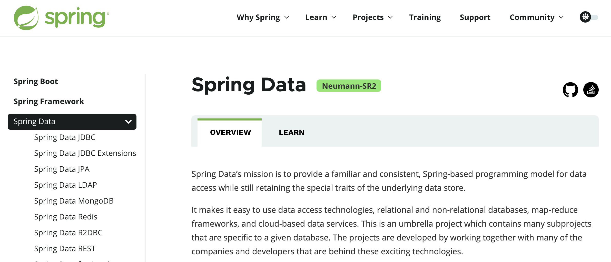

# 续Elasticsearch

## 数据库索引的缺点

我们使用的关系型数据库可以高效的在大部分情况下执行查询

高效查询的条件是查询的列有"索引"

数据库索引分类

* **聚集索引**

* **非聚集索引**

聚集索引就是id(主键),聚集索引就是保存数据的物理顺序的依据,所以按照物理顺序查询数据是非常快的

非聚集索引就是创建表后建立的索引了

例如一个表中如果有姓名列

我们为姓名列创建索引

在查询姓名为"张三"的人时,查询可以使用索引,查询速度快

但是如果没有创建姓名列的索引,查询"张三"数据库会逐行查询,

会引起"全表搜索"查询效率非常低

> 使用索引的规则和注意事项
>
> 1. 索引会占用数据库空间
> 2. 对数据进行增删改操作,会引起索引的更新,效率会低
> 3. 一般情况下要先添加好数据,最后在创建索引
> 4. 不要对数据样本较少的列添加索引
> 5. 如果经常运行的查询语句查询的数量较多,索引的效果会下降
> 6. 查询时where语句后先跟有索引的列

但是模糊查询(前面条件是模糊的)是不能启用索引查询的

所以一定会引起逐行搜索.全表搜索效率非常低

## Elasticsearch查询原理

* Elasticsearch是java开发的,需要java环境变量
* Elasticsearch虽然是java开发的,但是任何语言都可以使用它
* Elasticsearch也是支持分布式部署的,满足"高并发,高可用,高性能"

为什么Elasticsearch能够高效的完成模糊查询

因为ES使用分词后实现"倒排索引"

它会将一段文字中所有词汇创建在一个索引库中

查询时,搜索索引库中的词汇就能定位数据位置


Elasticsearc被称之为"全文搜索引擎"

只要具有分词后进行倒排索引后查询功能的都可以称之为"全文搜索引擎"

我们使用的网站或App中的搜索功能,几乎都是全文搜索引擎提供的功能

要实现功能需要先将数据库中所有数据复制到ES中,肯定也要占用硬盘空间,

但是能够大幅提升查询效果是值得的

## Elasticsearch的启动

官方下载链接

https://www.elastic.co/cn/downloads/past-releases#elasticsearch

我们以7.6.2版本为例

280M的压缩包解压

解压之后打开bin目录


双击运行elasticsearch.bat文件,可以启动ES


这个dos窗口不能关,一关ES就停止了

ES没有支持开机自动启动,所以每次开机都有双击bat文件启动

验证ES的工作状态

打开浏览器:localhost:9200


mac系统启动

```
tar -xvf elasticsearch-7.6.2-darwin-x86_64.tar.gz 
cd elasticsearch-7.6.2/bin 
./elasticsearch
```

linux:

```
tar -xvf elasticsearch-7.6.2-linux-x86_64.tar.gz
cd elasticsearch-7.6.2/bin
./elasticsearch
```

# ES基本使用

上面我们已经启动了ES

下面来使用它的功能

我们在csmall项目中创建一个子项目用于ES的测试

实现使用Es进行搜索

不要求创建的项目名称,课程中叫search

但是父子相认要做

search项目的pom文件

```xml
<?xml version="1.0" encoding="UTF-8"?>
<project xmlns="http://maven.apache.org/POM/4.0.0" xmlns:xsi="http://www.w3.org/2001/XMLSchema-instance"
         xsi:schemaLocation="http://maven.apache.org/POM/4.0.0 https://maven.apache.org/xsd/maven-4.0.0.xsd">
    <modelVersion>4.0.0</modelVersion>
    <parent>
        <groupId>cn.tedu</groupId>
        <artifactId>csmall</artifactId>
        <version>0.0.1-SNAPSHOT</version>
    </parent>
    <groupId>cn.tedu</groupId>
    <artifactId>search</artifactId>
    <version>0.0.1-SNAPSHOT</version>
    <name>search</name>
    <description>Demo project for Spring Boot</description>

    <dependencies>
        <dependency>
            <groupId>org.springframework.boot</groupId>
            <artifactId>spring-boot-starter</artifactId>
        </dependency>
    </dependencies>

</project>
```

下面创建一个http request文件


名字随便定,课程中es.http

这个文件中可以编写代码,向指定的ip地址和端口号发送请求

我们请求的是ES的ip和端口localhost:9200

这样的文件有一类名称http client(http客户端)

先向ES发送测试请求 localhost:9200

```json
### 是注释也是分割符,每次写命令之前都需要先编写它
GET http://localhost:9200

### ES分词测试
POST http://localhost:9200/_analyze
Content-Type: application/json

{
  "text": "我的名字是韩梅梅",
  "analyzer": "standard"
}
```


"analyzer": "standard"就是设置使用哪个分词器

默认情况下这行内容可以不写,也相当于使用这个分词器

但是这个分词器只能分词西文字符(有空格的),按照空格进行分词

但是中文是不能按空格分词的

我们需要一个安装一个插件,实现能够识别中文词汇进行分词

这个插件叫ik


安装了插件之后必须重启ES才能使用这个插件

关闭ES窗口重新打开

再次运行之前的分词代码

```json
{
  "text": "罗技激光无线游戏鼠标",
  "analyzer": "ik_smart"
}
```

再次运行,可以看到响应中包含了中文分词效果

## IK分词插件

上面已经完成了中文分词插件的安装

但是ik_smart并不是唯一的分词器

我们安装的插件还包含ik_max_word分词器,会有不同的分词效果

```json
### ES分词测试
POST http://localhost:9200/_analyze
Content-Type: application/json

{
  "text": "北京冬季奥林匹克运动会顺利闭幕",
  "analyzer": "ik_smart"
}
```

```json
### ES分词测试
POST http://localhost:9200/_analyze
Content-Type: application/json

{
  "text": "北京冬季奥林匹克运动会顺利闭幕",
  "analyzer": "ik_max_word"
}
```

分别去运行分词器,会用不同的分词结果

ik_smart:

* 优点:会粗略的将文字片段进行分词,占用空间小查询速度快
* 缺点:已经分词过的内容不会再次分词,分词粗略会导致查询不全面,

ik_max_word:

* 优点:会详情的将文字片段进行分词,查询结果全,不容易漏查
* 缺点:分词太详情导致索引库占用空间大,查询速度慢

# 使用ES操作数据

要想操作ES,必须先了解ES保存数据的结构


* ES启动后可以创建多个索引(index),index相当于数据库中表的概念
* 一个索引中可以创建保存多个文档(document)相当于数据库中行的概念
* 一个文档中的数据和数据库一行数据类型,也是有字段名称和字段的值

同学们可以直接使用提供给大家的ES命令运行观察效果

# Spring Boot操作Elasticsearch

## Spring Data简介

SpringData 是spring提供的一套连接各种第三方数据源的框架集

例如我们连接数据库(mysql)\redis\Elasticsearch等很多保存数据的软件都有提供直接可用的框架

SpringData也是一个框架集,包含很多我们连接数据源用的框架

 官方网站:https://spring.io/projects/spring-data



官网中包含了支持的各种数据源的介绍

我们使用SpringData连接这些数据源会非常简单

我们学习它主要是为了下面连接Elasticsearch使用

如果没有SpringData,我们操作ES要通过Socket发请求接响应

解析请求和响应内容非常麻烦

我们现在使用SpringData就可以了

## 添加依赖

search项目添加依赖

最终依赖为:

```xml
<dependencies>
    <dependency>
        <groupId>org.springframework.boot</groupId>
        <artifactId>spring-boot-starter</artifactId>
    </dependency>
    <dependency>
        <groupId>org.springframework.boot</groupId>
        <artifactId>spring-boot-starter-test</artifactId>
    </dependency>
    <dependency>
        <groupId>org.springframework.boot</groupId>
        <artifactId>spring-boot-starter-data-elasticsearch</artifactId>
    </dependency>
</dependencies>
```

application.properties

```properties
# 设置连接Es的ip和端口
spring.elasticsearch.rest.uris=http://localhost:9200

# ES的日志门槛级别
logging.level.cn.tedu.search=debug
logging.level.org.elasticsearch.client.RestClient=debug
```

下面开始进行测试

## 创建对应索引的实体类

ES和数据库一样

要操作ES也需要一个和ES索引中属性一致的java类,作为数据的载体

search项目中创建entity包

包中创建Item(商品)类

代码如下

```java
// 商品类
@Data
@Accessors(chain = true)
@AllArgsConstructor         // 生成全参构造
@NoArgsConstructor          // 生成无参构造
// SpringData要求我们在实体类中使用特定注解标记类和属于
// @Document注解对应ES索引名称
// 当操作这个索引时,如果索引不存在,会自动创建这个索引
@Document(indexName = "items")
public class Item implements Serializable {

    // SpringData标记当前索引主键的注解@Id
    @Id
    private Long id;  // 商品id
    // SpringData使用@Field标记文档中的属性的类型和各种特征
    @Field(type = FieldType.Text,
            analyzer = "ik_max_word",
            searchAnalyzer = "ik_max_word")
    private String title;  //商品名称
    // ES中Keyword类型的数据是不分词的字符串 Text是分词的字符串
    @Field(type = FieldType.Keyword)
    private String category;  //分类
    @Field(type = FieldType.Keyword)
    private String brand;     // 品牌
    @Field(type = FieldType.Double)
    private Double price;     // 价格
    // 图片地址不会成为搜索条件,设置index = false
    // 所以不需要将图片地址也创建索引表,能节省空间
    @Field(type = FieldType.Keyword,index = false)
    private String imgPath;   // 图片地址

    // images/hjsdf-skjhd-asjuh-xjzhjhasjkd.png


}
```

## 创建ES的持久层

我们学习的Mybatis框架能够连接数据库操作数据

现在我们使用SpringData框架连接ES操作数据

它们设计操作数据的结构类似,但是命名规范不同,我们使用SpringData的规范来创建操作Es的持久层

创建repository包

包中创建接口ItemRepository代码如下

```java
// Spring框架下持久层名称都为repository
@Repository
public interface ItemRepository extends ElasticsearchRepository<Item,Long> {
    // ElasticsearchRepository接口中包含了很多基本的增删改查方法
    // 只需要指定我们要操作的实体类,就会自动生成它们,让我们使用
    // 指定的方式是:ElasticsearchRepository<[实体类名],[实体类主键类型]>
    
}
```

## 测试操作ES

打开测试类运行测试

```java
@SpringBootTest
class SearchApplicationTests {

    // 加载SpringData生成的操作ES的持久层对象
    @Autowired
    private ItemRepository itemRepository;
    // 单增
    @Test
    void addOne() {
        Item item=new Item()
                .setId(1L)
                .setTitle("罗技激光无线游戏鼠标")
                .setCategory("鼠标")
                .setBrand("罗技")
                .setPrice(126.0)
                .setImgPath("/1.jpg");
        // 使用SpringData提供的新增到ES的方法
        itemRepository.save(item);
        System.out.println("ok");
    }
    // 按id查询
    @Test
    void getOne(){
        // SpringData框架自带根据id查询对象的方法
        // Optional是一个包装类型,能够封装从ES中查询出的结果
        Optional<Item> optional= itemRepository.findById(1L);
        // 如果需要取出这个对象,就调用get方法即可
        System.out.println(optional.get());

    }

    // 批量增
    @Test
    void addList(){
        // 实例化一个List对象
        List<Item> list=new ArrayList<>();
        // SpringData支持将一个List直接传入批量增的方法参数中,一次性将List中所有数据增到ES
        list.add(new Item(2L,"罗技激光有线办公鼠标","鼠标",
                "罗技",82.0,"/2.jpg"));
        list.add(new Item(3L,"雷蛇机械无线游戏键盘","键盘",
                "雷蛇",486.0,"/3.jpg"));
        list.add(new Item(4L,"微软有线静音办公鼠标","鼠标",
                "微软",168.0,"/4.jpg"));
        list.add(new Item(5L,"罗技有线机械背光键盘","键盘",
                "罗技",266.0,"/5.jpg"));
        // 批量新增的代码
        itemRepository.saveAll(list);
        System.out.println("ok");
    }

    // 全查
    @Test
    void getAll(){
        Iterable<Item> items=itemRepository.findAll();
        /*for(Item item:items){
            System.out.println(item);
        }*/
        items.forEach(item -> System.out.println(item));
    }
}
```

## SpringData自定义查询

SpringData框架能够提供基本的增删改查

但是要实现我们自有逻辑的查询一定需要自己编写

例如我们需要的模糊查询的编写,下面开始编写自定义查询代码

### 单条件查询

我们希望查询title属性的一个模糊查询

查询所有商品中,商品名称包含"游戏"这个分词的商品信息

> 参考:这个模糊查询的SQL
>
> ```sql
> select * from item where title like '%游戏%'
> ```

ES中不适用sql语句

SpringData怎么自定义方法呢

```java
// SpringData框架自定义查询
// 直接按照SpringData规定的格式编写方法名,无论是数据库还是Es查询逻辑代码会自动生成
// query:表示这是一个查询语句,类似sql的select
// Item\Items:表示查询的实体类型,带s返回集合
// By:开始设置条件的标识,类似sql的where
// Title:是要查询的列名
// Matches:是查询分词结果,类似sql的like
Iterable<Item> queryItemsByTitleMatches(String title);
//             select * from item where like %?%
```

测试代码

```java
// 单条件自定义查询
@Test
void queryOne(){
    // 查询title中包含"游戏"分词的Item对象
    Iterable<Item> items=itemRepository.queryItemsByTitleMatches("游戏");
    items.forEach(item -> System.out.println(item));
}
```

上面运行的查询底层运行的请求为

```json
### 单条件搜索
POST http://localhost:9200/items/_search
Content-Type: application/json

{
  "query": {"match": { "title":  "游戏" }}
}
```

### 多条件查询

在相对复杂的多个条件出现时

我们就需要定义逻辑运算"and"/"or"

在上面小结中的条件基础上添加品牌brand的属性条件

ItemRepository接口添加自定义方法

```java
// 多条件查询
// 多个条件直接直接使用And或Or进行逻辑表达
// 参数名称其实是无关的,内部是按照参数顺序赋值
Iterable<Item> queryItemsByTitleMatchesAndBrandMatches(String title,String brand);
```

测试代码

```java
// 多条件查询
@Test
void queryTwo(){
    Iterable<Item> items=itemRepository
            .queryItemsByTitleMatchesAndBrandMatches("游戏","雷蛇");
    items.forEach(item -> System.out.println(item));
}
```

底层运行的请求

```json
### 多字段搜索
POST http://localhost:9200/items/_search
Content-Type: application/json

{
  "query": {
    "bool": {
      "must": [
        { "match": { "title": "游戏"}},
        { "match": { "brand": "雷蛇"}}
      ]
    }
  }
}
```


