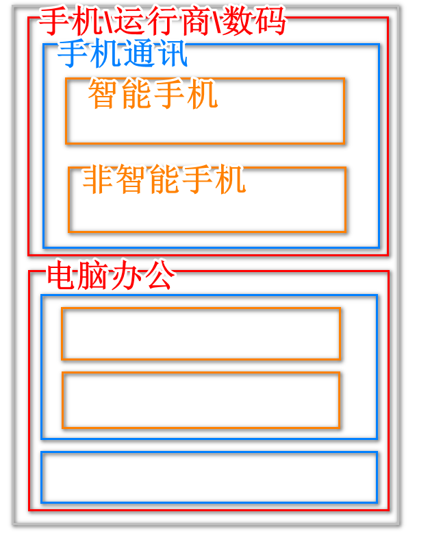

项目git地址

https://gitee.com/jtzhanghl/csmall-repo-class.git

# 续 SpringBoot操作ES

## 自定义查询

### 排序查询

上次课完成了多条件查询

我们如果想对查询结果进行排序,可以在方法名中添加排序逻辑

```java
// 排序查询
// 为了查询出较多的数据,我们在上面多条件查询的基础上,将And条件修改为Or再进行排序
Iterable<Item> queryItemsByTitleMatchesOrBrandMatchesOrderByPriceDesc(String title,String brand);
```

测试代码

```java
// 排序查询
@Test
void queryOrder(){
    Iterable<Item> items=itemRepository
            .queryItemsByTitleMatchesOrBrandMatchesOrderByPriceDesc("游戏","罗技");
    items.forEach(item -> System.out.println(item));
}
```

底层代码逻辑

```json
### 多字段搜索
POST http://localhost:9200/items/_search
Content-Type: application/json

{
  "query": {
    "bool": {
      "should": [
        { "match": { "title": "游戏"}},
        { "match": { "brand": "罗技"}}
      ]
    }
  },"sort":[{"price":"desc"}]
}
```

### 分页查询

SpringData框架支持分页查询

只需要修改参数和返回值就能自动实现分页效果

ItemRepository接口中编写代码如下

```java
// 分页查询
// 参数添加Pageable pageable,这个参数中包含分页的要求(第几页,每页多少条)
// 返回值修改为Page 类型,这个类型的对象不但包含查询结果,还包含分页信息
Page<Item> queryItemsByTitleMatchesOrBrandMatchesOrderByPriceDesc(
                        String title, String brand, Pageable pageable);
```

测试

```java
// 分页查询
@Test
void queryPage(){
    int pageNum=2;//页码
    int pageSize=2;//每页条数
    Page<Item> page=itemRepository
            .queryItemsByTitleMatchesOrBrandMatchesOrderByPriceDesc(
                    "游戏","罗技", PageRequest.of(pageNum-1,pageSize));
    page.forEach(item -> System.out.println(item));
    // 输入page对象中的分页信息
    System.out.println("总页数:"+page.getTotalPages());
    System.out.println("当前页:"+page.getNumber());
    System.out.println("每页条数:"+page.getSize());
    System.out.println("是不是首页:"+page.isFirst());
    System.out.println("是不是末页:"+page.isLast());
}
```

# 酷鲨商城前台开发开始

## 开发计划

1. 分类搜索
2. 商品详情
3. 购物车管理
4. 生成订单
5. 搜索
6. 秒杀

## 分类对象分析

数据库中分类数据的列的含义基本解释

id:主键

name:显示在页面上的分类名称

parentId:父分类的id   如果是一级分类父分类id为0

depth:分类深度,当前项目就是3级分类,1\2\3 分别代表它的等级

keyword:搜索关键字

sort:排序依据 正常查询时,根据此列进行排序,数字越小越出现在前面(升序)

icon:图标地址

enable:是否可用

isparent:是否为父分类  0 假  1真

isdisplay:是否显示在导航栏  0不显示  1显示

三级分类最终响应结果

```json
{
    "categories": [
      {
        "id": 1,
        "name": "手机 / 运营商 / 数码",
        "parentId": 0,
        "depth": 1,
        "keywords": null,
        "sort": 0,
        "icon": null,
        "parent": 1,
        "active": null,
        "display": 1,
        "childrens": [
          {
            "id": 2,
            "name": "手机通讯",
            "parentId": 1,
            "depth": 2,
            "keywords": "手机,电话",
            "sort": 0,
            "icon": null,
            "parent": 1,
            "active": null,
            "display": 1,
            "childrens": [
              {
                "id": 3,
                "name": "智能手机",
                "parentId": 2,
                "depth": 3,
                "keywords": null,
                "sort": 0,
                "icon": null,
                "parent": 0,
                "active": null,
                "display": 1,
                "childrens": null
              },
              {
                "id": 4,
                "name": "非智能手机",
                "parentId": 2,
                "depth": 3,
                "keywords": null,
                "sort": 0,
                "icon": null,
                "parent": 0,
                "active": null,
                "display": 1,
                "childrens": null
              }
            ]
          }
        ]
      },
      {
        "id": 5,
        "name": "电脑 / 办公",
        "parentId": 0,
        "depth": 1,
        "keywords": null,
        "sort": 0,
        "icon": null,
        "parent": 1,
        "active": null,
        "display": 1,
        "childrens": [
          {
            "id": 6,
            "name": "电脑整机",
            "parentId": 5,
            "depth": 2,
            "keywords": "电脑,计算机,微机,服务器,工作站",
            "sort": 0,
            "icon": null,
            "parent": 1,
            "active": null,
            "display": 1,
            "childrens": [
              {
                "id": 8,
                "name": "笔记本",
                "parentId": 6,
                "depth": 3,
                "keywords": "电脑,笔记本,微机,便携",
                "sort": 0,
                "icon": null,
                "parent": 0,
                "active": null,
                "display": 1,
                "childrens": null
              },
              {
                "id": 9,
                "name": "台式机 / 一体机",
                "parentId": 6,
                "depth": 3,
                "keywords": "台式机,一体机",
                "sort": 0,
                "icon": null,
                "parent": 0,
                "active": null,
                "display": 1,
                "childrens": null
              }
            ]
          },
          {
            "id": 7,
            "name": "电脑配件",
            "parentId": 5,
            "depth": 2,
            "keywords": "配件,组装,CPU,内存,硬盘",
            "sort": 0,
            "icon": null,
            "parent": 1,
            "active": null,
            "display": 1,
            "childrens": null
          }
        ]
      }
    ]
  }
```



下面要进行具体开发

在csmall-front-webapi项目中

编写业务逻辑层方法完成查询分类树的业务

创建service.impl包

创建FrontCategoryServiceImpl实现类

```java
@DubboService
@Service
@Slf4j
public class FrontCategoryServiceImpl implements IFrontCategoryService {

    // 设置Redis中保存三级分类的常量字符串
    public static final String CATEGORY_TREE_KEY="category_tree";
    // 利用Dubbo注解消费 product模块中提供的方法
    @DubboReference
    private IForFrontCategoryService forFrontCategoryService;
    @Autowired
    private RedisTemplate redisTemplate;
    @Override
    public FrontCategoryTreeVO categoryTree() {
        // 先检查redis中是否包含key为CATEGORY_TREE_KEY的数据
        if(redisTemplate.hasKey(CATEGORY_TREE_KEY)){
            // 如果有拿出来返回即可
            FrontCategoryTreeVO<FrontCategoryEntity> treeVO=
            (FrontCategoryTreeVO<FrontCategoryEntity>)redisTemplate
                                            .boundValueOps(CATEGORY_TREE_KEY).get();
            return treeVO;
        }
        // 如果没有数据,dubbo调用查询所有分类对象的方法
        List<CategoryStandardVO> categoryStandardVOs=
                forFrontCategoryService.getCategoryList();
        // 然后构建三级分类树返回
        FrontCategoryTreeVO<FrontCategoryEntity> treeVO=initTree(categoryStandardVOs);
        // 成功获得所有分类树信息后,将这个对象保存到Redis以便后面的访问直接从Redis中获取
        redisTemplate.boundValueOps(CATEGORY_TREE_KEY).set(treeVO,24, TimeUnit.HOURS);
        // 千万别忘了返回!!!!
        return treeVO;
    }

    private FrontCategoryTreeVO<FrontCategoryEntity> initTree(List<CategoryStandardVO> categoryStandardVOs) {
        // 定义一个Map,这个map使用父分类的id做key,使用当前父分类下所有子分类做Value
        Map<Long,List<FrontCategoryEntity>> map=new HashMap<>();
        // 日志输出当前所有分类总数
        log.info("当前总分类个数:{}",categoryStandardVOs.size());
        // 下面这个循环的目标是将所有父分类从所有分类对象中提取出来,并包含它的子分类集合,保存到map中
        // 提取方式是检查parentId值为0
        for(CategoryStandardVO categoryStandardVO: categoryStandardVOs){
            // 因为CategoryStandardVO类型只包含基本的分类对象数据
            // 要想出现级别包含关系,需要一个能够包含childrens属性的实体类
            FrontCategoryEntity frontCategoryEntity=new FrontCategoryEntity();
            // 利用工具类将CategoryStandardVO对象的同名属性赋值给FrontCategoryEntity对象
            BeanUtils.copyProperties(categoryStandardVO,frontCategoryEntity);
            // 提取出当前正则遍历的分类对象的父级id(parent_id)
            Long parentId=frontCategoryEntity.getParentId();
            // 判断这个父级在map中是否已经存在
            if(!map.containsKey(parentId)){
                // 如果是不存在,表示当前对象是父级分类,先实例化一个List,再保存在Map中
                List<FrontCategoryEntity> value=new ArrayList<>();
                value.add(frontCategoryEntity);
                map.put(parentId,value);
            }else{
                // 如果不是存在.证明不是父级分类,不是父级分类就一定可以绑定到另一个父级分类中
                map.get(parentId).add(frontCategoryEntity);
            }

        }
        log.info("当前map数据包含父级id的个数:{}",map.size());
        // 上面的循环完成后我们只能获得所有父级分类包含哪些子分类
        // 但是他们并不能确实哪个是一级哪个是二级
        // 下面要将map中所有的父级分类的关系保存在正确的节点位置
        // 数据库设计了根节点也就是一级分类的父分类id为0,所以先获得父分类为0的所有一级分类
        List<FrontCategoryEntity> firstLevels=map.get(0L);
        if(firstLevels==null){
            throw new CoolSharkServiceException(ResponseCode.BAD_REQUEST,"您访问的分类树没有父级");
        }
        // 使用循环嵌套,完成二级和三级分类的构建
        // 外层循环完成二级分类赋值给一级分类的操作,内层循环完成三级分类赋值给二级分类的操作
        for(FrontCategoryEntity oneLevel:firstLevels){
            // 遍历所有一级分类,获得一级分类id,也就是二级分类的父id
            Long secondLevelParentId=oneLevel.getId();
            // 获得内存循环遍历的list,也就是当前二级分类包含的所有三级分类
            List<FrontCategoryEntity> secondLevels=map.get(secondLevelParentId);
            // 如果当前二级分类为空,抛出异常
            if(secondLevels==null){
                log.warn("当前二级分类没有内容:{}",secondLevelParentId);
                continue;
            }
            for(FrontCategoryEntity twoLevel:secondLevels){
                // 获得三级分类id,准备将三级分类添加到二级分类中
                Long thirdLevelParentId=twoLevel.getId();
                List<FrontCategoryEntity> thirdLevels=map.get(thirdLevelParentId);
                // 判断当前二级分类是否包含三级分类
                if(thirdLevels==null){
                    log.warn("当前三级分类没有内容:{}",thirdLevelParentId);
                    continue;
                }
                //没有进if表示当前三级分类有明确指定二级分类
                twoLevel.setChildrens(thirdLevels);
            }
            // 将非空的二级分类(因为经过了上面的if非空判断),增加到一级分类中
            oneLevel.setChildrens(secondLevels);
        }
        FrontCategoryTreeVO treeVO =new FrontCategoryTreeVO();
        treeVO.setCategories(firstLevels);
        // 别忘了返回treeVO
        return treeVO;
    }
}
```

控制层创建controller包

包中创建

FrontCategoryController类

```java
@RestController
@RequestMapping("/front/category")
@Api(tags = "前台分类树模块")
public class FrontCategoryController {
    // 当前控制器为了显示分类树结果
    @Autowired
    private IFrontCategoryService frontCategoryService;

    //获得所有分类树结果的方法
    @GetMapping("/all")
    @ApiOperation("查询三级分类树")
    public JsonResult<FrontCategoryTreeVO<FrontCategoryEntity>> categoryTree(){
        // 调用业务逻辑层方法
        FrontCategoryTreeVO<FrontCategoryEntity> treeVO=frontCategoryService.categoryTree();
        return JsonResult.ok(treeVO);
    }


}
```

启动项目Leaf>Product>front

ip:192.168.137.150

虚拟机数据库密码tarena2017Up;

虚拟机登录:12345678


# 随笔

开发软件方式分敏捷开发和传统开发

**传统开发** 最经典的模型为"瀑布模型"

严格的在项目开发开始,定制计划,分析\设计\开发\测试\部署都有严格的时间线,规定好了每个阶段的输入和产出,每一个阶段都依赖上个阶段的产出才能进行,重视重视标准化和文档的规范

* 优点:

​	文档详情理解业务简单

​	当前阶段只需要关注下一阶段

​	方便每个节点的检查和验收

* 缺点:

​	文档输出大,工作量大

​	到后期才能看到成果

​    不适应客户需求的变化(严重缺点)

**敏捷开发模型**

将项目开发的核心转为用户的需求,根据用户需求的变化不断完善项目,强调的是更新迭代,每个迭代可以是非常短的开发周期

* 优点:

​    实施追踪用户需求,开发周期短,交付快,应对变化能力强

​    开发低风险,根据市场变化随时变化需求

* 缺点

​	没有非常详情的文档

​    很多开发的代码会在迭代过程中完全放弃,有无用功

当前项目需要的各个软件

sentinel\nacos\mysql\elasticsearch\logstash\seata\redis\rabbitMQ


