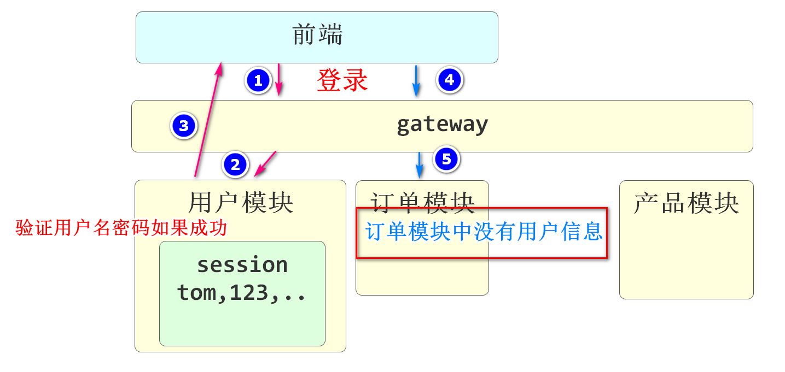

# 权限与令牌

用户与权限

用户                                            角色                                              权限

1杨过				1,1				 1任课老师                                        1成绩管理

2小龙女			2,1				 2班主任											2学生管理

​						  2,2

3令狐冲									3年级组长									   3课表管理

​																											xxxxx

​																										教师管理


临时权限关系表

是用户id和权限id的关系，一般是临时的情况


SpringSecurity

springSecurity如何实现登录

我们在表单中输入的用户名和密码都会被SpringSecurity获取

但是验证是在SpringSecurity框架下运行，验证不是程序员编写的

程序员要编写的是实现一个接口UserDetailsService，这个接口中有一个方法loadUserByUsername，这个方法的参数就是SpringSecurity接收用户输入的用户名。我们需要做的是使用这个用户名，查询用户的所有角色和权限

然后将用户信息和权限信息保存在一个类型为UserDetails的接口中并返回

SpringSecurity默认会将这个用户保存在当前服务器的session中，进行回话跟踪

springSecurity如何管理权限

SpringSecurity框架会使用一个authority的数组来保存所有权限

当一个控制器方法运行需要一个SpringSecurity框架中的权限时

我们可以在控制器方法前添加@PreAuthorize("[权限名称]")让SpringSecurity框架在运行该控制器方法前判断当前在Session中保存的登录用户是否包含这个权限,如果不包含会发生一个403错误

# 什么是单点登录

就是分布式项目(微服务项目)登录时实现会话保持的技术

如果没有单点登录,登录系统如下



当今单点登录解决方案有两种

一种使用在小规模微服务项目中,是**使用Session共享**


大概思路就是登录成功时,把用户信息保存到当前服务器session中的同时也保存到指定的Redis中.在访问其他模块时,根据请求中包含的sessionId到Redis中去获取用户信息,如果获取的到,证明该用户已经登录,并在也就知道当前登录用户是谁了,复制信息到当前服务器的内存中

这样做最严重的缺点是用户在线数量大时,有非常严重的内存冗余

另一种使用在较大规模微服务项目中,是**Token令牌**

最大的优点是能够解放内存


跨微服务的访问完全依靠sso登录服务器颁发的令牌

可以在所有识别该令牌的项目中表明自己身份

JWT(Json Web Token)

其实就是用户信息的一个加密后的字符串,其中还包含一些其他信息

登录验证整体流程


## Oauth2

Oauth2是一套登录验证标准,类似一个协议

其实就是确定了当前项目的登录验证标准,统一了验证授权思路

使得所有依据Oauth2标准的jwt可以通用

我们现在经常使用的扫码登录和一些手机app的内部客户端登录都是Oauth2标准下的

## 扫码登录流程

首先双方都需要在同一个登录标准下(一般指Oauth2)

达内要先向微信申请开通微信登录,一旦微信审核通过,会下发二维码

当用户扫机器A的二维码时,相当于向微信服务器发送了"我要登录机器A"的请求,微信服务器会给机器A一个扫码成功的提示,同时会想扫码的手机发送一个确认信息,当用户点击确认,才会真正将微信服务器中保存的该用户的jwt发送给达内

# 购物车模块

## 新增sku到购物车

控制层OmsCartController

业务逻辑层OmsCartServiceImpl

持久层OmsCartMapper

原则上讲,当前项目持久层只连接mall_oms数据

需要使用其他数据库资源时,调用对相应模块的方法即可

基本需求

判断用户身份是否为ROLE_user(判断是否已经登录)

验证收到的购物车信息是否完整

业务逻辑层中判断是否为新增的sku

如果是运行新增流程

如果不是运行修改数量流程

### 开发数据访问层

1.判断当前登录用户购物车中是否包含指定sku商品的方法

2.新增sku到购物车的方法

3.修改购物车指定sku数量的方法

先在OmsCartMapper中创建方法

```java
@Repository
public interface OmsCartMapper {

    // 1.判断当前登录用户的购物车中是否包含指定sku的方法
    OmsCart selectExistCart(@Param("userId")Long userId,@Param("skuId")Long skuId);

    // 2.保存到购物车的方法
    void saveCart(OmsCart omsCart);

    // 3.修改指定购物车信息数量的方法
    void updateQuantityById(OmsCart omsCart);


}
```

对应的mapper.xml文件

```xml
<?xml version="1.0" encoding="UTF-8"?>
<!DOCTYPE mapper PUBLIC "-//mybatis.org//DTD Mapper 3.0//EN" "http://mybatis.org/dtd/mybatis-3-mapper.dtd">
<mapper namespace="cn.tedu.mall.order.mapper.OmsCartMapper">

    <!-- 通用查询映射结果 -->
    <resultMap id="BaseResultMap" type="cn.tedu.mall.pojo.order.model.OmsCart">
        <id column="id" property="id" />
        <result column="user_id" property="userId" />
        <result column="sku_id" property="skuId" />
        <result column="title" property="title" />
        <result column="main_picture" property="mainPicture" />
        <result column="price" property="price" />
        <result column="quantity" property="quantity" />
        <result column="gmt_create" property="gmtCreate" />
        <result column="gmt_modified" property="gmtModified" />
        <result column="bar_code" property="barCode"/>
        <result column="data" property="data"/>
    </resultMap>
    <!--  声明全字段sql片段  -->
    <sql id="SimpleQueryFields">
        <if test="true">
            id,
            user_id,
            sku_id,
            title,
            main_picture,
            price,
            quantity,
            gmt_create,
            gmt_modified
        </if>
    </sql>
    <!-- 新增购物车信息 -->
    <insert id="saveCart" useGeneratedKeys="true" keyProperty="id">
        insert into oms_cart(
            user_id,
            sku_id,
            title,
            main_picture,
            price,
            quantity
        ) values(
                 #{userId},
                 #{skuId},
                 #{title},
                 #{mainPicture},
                 #{price},
                 #{quantity}
        )
    </insert>
    <!--  根据userId和skuId查询购物车信息  -->
    <select id="selectExistCart" resultType="cn.tedu.mall.pojo.order.model.OmsCart">
        select
            <include refid="SimpleQueryFields" />
        from
            oms_cart
        where
            user_id=#{userId}
        and
            sku_id=#{skuId}
    </select>
    <!-- 修改指定  -->
    <update id="updateQuantityById">
        update
            oms_cart
        set
            quantity=#{quantity}
        where
            id=#{id}
    </update>
</mapper>
```

### 开发业务逻辑层

创建OmsCartServiceImpl类继承IOmsCartService接口

这个接口需要实现一些方法,我们先创建默认实现,让编译通过

实现新增购物车的业务逻辑,和从SpringSecurity框架中获得用户信息的方法

```java
@Service
public class OmsCartServiceImpl implements IOmsCartService {

    @Autowired
    private OmsCartMapper omsCartMapper;

    @Override
    public void addCart(CartAddDTO cartDTO) {
        // 获取当前登录用户的userId
        Long userId=getUserId();
        // 判断这个userId的用户是否已经将指定的sku添加到购物车
        OmsCart omsCartExist= omsCartMapper.selectExistCart(userId,cartDTO.getSkuId());
        if(omsCartExist!=null) {
            // 如果sku已经存在于购物车中,就修改这个sku在购物车中的数量
            omsCartExist.setQuantity(omsCartExist.getQuantity()+cartDTO.getQuantity());
            // 执行数据库修改
            omsCartMapper.updateQuantityById(omsCartExist);
        }else {
            // 如果sky没有存在于购物车中,就新增sku信息到购物车
            OmsCart omsCartNew=new OmsCart();
            // 将cartDTO对象中的同名属性赋值给 新创建的OmsCart对象
            BeanUtils.copyProperties(cartDTO,omsCartNew);
            // OmsCart对象中赋值当前登录用户id
            omsCartNew.setUserId(userId);
            // 新增新增
            omsCartMapper.saveCart(omsCartNew);

        }
    }

    @Override
    public JsonPage<CartStandardVO> listCarts(Integer page, Integer pageSize) {
        return null;
    }

    @Override
    public void removeCart(Long[] ids) {

    }

    @Override
    public void removeAllCarts() {

    }

    @Override
    public void removeUserCarts(OmsCart omsCart) {

    }

    @Override
    public void updateQuantity(CartUpdateDTO cartUpdateDTO) {

    }

    // 业务逻辑层中可能有多个方法需要获得当前用户信息
    // 我们可以定义一个方法实现从SpringSecurity中获得用户信息
    public CsmallAuthenticationInfo getUserInfo(){
        // 从SpringSecurity框架的容器中,获得当前用户的authenticationToken对象
        UsernamePasswordAuthenticationToken authenticationToken=
                (UsernamePasswordAuthenticationToken)SecurityContextHolder
                                        .getContext().getAuthentication();
        // 判断获取的对象是不是null
        if(authenticationToken!=null){
            // 如果不是空,就是登录成功了,从authenticationToken对象中获得当前登录用户
            CsmallAuthenticationInfo csmallAuthenticationInfo=
                    (CsmallAuthenticationInfo)authenticationToken.getCredentials();
            return csmallAuthenticationInfo;
        }
        throw new CoolSharkServiceException(ResponseCode.UNAUTHORIZED,"没有登录信息");
    }
    // 单纯获得当前登录用户id的方法
    public Long getUserId(){
        return getUserInfo().getId();
    }
}
```

### 开发控制层

添加方法

OmsCartController

```java
@RestController
@RequestMapping("/oms/cart")
@Api(tags="购物车功能")
public class OmsCartController {
    @Autowired
    private IOmsCartService cartService;
    @PostMapping("/add")
    @ApiOperation("当前登录用户新增sku到购物车")
    // 判断当前用户是否为ROLE_user(是否登录了)
    @PreAuthorize("hasRole('ROLE_user')")
    // @Validated启动控制器运行前对CartAddDTO对象的SpringValidation验证
    public JsonResult addCart(@Validated CartAddDTO cartAddDTO){
        cartService.addCart(cartAddDTO);
        return JsonResult.ok("添加到购物车完成");
    }
    // leaf   passport    order
    // sso:10002   order:10005
    // 先运行10002的knife4j 访问前台用户登录 登录成功复制jwt
    // 转到order10005,在文档管理->全局设置中设置参数
    // name:   Authorization
    // value:  Bearer [复制的jwt]
    // 然后要刷新10005的knife4j页面
    // 就可以发送新增到购物车的请求了

}
```

启动leaf   passport    order
sso:10002   order:10005
先运行10002的knife4j 访问前台用户登录 登录成功复制jwt
转到order10005,在文档管理->全局设置中设置参数
name:   Authorization
value:  Bearer[复制的jwt]
然后要刷新10005的knife4j页面
就可以发送新增到购物车的请求了


## 查询购物车

需求:

将当前登录用户购物车中的所有sku查询列表

### 开发数据访问层

OmsCartMapper

```java
// 根据用户id查询购物车列表
List<CartStandardVO> selectCartsByUserId(Long userId);
```

对应的mapper.xml

```xml
<!-- 根据用户id查询用户的购物车信息 -->
<select id="selectCartsByUserId" resultType="cn.tedu.mall.pojo.order.vo.CartStandardVO">
    select
        <include refid="SimpleQueryFields" />
    from
        oms_cart
    where
        user_id=#{id}
</select>
```

### 开发业务逻辑层

OmsCartServiceImpl

```java
// 分页显示当前登录用户的购物车信息
@Override
public JsonPage<CartStandardVO> listCarts(Integer page, Integer pageSize) {
    // 拿到userId
    Long userId=getUserId();
    // 查询前设置好你要查询的页面和每页的条数
    PageHelper.startPage(page,pageSize);
    // 会执行分页查询,获得分页的list列表
    List<CartStandardVO> list=omsCartMapper.selectCartsByUserId(userId);
    // 实例化PageInfo并转换为JsonPage返回给控制器
    return JsonPage.restPage(new PageInfo<>(list));
}
```

### 开发控制层

OmsCartController添加方法

```java
// 根据登录用户id查询购物信息的方法
@GetMapping("/list")
@ApiOperation("根据登录用户id查询购物信息的方法")
@ApiImplicitParams({
        @ApiImplicitParam(value = "页码",name="page",required = true,dataType = "int"),
        @ApiImplicitParam(value = "每页条数",name="pageSize",required = true,dataType = "int")
})
@PreAuthorize("hasRole('ROLE_user')")
public JsonResult<JsonPage<CartStandardVO>> listCart(
    @RequestParam(required = false,defaultValue = WebConsts.DEFAULT_PAGE) Integer page,
    @RequestParam(required = false,defaultValue = WebConsts.DEFAULT_PAGE_SIZE) Integer pageSize
){
    JsonPage<CartStandardVO> jsonPage=cartService.listCarts(page,pageSize);
    return JsonResult.ok(jsonPage);
}
```

## 删除\清空购物车

### 删除购物车的持久层

支持删除一个或多个购物车中的商品

基本思路就是将一个要删除的id的数组传入Mapper进行删除

OmsCartMapper添加方法

```java
// 按id删除购物车商品(支持删除多个)
int deleteCartsByIds(Long[] ids);
```

对应的mapper.xml

```xml
<!-- 根据id删除购物车商品的方法  -->
<delete id="deleteCartsByIds">
    delete from
    oms_cart
    where
    id in
    <foreach collection="ids" separator="," item="id" open="(" close=")">
        #{id}
    </foreach>
</delete>
```

### 删除购物车的业务逻辑层

```java
@Override
public void removeCart(Long[] ids) {
    // rows是删除掉的行数
    int rows=omsCartMapper.deleteCartsByIds(ids);
    if(rows==0){
        throw new CoolSharkServiceException(ResponseCode.NOT_FOUND,"您的购物车没有对应商品");
    }
}
```

### 删除购物车控制层方法

```java
// 根据用户指定的购物车id删除购物车信息(支持批量)
@PostMapping("/delete/")
@ApiOperation("根据用户指定的购物车id删除购物车信息(支持批量)")
@ApiImplicitParams(
        @ApiImplicitParam(value = "指定购物车id",name="ids",required = true,dataType = "array")
)
@PreAuthorize("hasRole('ROLE_user')")
public JsonResult removeCartByIds(Long[] ids){
    cartService.removeCart(ids);
    return JsonResult.ok();
}
```

### 清空购物车的持久层

清空购物车指删除当前用户购物车中所有内容

也就是根据用户id删除oms_cart表的信息

OmsCartMapper

```java
// 按用户id清空该用户所有购物车内容
int deleteCartsByUserId(Long userId);
```

对应的mapper.xml

```xml
<delete id="deleteCartsByUserId">
    delete from
        oms_cart
    where
        user_id=#{userId}
</delete>
```

### 清空购物车的业务逻辑层

```java
@Override
public void removeAllCarts() {
    // 获得用户id
    Long userId=getUserId();
    int rows=omsCartMapper.deleteCartsByUserId(userId);
    if(rows==0){
        throw new CoolSharkServiceException(ResponseCode.NOT_FOUND,"您的购物车中没有数据");
    }
}
```

### 清空购物车的控制层方法

```java
// 根据用户id清空该用户购物车列表
@PostMapping("/delete/all")
@ApiOperation("根据用户id清空该用户购物车列表")
@PreAuthorize("hasRole('ROLE_user')")
public JsonResult removeCartsByUserId(){
    cartService.removeAllCarts();
    return JsonResult.ok("您的购物车已经清空!");
}
```


