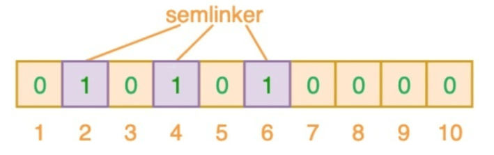
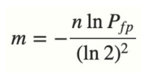

# 续 搜索功能

## 虚拟机环境实现搜索功能

### 开发数据访问层

根据当前系统情况是否支持虚拟机运行绝对是否要修改application-test.yml的配置,如果支持,修改ES的ip和端口号为虚拟机地址

连接虚拟机的ES使用SpuEntity实体类即可

创建SpuSearchRepository接口做虚拟机的ES的数据访问层

虚拟机因为logstash的存在和配置,只需要查询search_text字段即可

我们可以使用方法名称表达查询内容,也可以编写查询语句

方法名称(支持分页查询):

````java
Page<SpuEntity> querySpuEntitysBySearchTextMatches(String keyword,Pageable pageable);
````

按查询语句

```java
@Repository
public interface SpuSearchRepository extends ElasticsearchRepository<SpuEntity,Long> {
    // 虚拟机的系统中设置了一个search_text的字段
    // 这个字段包含了所有可能需要查询的字段的值的和
    // 简单来说就是包含了查询本地ES中的name\title\description\categoryName等
    // 实际上虚拟机的ES也只对search_text字段进行分词
    // 所以执行搜索只需搜索search_text字段
    @Query("{\"match\":{\"search_text\":{\"query\":\"?0\"}}}")
    Page<SpuEntity> querySearchByText(String keyword, Pageable pageable);

}
```

### 开发查询ES的业务逻辑层

为了防止ISearchService接口多个实现类加载时冲突

**建议将上次课连接本地ES的业务逻辑层代码的@Service注解删除或注释**

```java
@Service
@Slf4j
public class SearchServiceImpl implements ISearchService {

    @Autowired
    private SpuSearchRepository spuSearchRepository;

    @Override
    public JsonPage<SpuEntity> search(String keyword, Integer page, Integer pageSize) {
        if(page==null){
            page=1;
        }
        if(pageSize==null){
            pageSize=5;
        }
        // Page类型是SpringData框架支持的分页类型,和PageHelper框架的PageInfo类似,包含分页信息和查询结果
        Page<SpuEntity> spuEntities=spuSearchRepository
                .querySearchByText(keyword, PageRequest.of(page-1,pageSize));
        // JsonPage类型不包含将Page类型转换为JsonPage的方法,需要我们敲代码转换
        JsonPage jsonPage=new JsonPage();
        jsonPage.setPage(page);
        jsonPage.setPageSize(pageSize);
        // 赋值总页数
        jsonPage.setTotalPage(spuEntities.getTotalPages());
        // 赋值总条数
        jsonPage.setTotal(spuEntities.getTotalElements());
        // 赋值数据
        jsonPage.setList(spuEntities.getContent());
        // 别忘了返回jsonPage!!!!!
        return jsonPage;
    }

    @Override
    public void loadSpuByPage() {

    }
}
```

### 开发控制层代码

仍然可以编写在SearchController类中

```java
// 实现根据关键字查询Es中数据的搜索功能
// @GetMapping不写()或()里只有""表示当前方法路径就是类上定义的路径
// localhost:10008/search
@GetMapping
@ApiOperation("实现根据关键字查询Es中数据的搜索功能")
@ApiImplicitParams({
        @ApiImplicitParam(value = "搜索关键字",name="keyword",dataType = "string",required = true),
        @ApiImplicitParam(value = "页码",name="page",dataType = "int",required = true),
        @ApiImplicitParam(value = "每页条数",name="pageSize",dataType = "int",required = true)
})
public JsonResult<JsonPage<SpuEntity>> searchByKeyword(
                    String keyword,Integer page,Integer pageSize){
    JsonPage<SpuEntity> list=searchService.search(keyword,page,pageSize);
    return JsonResult.ok(list);
}
```

启动服务

leaf>product>passport>search

本地ES启动ES或启动虚拟机

如果不能查询出数据库中正确的对应的信息

需要在数据库工具软件中运行下面代码

```sql
USE mall_pms;	
UPDATE pms_spu	SET gmt_modified=NOW();
```

以激活logstash对spu表的监听,并向ES中保存数据

再次查询,就有能够正确搜索信息了!

# ELK简介

集中化日志解决方案

Elasticsearch+Logstash+Kibana

Elasticsearch:全文搜索引擎

Kibana:ES的可视化工具

Logstash:日志采集工具

这个组合的作用是指定一个程序,将这个程序运行过程中日志信息采集并保存到ES中,在需要查看时使用kibana查看

## LogStash

### 什么是LogStash

Logstash是一款开源的日志采集,处理,输出的软件,每秒可以处理数以万计条数据,可以同时从多个来源采集数据,转换数据,然后将数据输出至自己喜欢的存储库中(官方推荐的存储库为Elasticsearch)

java编写的软件


数据源到Logstash再输出掉目标(一般就是ES)

LogStash内部有3个处理数据的步骤

* input    将数据源的数据采集到Logstash
* filter     (非必要)如果需要可以对采集到的数据进行处理
* output 将处理好的数据保存到目标(一般就是ES)

其中采集数据的用法比较多样,还支持各种插件


# Quartz

## 什么是Quartz

quartz:石英钟

Quartz是OpenSymphony开源组织开发的一个高效的任务调度管理工具。

Symphony:交响乐

Quartz是java编写

使用时导入java依赖

## 为什么需要Quartz

因为程序中需要任务调用

最简单的任务掉调度就是Timer

但是Timer的功能比较单一支持延时运行和周期运行

Quartz更加强大,更适用于实际情况

## Quartz核心组件


调度器:Scheduler()

任务:Job工作

触发器:Trigger

调度器中可以配置发生什么事情(到达什么时间)去运行什么任务

简单来说就是什么时候干什么事情

* job(工作\任务):Quartz 实现过程中是一个接口,接口中有一个方法execute

​	我们创建一个类,实现这个接口,在方法中编写要进行的操作(执行具体任务)

​    我们还需要一个JobDetail的类型的对象,Quartz每次执行job时

​	会实例化job类型对象,去调用这个方法,JobDetail是用来描述Job实现类

​	的静态信息,	比如任务运行时在Quartz中的名称

* Trigger(触发器):能够描述触发指定job的规则,分为简单触发和负责触发

  简单触发可以使用SimplTrigger实现类.功能类似timer

  复杂触发可以使用CronTrigger实现类,内部利用cron表达式描述各种复杂的时间调度计划

* Scheduler(调度器):一个可以规定哪个触发器绑定哪个job的容器

  在调度器中保存全部的Quartz 保存的任务

  SpringBoot框架下,添加Quartz依赖后,调度器由SpringBoot管理,我们不需要编写

## Cron表达式


* \* 表示任何值,如果在分的字段上编写*,表示每分钟都会触发

* , 是个分割符如果秒字段我想20秒和40秒时触发两次就写  20,40

* \- 表示一个区间 秒字段5-10 表示 5,6,7,8,9,10

* / 表示递增触发 秒字段 5/10表示5秒开始没隔10秒触发一次

  日字段编写1/3表示从每月1日起每隔3天触发一次

* ? 表示不确定值, 因为我们在定日期时,一般确定日期就不确定是周几,相反确定周几时就不确定日期

* L 表示last最后的意思,我们可以设置当月的最后一天,就会在日字段用L表示,

  周字段使用L表示最后一周,一般会和1-7的数字组合

  例如6L表示本月最后一周的周五

* W 表示最近的工作日(单纯的周一到周五) 如果日字段编写15W表示

  每月15日最近的工作日触发,如果15日是周六就14日触发,如果15日是周日就16日触发

​	LW通常一起使用,表示本月的最后一个工作日

* \# 表示第几个,只能使用在周字段上 6#3表示每月的第三个周五

  如果#后面数字写大了,是一个不存在的日期,那就不运行了

  适合设计在母亲节或父亲节这样的日期运行

网络上可用的Cron表达式生成器很多

推荐一个http://cron.ciding.cc/

双11的Cron: 

 0 11 11 11 11 ?

0 0 12 1/5 * ?  每个月的1日每隔5天中午12点触发一次

0 * * * * ? 每分钟0秒运行一次

## SpringBoot使用Quartz

要想在SpringBoot框架下使用Quartz需要先添加依赖

我们利用之前搭建微服务架构的项目csmall的stock-webapi模块来演示和练习Quartz

```xml
<!--  SpringBoot Quartz 依赖  -->
<dependency>
    <groupId>org.springframework.boot</groupId>
    <artifactId>spring-boot-starter-quartz</artifactId>
</dependency>
```

先编写要执行的任务

我们在stock-webapi模块下创建一个quartz包

在包中创建一个类QuartzJob实现Job接口编写方法代码如下

```java
public class QuartzJob implements Job {
    @Override
    public void execute(JobExecutionContext jobExecutionContext) throws JobExecutionException {
        System.out.println("------------------"+ LocalDateTime.now()+"---------------------");
    }
}
```

再在quartz包下创建一个QuartzConfig类编写触发器

```java
// 因为我们添加的依赖包含了Quartz的调度器,已经在Spring容器中,所以我们要想设置的触发生效
// 必须将这些配置添加Spring中,这样Spring容器中的Quartz的调度器才能识别接收到
@Configuration
public class QuartzConfig {
    // 创建一个JobDetail对象,描述我们要运行的job(任务),保存到Spring容器中
    // 方法名无要求
    @Bean
    public JobDetail showDate(){
        System.out.println("showDate运行");
        return JobBuilder.newJob(QuartzJob.class) // 绑定要运行的任务类
                .withIdentity("date")             // 定义这个工作的名称
                .storeDurably()
                .build();
    }
    // 声明一个方法返回Trigger,Trigger中定义什么时候执行哪个方法
    @Bean
    public Trigger showDateTrigger(){
        System.out.println("showDateTrigger运行");
        // 定义Cron表达式
        CronScheduleBuilder cronScheduleBuilder=
                CronScheduleBuilder.cronSchedule("0 0/1 * * * ?");
        return TriggerBuilder.newTrigger()
                .forJob(showDate())  // 绑定jobDetail
                .withIdentity("dateTrigger")  //起名字
                .withSchedule(cronScheduleBuilder)  //绑定cron表达式
                .build();
    }


}
```

## 课上作业

利用Quart实现

每隔2分钟运行一次添加库存的操作,PC100号商品的库存添加10

```java
@Component
public class QuartzStock implements Job {
    @Autowired
    private  StockMapper stockMapper;


    @Override
    public void execute(JobExecutionContext jobExecutionContext) throws JobExecutionException {
        System.out.println("执行Quartz增加库存的方法");
        stockMapper.updateStockCountByCommodityCode("PC100",-10);
    }
}
```

还在QuartzConfig中添加代码

```java
@Bean
public JobDetail addStock(){
    return JobBuilder.newJob(QuartzStock.class)
            .withIdentity("addStock")
            .storeDurably()
            .build();
}
@Bean
public Trigger addStockTrigger(){
    CronScheduleBuilder cronScheduleBuilder=
            CronScheduleBuilder.cronSchedule("0 0/2 * * * ?");
    return TriggerBuilder.newTrigger()
            .forJob(addStock())
            .withIdentity("addStockTrigger")
            .withSchedule(cronScheduleBuilder)
            .build();
}
```

我们后面的秒杀业务

需要使用到Quartz

做缓存预热和相关的调度任务

在完成秒杀业务之前,我们还要有一些知识的准备

例如布隆过滤器

# 布隆过滤器

## 什么是布隆过滤器

布隆过滤器能够使用较少的空间来判断一个指定的元素是否在集合中

常见的使用场景

1.判断一个单词是否在词库中(idea的拼写正确提示)

2.公安系统,一个人名(身份证号)是否在追逃名单中

3.爬虫检查一个网站是否被爬取过

.....

## 为什么使用布隆过滤器

常规的检查一个元素是否在一个集合中的思路是遍历集合,判断元素是否相等

这样的查询效率非常低下

要保证快速确定一个元素是否在一个集合中,我们可以使用HashMap

因为HashMap内部的散列机制,保证更快更高效的找到元素

所以当数据量较小时,用HashMap或HashSet保存对象然后使用它来判定元素是否存在是不错的选择

但是如果数据量太大,每个元素都要生成哈希值来保存,我们也要依靠哈希值来判定是否存在,一般情况下,我们为了保证尽量少的哈希值冲突需要8字节哈希值做保存

long取值范围:-9223372036854775808-----9223372036854775807

5亿条数据,每条8字节,需要多少内存呢?

3.72G内存,肯定是不行的

所以我们使用布隆过滤器

它能够使用相对很少的内存,判断一个元素是否包含在一个集合中

但是不能获得元素内容,而且有误判率

## 布隆过滤器介绍

* 巴顿.布隆于⼀九七零年提出
* ⼀个很长的⼆进制向量（位数组）
* ⼀系列随机函数 (哈希)
* 空间效率和查询效率⾼
* 有⼀定的误判率（哈希表是精确匹配）


当我们保存一个单词时,会运行3个不同的hash算法

举例来说semlinker



当布隆过滤器保存了semlinker的信息之后,再次使用semlinker单词判断这个布隆过滤器是否包含元素时,生成的结果仍然是246,而现在布隆过滤器246位置是1,就可以额判断semlinker包含在集合中

当包含新的单词时kakuqo


新的单词也会生成3个数字,结果347会将新的3个位置的值修改为1

再次判断也是判断这3个位置

但是会出现下面的情况

如果再一个新单词red它生成的结果是237,这3个位置也是1,所以也会被判断为存在,**误判就是这样出现的**,

也就是布隆过滤器判断没有的元素一定不在集合中,但是布隆过滤器判断在集合的元素不一定真的在集合中

* 优点

​	空间效率和查询效率⾼，

* 缺点
  * 有⼀定误判率即可（在可接受范围内）。
  * 删除元素困难
  * 极端情况下,如果布隆过滤器所有为位都是1,那么任何元素都会被判断为存在于集合中

那么我们要如何设计一个性能良好,误判率又在可接受范围内的布隆过滤器呢


n 是已经添加元素的数量；

k 哈希的次数；

m 布隆过滤器的长度(位数的大小)

如果我们实现确定能接受的误判率

想计算需要达到这个误判率的布隆过滤器长度公式为




# 随笔


Schedule:日程表(计划表)

Scheduler:计划者\计划器 调度者

散列


