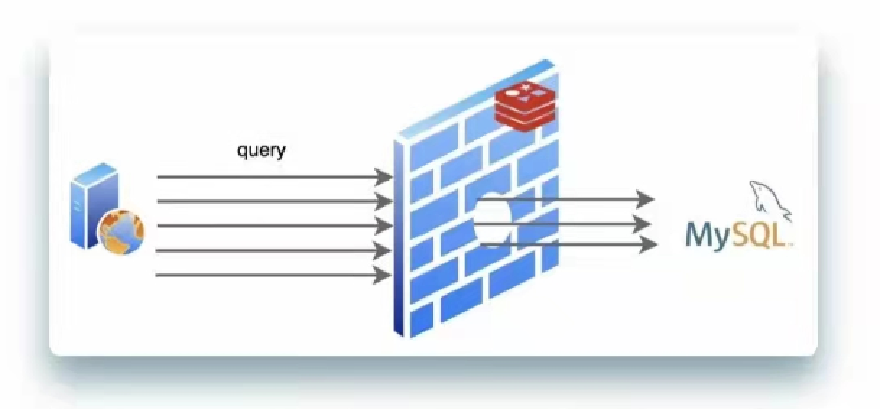
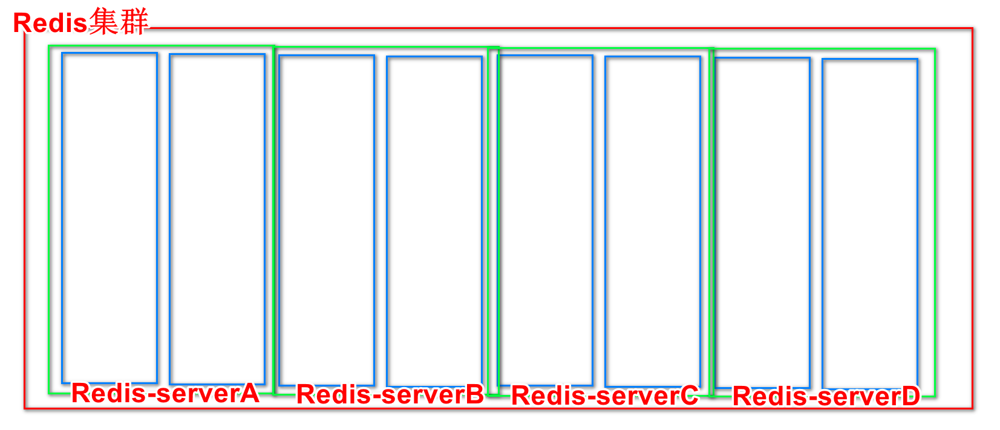
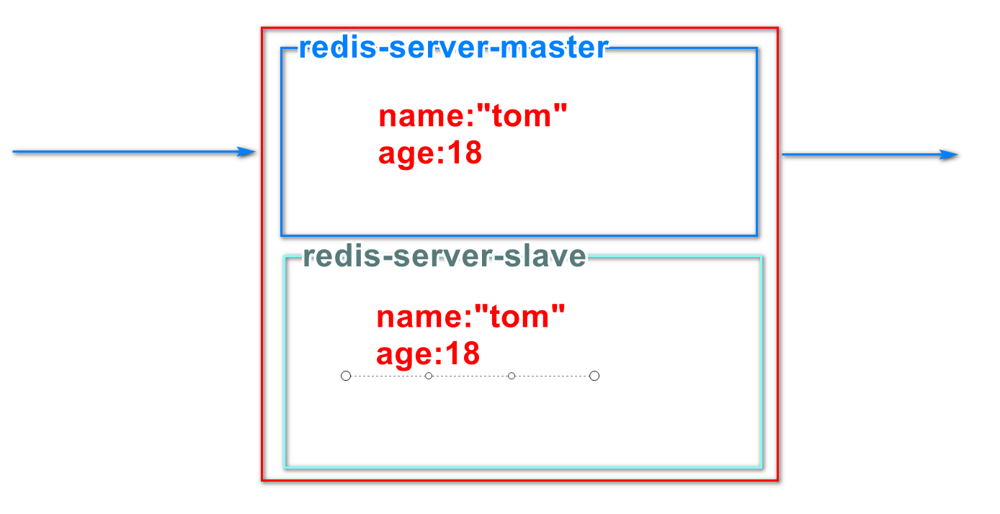
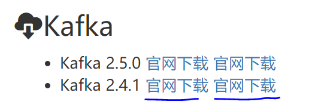
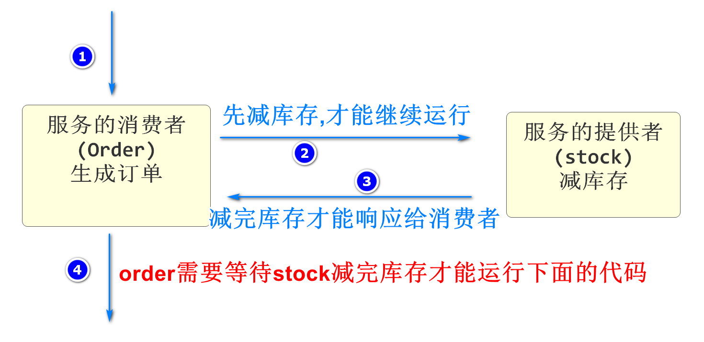
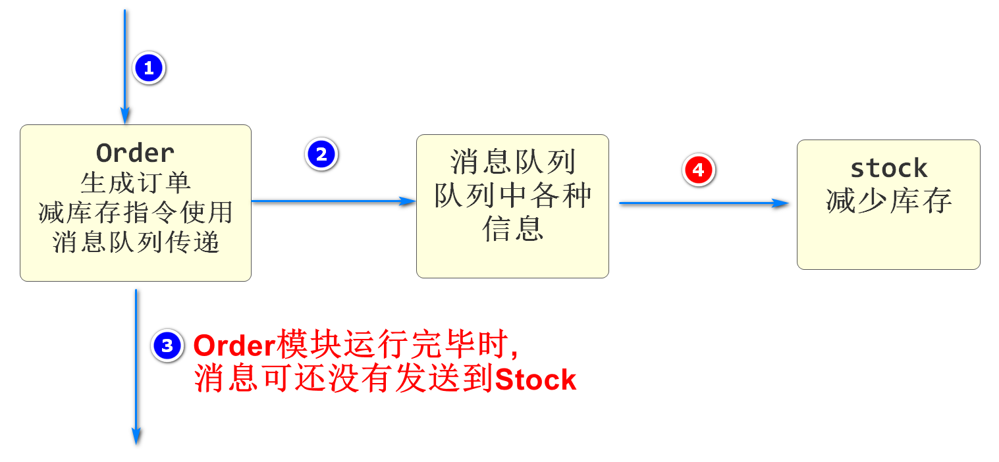
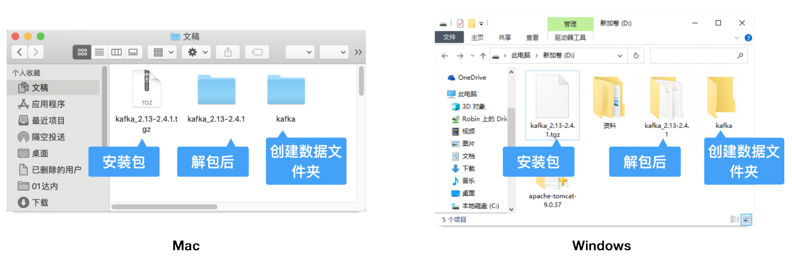
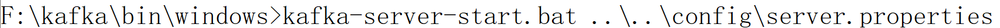
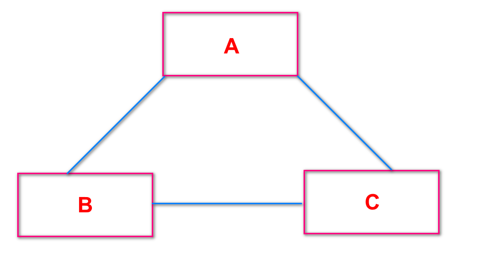
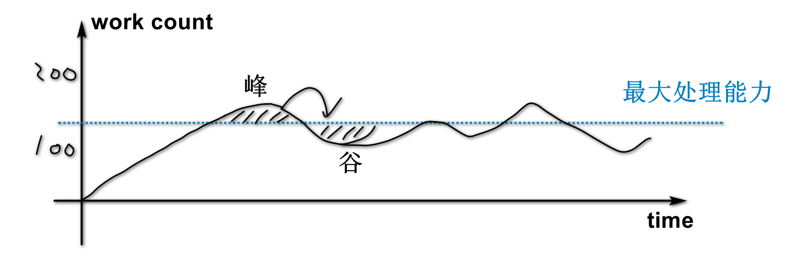

# 续 布隆过滤器

## 布隆过滤器的使用

一般情况下,我们使用Redis作为布隆过滤器的内存介质

我们仍然在之前微服务架构项目中的stock模块来测试

首先添加操作redis的依赖 Spring Data Redis

```xml
<!-- 布隆过滤器测试依赖redis的 -->
<dependency>
    <groupId>org.springframework.boot</groupId>
    <artifactId>spring-boot-starter-data-redis</artifactId>
</dependency>
```

刷新maven

然后可以将酷鲨前台项目中seckill-webapi下utils包下

RedisBloomUtils类复制到需要使用布隆过滤器的项目中

要修改yml文件,添加redis的支持

```yml
spring:
  redis:
    host: 192.168.137.150
    port: 6379
    password:
```

ip地址host要根据实际情况设置

可以将上次课设置的job修改为每秒执行一次

然后再QuartzJob中编写代码观察结果

```java
public class QuartzJob implements Job {
    @Autowired
    private RedisBloomUtils redisBloomUtils;
    @Override
    public void execute(JobExecutionContext jobExecutionContext) throws JobExecutionException {
        System.out.println("------------------"+ LocalDateTime.now()+"---------------------");
        // 先将要添加到布隆过滤器的元素保存在一个数组中
        String[] colors={"red","origin","yellow","green","blue","pink"};
        // 将上面的集合中的元素批量新增到布隆过滤器中
        redisBloomUtils.bfmadd("color",colors);
        // 定义一个要判断是否在集合中的元素
        String elm="black";
        System.out.println("布隆过滤器判断"+elm+"是否在集合中:"+redisBloomUtils.bfexists("color",elm));

    }
}
```

运行前注意需要的环境

Nacos\Seata\Redis启动

# redis 

## 缓存淘汰

当Redis应用内存不足时,再有新的数据新增到Redis时

需要删除一部分已有内存数据,才能新增新的数据

noeviction：返回错误
allkeys-random：所有数据中随机删除数据
volatile-random：有过期时间的数据库中随机删除数据
volatile-ttl：删除剩余有效时间最少的数据
allkeys-lru：所有数据中删除上次使用时间最久的数据
volatile-lru：有过期时间的数据中删除上次使用时间最久的数据
allkeys-lfu：所有数据中删除使用频率最少的
volatile-lfu：有过期时间的数据中删除使用频率最少的

## 缓存穿透

当一个查询查到redis,redis中没有,那么逻辑上就要查询数据库,数据库查询慢,消耗资源,但是数据库中也没有,下次再有这个查询,还会穿过redis,查到数据库,还是消耗资源

如果有恶意的行为,不断反复的查询你数据库中没有的东西,就会导致系统的缓慢甚至宕机

在实际开发中,流行的做法是在Redis中再保存一个布隆过滤器

查询Redis中信息不存在时,先查询布隆过滤器,如果布隆过滤器显示数据库中没有这个数据,直接给出响应,就不会到数据库查询了

## 缓存击穿

一个数据本来在Redis中保存着(这个数据来自数据库)

正常情况下,一个请求查询到这个数据会直接从Redis中获得然后返回

不会查询数据库 

但是Redis的数据一般都会设置过期时间的

在过期的一瞬间,Redis是没有这个缓存数据的,

如果多个请求凑巧请求这个数据,就会访问到数据库,带来压力

这个现象并不是不允许,数据的过期也是正常现象,一个请求之后Redis中会重新更新获得这个数据




## 缓存雪崩

如果短时间内大量出现缓存过期,就是缓存雪崩

其实就是并发了很多缓存击穿,数据库会不堪重负

分析缓存雪崩的原因,一般都是因为大量缓存数据同时添加到Redis并且设置了相同的有效期

解决和缓解的办法是在设置有效期时,添加一个随机数,这样他们就不会同时失效了


## Redis持久化

Redis信息保存在内存

一旦断电,所有信息会丢失,在开机重启,需要将所有数据重新从数据源获得

给数据源(指mysql)带来压力

我们如果能够在Redis运行的同时,将Redis内存的数据保存在当前服务器的硬盘,即使断电,在重启的过程中,我们可以从本机的硬盘恢复数据,无需访问数据源

Redis的持久化策略有两种

RDB:

数据库快照(内存中的所有数据以二进制的方式保存在硬盘上),生成一个dump.rdb的文件

我们可以在redis安装程序的配置文件中找到conf文件

在空白位置编写例如下面的内容

```
save 60 5
```

60表示60秒既一分钟

5表示key被修改的次数

整体含义,一分钟内有5次以上的key的修改,就会启动rdb数据库快照

优点:因为是二进制格式,整体恢复数据

缺点:突然断电情况下,会丢失上次生成rdb文件和断电时间之间的数据

​		生成rdb文件是一个磁盘写操作,效率低

AOF

​		记录所有对redis的命令日志

conf配置文件

```
appendonly yes
```

特点:不保存数据,只保存命令

这种情况下,理论上,所有redis运行过的指令都会保存下来,任何情况下断电都不会丢失数据

但是实际情况下,Redis非常繁忙的情况下,再保存所有运行的指令,会影响运行速度

为了减少对运行速度的影响,默认情况下会将每一秒运行的所有指令整体的发送到日志中,减少io操作的次数

但是缺点就是仍然会丢失断电时,每秒间隔之间的数据

> 如果希望Redis仅作为纯内存的缓存来用，亦可禁用RDB和AOF。可以在同一实例中同时使用AOF和RDB。这种情况下，当Redis重新启动时，AOF文件将用于重建原始数据集，因为它可以保证是最完整的。


## Redis集群

当今互联网程序集群非常常见

简单来说就是请求较多时,一台服务器无法完成时,由多台服务器共同完成

Redis作为为了提高服务器请求并发量的重要组件,承担着非常重要的职责

Redis服务器一台忙不过来,也是可以形成集群的

Redis集群有两种形式

**一种是高性能集群(分区分片)**

每个Redis服务器只负责redis所有哈希槽16384个中的一部分

服务器越多,每个Redis服务器负责的分区越少,整体性能就越高!



**一种是高可用集群(Redis镜像服务器)**

当一个Redis服务器保存了很多信息

如果它宕机就会导致整个系统瘫痪

为了尽量的减少这种情况的发生

可能要搭建一个镜像服务器,提高高可用



# 消息队列

## 下载Kafka



## Dubbo远程调用的性能问题



任何dubbo调用都有这个问题

就是Dubbo中的消费者在调用服务的提供者之后,是等待服务提供者响应结果之后,才能运行后面的操作的,这个过程中,消费者程序进入阻塞状态属于资源的浪费

在非极致要求高并发性能的前提下,Dubbo的内部的资源使用缺陷是可以接受的

但是在极致要求高并发性能环境下,并且我们对生产者的结果不迫切需求时,我们就可以使用消息队列代替Dubbo调用,消除消费者线程的阻塞

## 什么是消息队列

消息队列(Message Queue)简称MQ

消息队列是采用"异步(两个微服务项目并不需要同时完成请求)"的方式来传递数据完成业务操作流程的业务处理方式

## 消息队列的优缺点



> 常见面试题 

* 利用异步的特性,提高服务器的运行效率,减少线程阻塞的时间
* 削峰填谷:在并发峰值的瞬间将信息保存到消息队列中,依次处理,不会因短时间需要处理大量请求而出现意外,在并发较少时在依次处理队列中的内容,直至处理完毕
* 消息队列的弊端:因为是异步执行,order模块完成响应时,stock模块可能还没有运行,这样的话就可能出现延迟的现象,如果不能接受这种延迟,就不要使用消息队列

常见的消息队列软件

* Kafka:性能好
* RabbitMQ:功能好
* RocketMQ:阿里的
* ActiveMQ:几年前流行的

> 常见面试题:死信队列

如果不使用消息队列,我们可以使用Seata或类似的事务管理工具,保证数据的完整性,但是一旦有消息队列的加入,那么Seata就不能使用了

如果消息的接收方运行发生异常或错误,我们可以在发生异常错误处理的位置

进行代码的编写,手动实现数据的回滚,也就是向消息的来源发送信息,让消息的来源处理异常恢复数据之前的样子

如果在消息队列发送和接收的过程中不断发生异常,我们需要选择一个节点,最终向消息队列指定名称中发送一个信息,这个信息中只有错误发生的描述

但是没有任何程序在接收,这就是死信队列

死信队列中的信息会定期有人工处理,修改数据库中的信息

# Kafka

## 什么是Kafka

Kafka是由Apache软件基金会开发的一个开源流处理平台，由Scala和Java编写。该项目的目标是为处理实时数据提供一个统一、高吞吐、低延迟的平台。Kafka最初是由LinkedIn开发，并随后于2011年初开源。

kafka的软件结构


Producer:消息的发送方,也就是消息的来源,Kafka中的生产者

​					order就是消息的发送方

Consumer:消息的接收方,也是消息的目标,Kafka中的消费者

​					stock就是消息的接收方法

Topic:话题或主题的意思,消息的收发双方要依据同一个话题名称,才不会将信息错发给别人

Record:消息记录,就是生产者和消费者传递的信息内容,保存在指定的Topic中

## Kafka的特征与优势

Kafka作为消息队列,它和其他产品相比,突出的特征就是性能优秀

Kafka是将消息队列中的信息保存在硬盘中的,

但是Kafka对硬盘读取效率的优化,可以做到和内存效率接近,

主要依靠"顺序读写,零拷贝,日志压缩等技术"

Kafka处理队列中数据的默认设置

Kafka队列中的信息能够一直向硬盘中保存(理论上没有大小限制)

Kafka默认队列中的信息保存7天,缩短这个时间会减少硬盘空间消耗

## kafka的安装和启动

最好找到一个根目录路径下解压kafka

然后路径不要有空格和中文



创建一个空文件夹,用于保存数据,文件夹名称随意,但必须是空的

本次创建名称为data

没有所谓的安装操作,我们启动它就可以了

但是启动kafka之前,必须先启动zookeeper软件,才能启动kafka

先到F:\kafka\config下配置有文件zookeeper.properties

找到dataDir属性修改如下

```
dataDir=F:/data
```

注意F盘和data文件夹名称,匹配自己电脑的真是路径和文件夹名称

还要修改server.properties配置文件

```
log.dirs=F:/data
```

修改注意事项和上面相同

下面开始先启动zookeeper

进入路径F:\kafka\bin\windows

在地址栏输入cmd进入dos,输入下面命令启动zookeeper


```
zookeeper-server-start.bat ..\..\config\zookeeper.properties
```

同样的方法启动kafka



```
kafka-server-start.bat ..\..\config\server.properties
```

两个项目启动之后不要关闭dos窗口

**附录**

Mac系统启动Kafka服务命令（参考）：

```
# 进入Kafka文件夹
cd Documents/kafka_2.13-2.4.1/bin/
# 动Zookeeper服务
./zookeeper-server-start.sh -daemon ../config/zookeeper.properties 
# 启动Kafka服务
./kafka-server-start.sh -daemon ../config/server.properties 
```

Mac系统关闭Kafka服务命令（参考）：

```
# 关闭Kafka服务
./kafka-server-stop.sh 
# 启动Zookeeper服务
./zookeeper-server-stop.sh
```

在启动kafka时有一个常见错误

```
wmic不是内部或外部命令
```

这样的提示,需要安装wmic命令,安装方式参考

https://zhidao.baidu.com/question/295061710.html

## 测试kafka

在cart-webapi项目中

添加依赖

```xml
<!-- Google JSON API -->
<dependency>
    <groupId>com.google.code.gson</groupId>
    <artifactId>gson</artifactId>
</dependency>
<!-- Kafka API -->
<dependency>
    <groupId>org.springframework.kafka</groupId>
    <artifactId>spring-kafka</artifactId>
</dependency>
```

yml文件添加配置

```yml
spring:
  kafka:
    # 定义kafka的位置
    bootstrap-servers: localhost:9092
    # 为当前项目的所有话题设置前缀,也就是分组名称,是框架强制要求配置的
    consumer:
      group-id: csmall
```

SpringBoot启动类

```java
@SpringBootApplication
@EnableDubbo
// ↓↓↓↓↓↓↓↓↓
@EnableKafka
// 激活SpringBoot自带的调度工具
@EnableScheduling
public class CsmallCartWebapiApplication {

    public static void main(String[] args) {
        SpringApplication.run(CsmallCartWebapiApplication.class, args);
    }

}
```

我们要实现周期性的向kafka发送信息

也就是利用SpringBoot的调度工具每隔一段时间运行包含向kafka发送信息的代码

再编写Kafka的消费者(信息接收方)接收信息并输出


# 随笔


布隆过滤器计算器

https://hur.st/bloomfilter

windows安装redisbloom布隆过滤器

https://blog.csdn.net/weixin_44770915/article/details/107918770

选举的过程



一个集群服务器要选出一个领导

一般的做法是,每个服务器向其他服务器发送请求

每个服务器也对其他服务器发送过来的请求做响应

但是每个服务器只响应第一个发送到本服务的请求(每个服务器只有一张选票)

最终获得响应(选票)最多的服务器称为集群的领袖(Leader)

Lead负责统筹和通用配置和组织工作

当各个服务器信息有分歧时,各个服务器,会比对有分歧的信息,然后少数服从多数

一般集群数量是单数,不会出现平票情况

削峰填谷




## zookeeper

zoo:动物园

keeper:维持者

zookeeper可以翻译为动物管理员

大数据很多软件使用动物logo

zookeeper就是管理很多软件配置的文件系统

实现各种软件将配置信息保存在zookeeper中,

我们需要修改配置文件信息时,只需要修改Zookeeper中的信息就可以了

长此以往,很多软件就直接将配置文件保存在zookeeper中

Kafka就是


# 英文

Cluster:集群

Partition:分片


