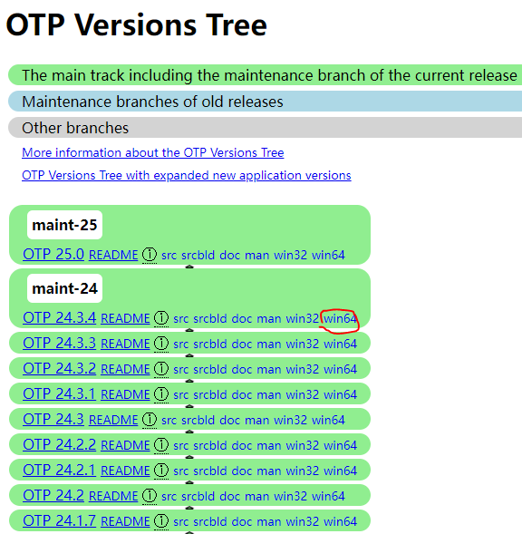

# 续Kafka测试

启动zookeeper

再启动kafka

我们利用csmall-cart-webapi项目的内容

完成Kafka的测试

使用SpringBoot自带的任务调度

每隔10秒向kafka发送信息

我们再编写一个类来接收这个信息

发送信息就使用cart的实体类

## 编写消息的发送

cart-webapi项目中新建包kafka

然后包中新建类Producer代码如下

```java
// 将当前对象保存在spring容器中
// 下面的SpringBoot任务调度才能生效
@Component
public class Producer {
    // 目标每隔10秒向kafka发送一条信息
    // 从Spring容器中获得kafkaTemplate对象
    // 我们之前配置好的依赖就能获得这个对象
    // KafkaTemplate<[话题名称类型],[传递消息的类型]>
    @Autowired
    private KafkaTemplate<String,String> kafkaTemplate;
    
    int i=1;
    // fixedRate就是周期调用 10000毫秒 就是10秒
    @Scheduled(fixedRate = 10000)
    public void sendMessage(){
        // 实例化Cart对象用于发送
        Cart cart=new Cart();
        cart.setId(i++);
        cart.setCommodityCode("PC100");
        cart.setPrice((int)(Math.random()*200+100));
        cart.setCount((int)(Math.random()*10+1));
        cart.setUserId("UU100");
        // 将Cart对象转换为json字符串
        Gson gson=new Gson();
        String json=gson.toJson(cart);
        System.out.println("发送信息的内容为:"+json);
        // 执行发送消息
        // send([话题名称],[要发送的消息]),需要遵循上面kafkaTemplate声明的泛型
        kafkaTemplate.send("myCart",json);
        
    }
    
}
```

## 编写消息的接收

还在kafka包中创建类Consumer

编写接收信息的代码

```java
@Component
public class Consumer {

    // SpringKafka框架接收Kafka的消息使用监听器
    // 这个监听器由SpringKafka框架提供,专门负责监听Kafka的某一个话题
    // 只要这个话题中有消息,就运行指定的方法
    @KafkaListener(topics = "myCart")
    // 当myCart话题有消息时,框架会自动调用这个方法,并将这个消息发送给这个方法做参数
    public void received(ConsumerRecord<String,String> record){
        // 参数record就是kafka中的消息对象
        // 泛型<[话题类型],[消息类型]>
        // 先获得消息内容(就是cart对象的json格式字符串)
        String json=record.value();
        // 将它转换成java的Cart类型
        Gson gson=new Gson();
        Cart cart=gson.fromJson(json,Cart.class);
        //输出获得的信息
        System.out.println("接收到对象为:"+cart);
    }

}
```

zookeeper\kafka\nacos\seata都要启动

然后运行cart项目即可

每隔10秒会看到消息的发送和接收

# RabbitMQ

## 什么是RabbitMQ

RabbitMQ 是一个由 Erlang 语言开发的 AMQP 的开源实现。  AMQP ：Advanced Message Queue，高级消息队列协议。它是应用层协议的一个开放标准，为面向消息的中间件设计，基于此协议的客户端与消息中间件可传递消息，并不受产品、开发语言等条件的限制。  RabbitMQ 最初起源于金融系统，用于在分布式系统中存储转发消息，在易用性、扩展性、高可用性等方面表现不俗。

## RabbitMQ特征

1.可靠性（Reliability）  RabbitMQ 使用一些机制来保证可靠性，如持久化、传输确认、发布确认。

2.灵活的路由（Flexible Routing）  在消息进入队列之前，通过 Exchange 来路由消息的。对于典型的路由功能，RabbitMQ已经提供了一些内置的 Exchange 来实现。针对更复杂的路由功能，可以将多个Exchange 绑定在一起，也通过插件机制实现自己的 Exchange 。

3.消息集群（Clustering）  多个 RabbitMQ 服务器可以组成一个集群，形成一个逻辑 Broker

4.高可用（Highly Available Queues）  队列可以在集群中的机器上进行镜像，使得在部分节点出问题的情况下队列仍然可用。

5.多种协议（Multi-protocol）  RabbitMQ 支持多种消息队列协议，比如 STOMP、MQTT 等等。

6.多语言客户端（Many Clients）  RabbitMQ 几乎支持所有常用语言，比如 Java、.NET、Ruby 等等。

7.管理界面（Management UI）  RabbitMQ 提供了一个易用的用户界面，使得用户可以监控和管理消息 Broker 的许多方面。

8.跟踪机制（Tracing）  如果消息异常，RabbitMQ 提供了消息跟踪机制，使用者可以找出发生了什么。

9.插件机制（Plugin System）  RabbitMQ 提供了许多插件，来从多方面进行扩展，也可以编写自己的插件。

## 下载软件

RabbitMQ是Erlang开发的,所以要先安装Erlang的语言运行环境

先下载安装Erlang

https://erlang.org/download/otp_versions_tree.html



安装的话就是双击

**不要安装在中文路径下,也最好不要安装在有空格的路径下**

RabbitMQ下载

https://www.rabbitmq.com/install-windows.html


rabbitMQ安装也是双击

也是**不要安装在中文路径下,也最好不要安装在有空格的路径下**

## 设置环境变量

要想运行RabbitMQ必须保证系统有Erlang的环境变量

配置Erlang环境变量

把安装Erlang的bin目录配置在环境变量path的属性中


## RabbitMQ的结构


和Kafka不同,Kafka是使用话题名称来收发信息,结构简单

RabbitMQ是使用交换机\路由key指定要发送消息的队列

消息的发送者发送消息时,需要指定交换机和路由key名称

消息的接收方接收消息时,只需要指定队列的名称

在编写代码上,相比于Kafka,每个业务要编写一个配置类

这个配置类中要绑定交换机和路由key的关系,以及路由Key和队列的关系

## 启动RabbitMQ

在安装RabbitMQ的目录的sbin目录下

F:\tool\rabbitmq_server-3.10.1\sbin

运行下面指令

```
rabbitmq-plugins enable rabbitmq_management
```

可能得到下面结果


运行完成之后

可以在Windows任务管理器(Ctrl+Shift+ESC)的服务选项卡中找到rabbitMQ

并且是运行状态

另外一方面可以访问自带的管理界面

http://localhost:15672

默认用户名密码:

guest

guest

## 利用RabbitMQ完成消息队列的收发

我们在csmall-stock-webapi项目中来测试RabbitMQ

可以利用Quartz的任务调度,每隔10秒发一次消息

### 添加依赖

```xml
<dependency>
    <groupId>org.springframework.boot</groupId>
    <artifactId>spring-boot-starter-amqp</artifactId>
</dependency>
```

yml文件配置

```yaml
spring:
  rabbitmq:
    host: localhost
    port: 5672
    username: guest
    password: guest
    virtual-host: /
```

### 交换机,路由,队列配置

专门编写一个类,一般会编写在config包中

本次测试我们在stock-webapi项目的quartz包中创建config包

这个包中创建RabbitMQConfiguration类配置这些信息

```java
// 因为交换机路由key和队列的绑定关系最终交由SpringBoot管理
// 所以当前类要设置为Spring配置类,而且后面所有关系的绑定也要保存到Spring容器中
@Configuration
public class RabbitMQConfiguration {
    // 声明一个交换机名称,一个路由Key名称,一个队列名称
    public static final String STOCK_EX="stock_ex";
    public static final String STOCK_ROUT="stock_rout";
    public static final String STOCK_QUEUE="stock_queue";

    // 声明队列对象,保存到spring容器中
    @Bean
    public Queue stockQueue(){
        return new Queue(STOCK_QUEUE);
    }
    // 声明交换机对象,保存到spring容器中
    @Bean
    public DirectExchange stockDirectExchange(){
        return new DirectExchange(STOCK_EX);
    }
    // 由路由key保存交换机和队列的关系,也保存在Spring容器中
    @Bean
    public Binding stockBinding(){
        return BindingBuilder.bind(stockQueue()).to(stockDirectExchange())
                .with(STOCK_ROUT);
    }

}
```

### 消息的发送

我们在quartz包下QuartzJob类编写了发送消息到RabbitMQ的代码

代码如下

```java
@Autowired
private RedisBloomUtils redisBloomUtils;

// RabbitTemplate 能够向rabbitMQ发送信息
@Autowired
private RabbitTemplate rabbitTemplate;
@Override
public void execute(JobExecutionContext jobExecutionContext) throws JobExecutionException {
    System.out.println("------------------"+ LocalDateTime.now()+"---------------------");
    // 先简单的发一个字符串
    // convertAndSend指定3个参数,交换机名称,路由Key名称,发送信息
    rabbitTemplate.convertAndSend(RabbitMQConfiguration.STOCK_EX,
            RabbitMQConfiguration.STOCK_ROUT,"接收到减库存的消息");
}
```

我们可以根据自己需求修改QuartzConfig配置中这个job的调用周期

参考的每隔10秒运行的Cron表达式

```
"0/10 * * * * ?"
```

### 消息的接收者

quartz包下创建一个RabbitMQConsumer代码如下

```java
// 这个消息消息接收者也要保存到Spring容器
@Component
// RabbitMQ要在类上编写监听器
// 监听STOCK_QUEUE队列,一旦队列有消息,就去运行指定方法
@RabbitListener(queues = {RabbitMQConfiguration.STOCK_QUEUE})
public class RabbitMQConsumer {
    // 这个类中只允许一个方法添加这个注解
    // 意思是当监听器的队列有信息时运行这个方法
    @RabbitHandler
    public void process(String str){

        System.out.println("消费者接收到信息:"+str);
    }
}
```

启动测试

Nacos\seata\rabbitMQ

每逢时间秒数为0,10,20,30,40,50

会运行消息的发收

# 秒杀准备

## 秒杀业务概述

酷鲨项目专门设计了秒杀数据库

其中包含秒杀相关的表信息

秒杀商品的spu\sku,以及秒杀成功的记录

我们的秒杀业务模块mall-seckill,原则上只操作mall_seckill数据库

在秒杀开始之前,我们先要进行一些准备工作

1.在秒杀时间到达之前,将参与秒杀的商品信息保存在布隆过滤器

2.要将秒杀的商品信息预热到Redis缓存

这些工作都是利用Quartz在秒杀开始前的特定时间进行的

## 查询秒杀商品列表

转到我们的正式的酷鲨前台项目

mall-seckill-webapi模块数据访问层编写

创建mapper包,包中创建SeckillSpuMapper

```java
@Repository
public interface SeckillSpuMapper {

    // 声明查询秒杀spu商品列表的方法
    List<SeckillSpu> selectSeckillSpus();

}
```

SeckillSpuMapper.xml

```xml
<!-- 声明当前表各列名称 -->
<sql id="SimpleField">
    <if test="true">
        id,
        spu_id,
        list_price,
        start_time,
        end_time,
        gmt_create,
        gmt_modified
    </if>
</sql>
<!--   查询秒杀列表spu   -->
<select id="selectSeckillSpus" resultMap="BaseResultMap">
    select
        <include refid="SimpleField" />
    from
        seckill_spu
</select>
```

业务逻辑层

创建包service.impl

包中创建类SeckillSpuServiceImpl实现ISeckillSpuService

代码如下

```java
@Service
@Slf4j
public class SeckillSpuServiceImpl implements ISeckillSpuService {

    @Autowired
    private SeckillSpuMapper seckillSpuMapper;
    // 利用product模块根据spuid查询spu信息的方法,保证返回的spu列表包含详细信息
    @DubboReference
    private IForSeckillSpuService dubboSeckillSpuService;

    @Override
    public JsonPage<SeckillSpuVO> listSeckillSpus(Integer page, Integer pageSize) {
        // 查询分页结果,使用PageHelper设置分页查询内容
        PageHelper.startPage(page,pageSize);
        List<SeckillSpu> seckillSpus=seckillSpuMapper.selectSeckillSpus();
        // 下面进行数据封装
        // 准备一个包含更详细信息返回值类型的泛型集合
        List<SeckillSpuVO> seckillSpuVOs=new ArrayList<>();
        for(SeckillSpu seckillSpu: seckillSpus){
            // 根据spuid查询到spu详情
            Long spuId=seckillSpu.getSpuId();
            // 根据spuId 查询Spu详情(Dubbo调用)
            SpuStandardVO spuStandardVO=
                dubboSeckillSpuService.getSpuById(spuId);
            // 实例化包含spu详情和秒杀详情的对象
            SeckillSpuVO seckillSpuVO=new SeckillSpuVO();
            // 将spu详情赋值给SeckillSpuVO对象
            BeanUtils.copyProperties(spuStandardVO,seckillSpuVO);
            // 取出秒杀价
            BigDecimal seckillListPrice=seckillSpu.getListPrice();
            // 向seckillSpuVO中赋值秒杀相关的属性,秒杀价,秒杀开始时间,秒杀结束时间
            seckillSpuVO.setSeckillListPrice(seckillListPrice);
            seckillSpuVO.setStartTime(seckillSpu.getStartTime());
            seckillSpuVO.setEndTime(seckillSpu.getEndTime());
            // 将既有秒杀信息,又有spu详情的seckillSpuVO添加到集合中
            seckillSpuVOs.add(seckillSpuVO);
        }
        // 将分页查询结果PageInfo转换为JsonPage返回
        return JsonPage.restPage(new PageInfo<>(seckillSpuVOs));
    }

    @Override
    public SeckillSpuVO getSeckillSpu(Long spuId) {
        return null;
    }

    @Override
    public SeckillSpuDetailSimpleVO getSeckillSpuDetail(Long spuId) {
        return null;
    }
}
```

开发控制层

创建controller包

包中创建SeckillSpuController类代码如下

```java
@RestController
@RequestMapping("/seckill/spu")
@Api(tags = "秒杀SPU模块")
public class SeckillSpuController {
    @Autowired
    private ISeckillSpuService seckillSpuService;

    // 分页查询所有秒杀列表中的spu
    @GetMapping("/list")
    @ApiOperation("分页查询所有秒杀列表中的spu")
    @ApiImplicitParams({
            @ApiImplicitParam(value = "页码",name = "page",required = true,dataType = "int"),
            @ApiImplicitParam(value = "每页条数",name = "pageSize",required = true,dataType = "int")
    })
    // 查看秒杀列表不需要登录
    public JsonResult<JsonPage<SeckillSpuVO>> listSeckillSpus(Integer page,Integer pageSize){
        JsonPage<SeckillSpuVO> spuVOJsonPage=seckillSpuService.listSeckillSpus(page,pageSize);
        return JsonResult.ok(spuVOJsonPage);
    }

}
```

可以将所有windows相关的软都停止了(虚拟机能使用的同学)

启动虚拟机即可

没有虚拟机的同学启动Nacos\RabbitMQ\Redis

测试启动项目Leaf\product\seckill\passport

测试seckill端口号10007

先登录获得jwt,然后设置10007的全局参数

## 加载秒杀商品

我们下面要查询出即将开始进行秒杀的商品信息

并且将这些信息保存在布隆过滤器中

保证在秒杀进行过程中,有查询不存在的商品请求时,阻止它访问数据库

### 开发持久层(根据SpuId查询Sku列表)

根据SpuId查询Sku列表

创建SeckillSkuMapper

```java
@Repository
public interface SeckillSkuMapper {
    // 根据spuid查询Sku列表
    List<SeckillSku> selectSeckillSkusBySpuId(Long spuId);
}
```

SeckillSkuMapper.xml

```xml
<sql id="SimpleFields">
    <if test="true">
        id,
        sku_id,
        spu_id,
        seckill_stock,
        seckill_price,
        gmt_create,
        gmt_modified,
        seckill_limit
    </if>
</sql>
<!-- 根据spuid查询sku列表的方法 -->
<select id="selectSeckillSkusBySpuId" resultMap="BaseResultMap">
    select
        <include refid="SimpleFields" />
    from
        seckill_sku
    where
        spu_id=#{spuId}
</select>
```

### 开发持久层(查询正在秒杀的商品)

根据给定时间查询出正在秒杀的商品列表

SeckillSpuMapper 添加这个方法

```java
// 查询给定时间正在进行秒杀活动的spu列表
List<SeckillSpu> selectSeckillSpusInTime(LocalDateTime time);
```

SeckillSpuMapper.xml

```xml
<!--  查询正在秒杀的商品列表  -->
<select id="selectSeckillSpusInTime" resultMap="BaseResultMap">
    select
        <include refid="SimpleField" />
    from
        seckill_spu
    where
        start_time &lt; #{time}
    and
        end_time &gt; #{time}
</select>
```

### 开发持久层(查询所有秒杀商品的SpuId)

为了布置布隆过滤器,我们需要先将秒杀表中所有商品的Spuid查询出来

这样将他们添加到布隆过滤器中

这样就可以布置一个防止查询不在秒杀商品列表中信息的布隆过滤器

仍然是SeckillSpuMapper添加方法

```java
// 查询所有秒杀商品的spuid列表
Long[] selectAllSeckillSpuIds();
```

SeckillSpuMapper.xml

```xml
<!--   查询所有秒杀商品列表的spuId   -->
<select id="selectAllSeckillSpuIds" resultType="long">
    select
        spu_id
    from
        seckill_spu
</select>
```

## 开发计划

上面准备完成

下面我们要利用Quartz设置要运行时机

达到下面两个目标

1.将即将开始秒杀活动的商品查询出来,保存在Redis中,完成"缓存预热"

​	真正秒杀开始时,都从Redis中获取商品信息,并且防止雪崩

2.将所有可能进入秒杀的商品保存在布隆过滤器中

​	后期编写业务逻辑层时,查询数据库之前,要先判断查询的信息在

​	布隆过滤器中是否存在,如果不存在终止访问流程!


