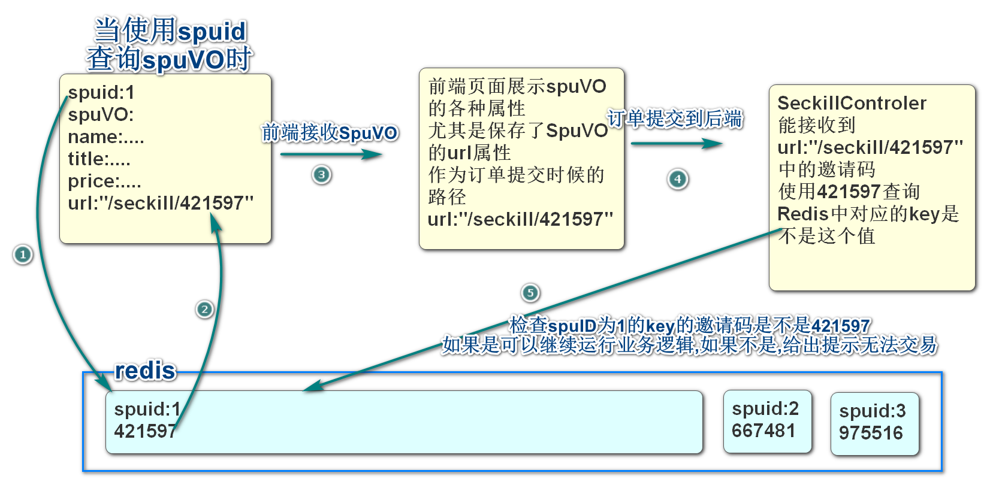

# 续查询秒杀商品详情页

## 按SpuId查询sku列表

秒杀时,秒杀表中sku信息和常规表sku信息有很多不同

价格,库存,有些常规表中销售的规格,秒杀表中可能没有

### 开发业务逻辑层

按SpuId查询秒杀sku列表的持久层方法,之前已经完成了编写

下面在service.impl包下创建SeckillSkuServiceImpl类代码如下

```java
@Service
@Slf4j
public class SeckillSkuServiceImpl implements ISeckillSkuService {
    @Autowired
    private RedisTemplate redisTemplate;
    @Autowired
    private SeckillSkuMapper seckillSkuMapper;
    @DubboReference
    private IForSeckillSkuService dubboSkuService;

    @Override
    public List<SeckillSkuVO> listSeckillSkus(Long spuId) {
        // 按SpuId从seckill_sku表中查询对应的sku列表
        List<SeckillSku> seckillSkus=seckillSkuMapper.selectSeckillSkusBySpuId(spuId);
        // 声明返回类型的集合对象
        List<SeckillSkuVO> seckillSkuVOs=new ArrayList<>();
        for(SeckillSku seckillSku : seckillSkus){
            SeckillSkuVO seckillSkuVO=null;
            // 获得当前skuId
            Long skuId=seckillSku.getSkuId();
            // 获得skuId对应Redis的Key
            String seckillSkuVOKey= SeckillCacheUtils.getSeckillSkuVOKey(skuId);
            // 判断Redis中是否有这个key
            if(redisTemplate.hasKey(seckillSkuVOKey)){
                seckillSkuVO =(SeckillSkuVO)redisTemplate
                                .boundValueOps(seckillSkuVOKey).get();
            }else{
                // 如果Redis中没有对应的key
                // 先查询常规sku表中的信息
                SkuStandardVO skuStandardVO=dubboSkuService.getById(skuId);
                // 实例化seckillSkuVO
                seckillSkuVO=new SeckillSkuVO();
                // 将常规表中信息赋值给seckillSkuVO
                BeanUtils.copyProperties(skuStandardVO,seckillSkuVO);
                // 将秒杀信息也赋值到seckillSkuVO
                seckillSkuVO.setStock(seckillSku.getSeckillStock());
                seckillSkuVO.setSeckillPrice(seckillSku.getSeckillPrice());
                seckillSkuVO.setSeckillLimit(seckillSku.getSeckillLimit());
                // 将信息保存在Redis,以便后续获取
                redisTemplate.boundValueOps(seckillSkuVOKey).set(seckillSkuVO,
                        1000*60*60*72+ RandomUtils.nextInt(1000*60*60*5),
                                TimeUnit.MILLISECONDS);
            }
            // 将查询好的seckillSkuVO对象新增到集合中
            seckillSkuVOs.add(seckillSkuVO);
        }
        // 千万别忘了返回集合对象!!!!
        return seckillSkuVOs;
    }
}
```

### 开发控制层

controller包中创建SeckillSkuController类

代码如下

```java
@RestController
@RequestMapping("/seckill/sku")
@Api(tags="秒杀Sku模块")
public class SeckillSkuController {
    @Autowired
    private ISeckillSkuService seckillSkuService;

    // 根据spuId查询sku列表的数据
    @GetMapping("/list/{spuId}")
    @ApiOperation("根据spuId查询sku列表的数据")
    @ApiImplicitParams({
            @ApiImplicitParam(value = "SPU ID", name="spuId"
                                ,required = true,dataType = "long")
    })
    public JsonResult<List<SeckillSkuVO>> listSeckillSkus(
            @PathVariable Long spuId){
        List<SeckillSkuVO> list=seckillSkuService.listSeckillSkus(spuId);
        return JsonResult.ok(list);
    }
}
```

启动服务测试

虚拟机同学启动虚拟机

Windows版的启动Nacos\Redis\RabbitMQ

项目启动Leaf\Product\passport\seckill

# 开发秒杀执行流程

## Sentinel限流和降级处理类

Sentinel是阿里提供的SpringCloud组件,主要用于限制外界访问当前服务器的控制器方法

之前的课程中,我们已经比较详细的学习的Sentinel使用的方式

下面我们要先编写Sentinel限流和服务降级时,运行的自定义异常处理类

我们需要再创建一个包exception

创建限流类SeckillBlockHandler

```java
// 秒杀限流类
@Slf4j
public class SeckillBlockHandler {

    // 类中声明限流的方法,返回值必须和限流的控制器方法一致
    // 参数也需要和限流的控制器方法一致,还需要额外添加一个BlockException的异常参数
    // 定义成静态的可以直接使用类名调用,不用实例化对象
    public static JsonResult seckillBlock(String randCode,
                 SeckillOrderAddDTO seckillOrderAddDTO, BlockException e){
        log.error("限流模块生效");
        return JsonResult.failed(ResponseCode.INTERNAL_SERVER_ERROR,"服务器忙");
    }
}
```

再创建降级类SeckillFallBack

```java
// Sentinel秒杀降级方法
@Slf4j
public class SeckillFallBack {

    // 返回值类型和参数列表要求和限流方法基本一致
    // 只是降级方法是因为控制器发生了异常,我们的降级方法可以接收这个异常来处理,或给出提示
    // 所有异常类型不限
    public static JsonResult seckillFall(String randCode,
           SeckillOrderAddDTO seckillOrderAddDTO,Throwable throwable){
        log.error("秒杀业务降级!");
        return JsonResult.failed(ResponseCode.INTERNAL_SERVER_ERROR,
                throwable.getMessage());
    }
}
```

## 提交秒杀订单

### 开发业务逻辑层

没有新的持久层代码需要开发

直接开发提交订单的业务逻辑层

秒杀提交订单和常规提交订单的基本业务逻辑一致

只是秒杀订单是判断Redis中是否有库存,减redis库存

还需要判断秒杀次数是否唯一

将秒杀订单转换成普通订单再使用dubbo调用普通订单的新增方法

最后要将秒杀成功的信息发送给RabbitMQ,后续再处理success表中的记录

我们单独创建一个业务逻辑层类

SeckillServiceImpl编写代码如下

```java
@Service
public class SeckillServiceImpl implements ISeckillService {
    @Autowired
    private StringRedisTemplate stringRedisTemplate;
    @Autowired
    private RabbitTemplate rabbitTemplate;
    @DubboReference
    private IOmsOrderService dubboOrderService;

    /**
     *  秒杀提交方法
     *  1.获得Redis库存,如果有库存减库存,没库存给提示
     *  2.收集各方面信息,形成订单对象,利用Dubbo将订单信息提交到oms_order等表里
     *  3.发送消息队列,将订单相关信息发送给RabbitMQ后续再处理
     */
    @Override
    public SeckillCommitVO commitSeckill(SeckillOrderAddDTO seckillOrderAddDTO) {
        // 第一阶段:检查重复购买和库存数
        // 获得用户秒杀购买的skuId
        Long skuId=seckillOrderAddDTO.getSeckillOrderItemAddDTO().getSkuId();
        // 获得秒杀商品的用户id
        Long userId=getUserId();
        // 一个用户id和一个skuId就能确定一个用户买了什么商品
        // 秒杀业务要求一个用户只能购买一次一个skuId
        // 我们会将用户id和skuId的购买关系保存在Redis中,以便判断是否重复购买
        // 声明重复秒杀的判断key
        String reSeckillKey= SeckillCacheUtils.getReseckillCheckKey(skuId,userId);
        // 向当前保存购买关系的key中使用自增方法
        // 如果redis中没有这个key,默认情况下,自增后结果为1返回给seckillTimes
        // 但是如果之前已经出现过key,再自增的话至少为2,返回给seckillTimes
        Long seckillTimes=stringRedisTemplate.boundValueOps(reSeckillKey).increment();
        // 这里就可以判断这个key对应的Redis的值(seckillTimes)是否>1,如果>1,证明之前购买过
        if(seckillTimes>1){
            //如果seckillTimes>1,抛出异常,提示已经购买过
            throw new CoolSharkServiceException(ResponseCode.FORBIDDEN,"一个用户只能购买一种商品一次");
        }
        // 没有进if表示是第一次购买,进入减库存环节
        // 先获得当前库存的值,利用SkuId,获取对应的Key,获得库存数
        String seckillSkuKey=SeckillCacheUtils.getStockKey(skuId);
        // 从Redis中获得库存数
        // decrement方法和上面increment方法相反,会返回当前库存减一之后的值
        Long leftStock=stringRedisTemplate.boundValueOps(seckillSkuKey).decrement(1);
        // leftStock是当前用户购买秒杀商品之后,该商品剩余的库存
        // 如果该值小于0,表示当前用户购买是已经无货
        if(leftStock<0){
            throw new CoolSharkServiceException(
                            ResponseCode.NOT_ACCEPTABLE,"您选购的商品已经无货");
        }
        // 用户第一次购买的同时,还有货
        // 第二阶段:开始生成订单
        // 我们现在业务逻辑层获得的参数是SeckillOrderAddDTO类型
        // 能够利用Dubbo新增到order模块的订单类型是OrderAddDTO
        // 它们类型不同,而且属性结果不完全一致,需要进行针对性的转换,
        // 而这个转换过程我们可以编写一个方法完成
        OrderAddDTO orderAddDTO=convertSeckillOrderToOrder(seckillOrderAddDTO);
        // 转换过程中,没有userId数据,需要转换后手动赋值
        orderAddDTO.setUserId(userId);
        // Dubbo调用order业务逻辑层方法,完成订单的新增
        OrderAddVO orderAddVO=dubboOrderService.addOrder(orderAddDTO);
        // 到此为止新增订单完成
        // 进入第三阶段: rabbitMQ消息队列的发送
        // 我们要通过发送RabbitMQ消息的方式完成Success对象保存到数据库的功能
        // 简单来说我们只需要将Success对象赋上值,然后将它发送到消息队列中就完成任务了
        Success success=new Success();
        // SeckillOrderItemAddDTO和Success有比较多的同名属性,可以赋值
        BeanUtils.copyProperties(
                seckillOrderAddDTO.getSeckillOrderItemAddDTO(),success);
        // 还缺少一些主要属性(实际开发可以根据需求再添加)
        success.setUserId(userId);
        success.setOrderSn(orderAddVO.getSn());
        // 利用RabbitTemplate将success对象发送到RabbitMQ中,等待消息队列处理
        rabbitTemplate.convertAndSend(RabbitMqComponentConfiguration.SECKILL_EX,
                RabbitMqComponentConfiguration.SECKILL_RK,success);
        // 声明最终返回类型SeckillCommitVO
        SeckillCommitVO seckillCommitVO=new SeckillCommitVO();
        // 它的属性和新增订单的返回值OrderAddVO完全一致,直接赋值即可
        BeanUtils.copyProperties(orderAddVO,seckillCommitVO);
        // 别忘了返回
        return seckillCommitVO;
    }

    private OrderAddDTO convertSeckillOrderToOrder(SeckillOrderAddDTO seckillOrderAddDTO) {
        // 实例化返回值对象
        OrderAddDTO orderAddDTO=new OrderAddDTO();
        // 先将参数seckillOrderAddDTO中所有的属性赋值到orderAddDTO同名属性中
        BeanUtils.copyProperties(seckillOrderAddDTO,orderAddDTO);
        // seckillOrderAddDTO中还包含订单商品详情的对象SeckillOrderItemAddDTO
        // 我们要将SeckillOrderItemAddDTO赋值给常规的订单商品详情类型orderItemAddDTO
        // 所以实例化OrderItemAddDTO对象
        OrderItemAddDTO orderItemAddDTO=new OrderItemAddDTO();
        // 将SeckillOrderItemAddDTO对象的同名属性赋值给orderItemAddDTO
        BeanUtils.copyProperties(seckillOrderAddDTO.getSeckillOrderItemAddDTO(),
                                    orderItemAddDTO);
        // 又因为常规订单对象OrderAddDTO中包含的订单详情是个集合
        // 所以实例化一个集合
        List<OrderItemAddDTO> orderItemAddDTOs=new ArrayList<>();
        // 将已经赋值完成的orderItemAddDTO对象添加到集合中
        orderItemAddDTOs.add(orderItemAddDTO);
        // 将集合赋值到常规订单对象orderAddDTO中
        orderAddDTO.setOrderItems(orderItemAddDTOs);
        // 最终返回常规订单对象(转换完成)
        return orderAddDTO;
    }


    // 业务逻辑层中可能有多个方法需要获得当前用户信息
    // 我们可以定义一个方法实现从SpringSecurity中获得用户信息
    public CsmallAuthenticationInfo getUserInfo(){
        // 从SpringSecurity框架的容器中,获得当前用户的authenticationToken对象
        UsernamePasswordAuthenticationToken authenticationToken=
                (UsernamePasswordAuthenticationToken) SecurityContextHolder
                        .getContext().getAuthentication();
        // 判断获取的对象是不是null
        if(authenticationToken!=null){
            // 如果不是空,就是登录成功了,从authenticationToken对象中获得当前登录用户
            CsmallAuthenticationInfo csmallAuthenticationInfo=
                    (CsmallAuthenticationInfo)authenticationToken.getCredentials();
            return csmallAuthenticationInfo;
        }
        throw new CoolSharkServiceException(ResponseCode.UNAUTHORIZED,"没有登录信息");
    }
    // 单纯获得当前登录用户id的方法
    public Long getUserId(){
        return getUserInfo().getId();
    }
}
```

### 开发控制层

随机码使用流程



controller包中创建SeckillController

代码如下

```java
@RestController
@RequestMapping("/seckill")
@Api(tags = "秒杀发起模块")
public class SeckillController {

    @Autowired
    private ISeckillService seckillService;
    @Autowired
    private RedisTemplate redisTemplate;

    // 验证随机码并调用秒杀生成订单的控制器方法
    @PostMapping("/{randCode}")
    @ApiOperation("验证随机码并调用秒杀生成订单的控制器方法")
    @ApiImplicitParams({
            @ApiImplicitParam(value = "随机码",name = "randCode",required = true,dataType = "string")
    })
    // Sentinel限流和降级方法的指定
    @SentinelResource(value = "seckill",
            blockHandlerClass = SeckillBlockHandler.class,blockHandler = "seckillBlock",
            fallbackClass = SeckillFallBack.class,fallback = "seckillFall")
    @PreAuthorize("hasRole('ROLE_user')")
    public JsonResult<SeckillCommitVO> commitSeckill(
            @PathVariable String randCode, SeckillOrderAddDTO seckillOrderAddDTO){
        // 获得SpuId
        Long spuId=seckillOrderAddDTO.getSpuId();
        // 从redis中获得当前spuId对应的随机码
        String randCodeKey= SeckillCacheUtils.getRandCodeKey(spuId);
        if(redisTemplate.hasKey(randCodeKey)){
            // 如果redis中包含当spuId的key
            // 获取redis中对应的key的随机码
            String redisRandCode= redisTemplate.boundValueOps(randCodeKey).get()+"";
            if(redisRandCode==null){
                // 如果redis中邀请码丢失,服务器内部错误
                throw new CoolSharkServiceException(ResponseCode.INTERNAL_SERVER_ERROR,
                        "缓存随机码为空,联系网站管理员");
            }
            // 判断路径中的随机码和Redis中的随机码是否一致
            if(!redisRandCode.equals(randCode)){
                // 如果不一致,我们认为本次请求是有人攻击行为
                throw new CoolSharkServiceException(ResponseCode.NOT_FOUND,"没有这商品");
            }
            // 一切正常,提交信息到业务逻辑层
            SeckillCommitVO seckillCommitVO=
                    seckillService.commitSeckill(seckillOrderAddDTO);
            return JsonResult.ok(seckillCommitVO);
        }else{
            // 没有key对应,就是秒杀商品列表中没有这个spuId
            throw new CoolSharkServiceException(ResponseCode.NOT_FOUND,"没有这商品");
        }

    }
}
```

测试:

重启Seckill

因为需要order的Dubbo的支持,所以启动order模块

启动Sentinel

无论是虚拟机同学还是windows同学

都要在本地启动Sentinel才能生效

可以在SeckillInitialJob类的最后位置输出以下spuId为2的随机码用于测试

## 新增成功信息到success

我们在上面提交秒杀订单的业务中,已经将success对象发送到的RabbitMQ

为了提高秒杀系统的性能和并发量,使用RabbitMQ消息队列异步完成success的新增操作

实际上还有数据库seckill_sku表库存的修改,一并完成

### 开发持久层

SeckillSkuMapper添加修改秒杀库存的方法

```java
// 根据skuid修改库存数
void updateReduceStockBySkuId(@Param("skuId") Long skuId,
                        @Param("quantity") Integer quantity);
```

SeckillSkuMapper.xml添加方法

```xml
<!-- 根据skuid修改数量quantity  -->
<update id="updateReduceStockBySkuId">
    update
        seckill_sku
    set
        seckill_stock=seckill_stock-#{quantity}
    where
        sku_id=#{skuId}
</update>
```


