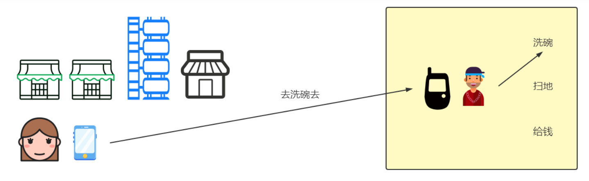
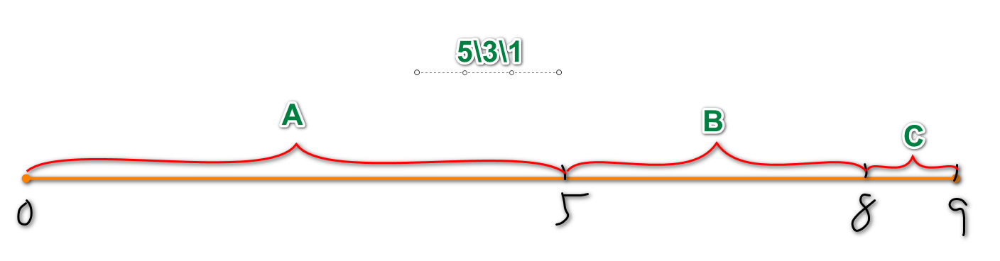

# 续 开发秒杀执行流程

## 新增成功信息到success

### 开发持久层

上次课我们完成了执行秒杀生成订单的全部代码

还有减少数据库库存的持久层方法

下面我们继续针对处理success的业务完成编写新增success到数据库的持久层

创建SuccessMapper添加新增success的方法

```java
@Repository
public interface SuccessMapper {

    // 新增Success对象到数据库的方法
    void saveSuccess(Success success);
}
```

SuccessMapper.xml 添加对应方法

```xml
<insert id="saveSuccess">
    insert into
        success(
                user_id,
                user_phone,
                sku_id,
                title,
                main_picture,
                seckill_price,
                quantity,
                bar_code,
                data,
                order_sn
    ) values(
             #{userId},
             #{userPhone},
             #{skuId},
             #{title},
             #{mainPicture},
             #{seckillPrice},
             #{quantity},
             #{barCode},
             #{data},
             #{orderSn}
                    )
</insert>
```

### 开发业务逻辑层

这里所谓的业务逻辑层就是监听队列

在队列出现数据时,自动运行的方法

```java
@Component
// RabbitListener指定监听的队列名称
@RabbitListener(queues = {RabbitMqComponentConfiguration.SECKILL_QUEUE})
public class SeckillQueueConsumer {

    @Autowired
    private SuccessMapper successMapper;
    @Autowired
    private SeckillSkuMapper seckillSkuMapper;
    // 当监听的队列名称有数据\信息时
    // 会自动运行下面的方法,方法名无关,主要关联@RabbitHandler注解
    // 参数应该和发送消息的参数类型一致
    
    @RabbitHandler
    public void process(Success success){
        // 扣库存
        seckillSkuMapper.updateReduceStockBySkuId(
                success.getSkuId(),success.getQuantity());
        // 新增Success
        successMapper.saveSuccess(success);
    }
}
```

下面进行测试

本次测试内容和之前测试需求一致

环境方面

Nacos\Sentinel\Seata\redis\RabbitMQ

服务方面

Leaf\product\order\passport\seckill

Sentinel必须本地起!!!!!

# 知识点总复习

## 微服务相关

### SpringCloud

微服务是马丁富勒2014年提出的标准

规定了分布式项目的开发标准结构

SpringCloud是在该标准结构的基础上,实现分布式微服务项目的框架集

SpringCloud框架的贡献者:

Spring: Gateway(网关)

Netflix:Eureka(注册中心),Zuul(网关),Ribbon\Feign(微服务间调用),Hystrix(限流)

Alibaba:Nacos(注册中心\配置中心),Dubbo(微服务间调用),Sentinel(限流),Seata(分布式事务)

### Nacos

微服务项目的注册中心


当前微服务的所有模块(项目)启动时都要将信息注册到Nacos

Nacos心跳机制

Nacos实例分两类

* 临时实例
* 永久实例

```yml
ephemeral: false # 默认false实例为永久实例。true：临时; false：永久
```

**临时实例**是每隔5,秒向Nacos发送心跳包(续约)

心跳包中包含当前服务的基本信息

Nacos接收到信息后,为它进行注册

称之为心跳续约

**永久实例**不会主动向Nacos报告

而是Nacos每隔15秒检查永久实例的健康状态

如果连续的两个15秒都没有响应,就会剔除服务

称之为心跳检测

### RPC和Dubbo

RPC是Remote Procedure Call 翻译为:远程过程调用

包含两个协议

1.序列化协议

2.通信协议



Dubbo就是RPC结构的实现

Dubbo内部包含了序列化协议和通信协议的实现

我们使用Dubbo实现微服务间方法的调用

具体操作就是业务逻辑层的调用


1.首先服务的提供者启动服务到注册中心注册,包括各种ip端口信息,Dubbo会同时注册该项目提供的远程调用的方法

2.服务的消费者(使用者)注册到注册中心,订阅发现

3.当有新的远程调用方法注册到注册中心时,注册中心会通知服务的消费者有哪些新的方法,如何调用的信息

4.RPC调用,在上面条件满足的情况下,服务的调用者无需知道ip和端口号,只需要服务名称就可以调用到服务提供者的方法

Dubbo的负载均衡

* **randomloadbalance:随机分配策略(默认)**

* roundRobinLoadbalance:权重平均分配
* leastactiveLoadbalance:活跃度自动感知分配
* consistanthashLoadbalance:一致性hash算法分配



平滑加权算法


### Seata

分布式的事务解决方案

**Seata为用户提供了 AT、TCC、SAGA 和 XA 事务模式,为用户打造一站式的分布式解决方案。**

我们项目中只使用了AT模式


AT模式优点:自动化,开发方便一个注解解决问题

缺点:依赖数据库连接,只能回滚数据库操作

Seata构成

* 事务协调器TC
* 事务管理器TM
* 资源管理器RM

AT模式运行过程

1.事务的发起方(TM)会向事务协调器(TC)申请一个全局事务id,并保存

2.Seata会管理事务中所有相关的参与方的数据源,将数据操作之前和之后的镜像都保存在undo_log表中,这个表是seata框架规定的,方便提交(commit)或回滚(roll back)

3.事务的发起方(TM)会连同全局id一起通过远程调用运行资源管理器(RM)中的方法

4.资源管理器(RM)接收到全局id,并运行指定的方法,将运行的状态同步到事务协调器(TC)

5.如果运行整体没有发生异常,发起方(TM)会通过事务协调器通知所有分支,将本次事务所有对数据库的影响真正生效,

如果任何一个参与者发生异常,那么都会通知事务协调器,再由事务协调器通知有分支,根据undo_log表中保存的信息,撤销(回滚)即将正式影响数据库的数据

**如果事务中有的参与者操作的不是关系型数据库(例如操作Redis)**

那么AT模式就不能生效了

**TCC模式**

这个模式可以实现对数据库之外的信息存储媒介进行回滚操作

只不过这个回滚需要我们自己编写代码

需要为每个业务编写Prepare\Commit\Rollback方法

Prepare编写常规准备,如果整个业务运行无异常运行Commit,如果有异常会自动运行Rollback

缺点是每个业务都需要编写3个对应的方法,代码有冗余,而且业务入侵量大

**SAGA模式**

一般用于修改老版本代码

不用编写像TCC模式那么多的方法

但是需要手动编写每个参与者的方法回滚的业务逻辑层代码类

开发量大

**XA 模式**

XA是适用于支持XA协议的数据库,使用的比较少

### Sentinel

随着微服务的流行，服务和服务之间的稳定性变得越来越重要。Sentinel 以流量为切入点，从流量控制、熔断降级、系统负载保护等多个维度保护服务的稳定性。

我们可以对控制器方法(Controller)进行限流和降级操作

@SentinelResource注解编写在控制器方法前

可以规定,限流时运行哪个方法,降级时运行哪个方法

我们可以启动Sentinel,在Sentinel的dashboard(仪表盘\控制台)中对这些标记有@SentinelResource注解的方法进行限流的设置

常用的限流策略有QPS和并发线程数

QPS表示每秒内请求该控制器方法的请求数

并发线程数表示同时在访问这个控制器方法的线程数量

所谓降级就是在控制器运行过程中,发生异常时,可以运行降级的方法

这个降级方法会优先于SpringMvc的统一异常处理

**blockHandler(限流方法)**

- 属性值是流控后调用的方法名称
- 流控处理方法返回值和资源方法(控制方法)返回值一致
- 流控处理方法参数和资源方法(控制方法)一致的同时,可以接收额外参数BlockException
- 流控处理方法一定要在资源方法同一个类内,如果不在同一个类,使用blockHandlerClass属性

**fallback**

- 属性值是降级处理方法名称
- 降级处理方法返回值和资源方法返回值一致
- 降级处理方法参数和资源方法一致的同时,可以接收额外异常类型参数
- 降级处理方法一定要在资源方法同一个类内,如果不在同一个类,使用fallbackClass属性

到此为止,所有阿里提供的SpringCloud组件库就复习完成了

### Gateway

所谓网关,就是请求到当前微服务项目,当前项目为访问者提供的统一入口


任何请求访问到网关,再由网关分析路由到指定的服务器运行

路由的近义词就是"分配"

我们使用SpringGateway作为当前项目的网关组件,是Spring自己开发的,也是SpringCloud中的组件之一

网关的使用并不是一个程序,而是我们需要创建一个项目,然后按要求配置好

网关需要注册到Nacos,因为它也是微服务的一员

网关路由配置

```yaml
spring:
  cloud:
    gateway:
      routes:   # gateway配置路由信息开始
        # spring.cloud.gateway.routes[0].predicates[0]
        - id: gateway-shanghai
          uri: lb://shanghai
          predicates:
            - Path=/sh/**
```

Spring Gateway还内置了断言和过滤器

我们可以直接使用SpringGateway的动态路由功能

自动生成和项目相关的路径完成路由

动态路由配置

```yaml
spring:
  cloud:
    gateway:
      discovery:
        locator:
          # 开启动态路由,网关会自动从Nacos注册列表中寻找指定的服务器名称,路由到该项目
          enabled: true
```

生效后可以使用下面路径访问微服务的资源

9000是网关项目的端口号

```
localhost:9000/[服务名称]/bj/show
```

到此为止,SpringCloud组件全部完成

## Docker

windows系统安装Docker的实际情况较少

所以我们安装Linux虚拟机学习docker

Docker是一个用来开发、运输和运行应用程序的开放平台。使用Docker可以将应用程序与基础结构分离，以便快速交付软件。使用Docker，您可以以管理应用程序的方式管理基础架构。通过利用Docker的方法快速传送、测试和部署代码，可以显著减少编写代码和在生产中运行代码之间的延迟。


现今开发的过程中

大多数系统运行时需要的软件(mysql\Nacos\redis)都会安装在Docker中

我们启动的虚拟机中,所有服务也都是Docker的容器

## Elasticsearch

是java开发的一个全文搜索引擎

使用Lucene作为搜索核心

能够高效的完成类似于数据库模糊查询的操作

数据保存在硬盘上

同样数量级的查询,速度是数据库模糊查询的100倍

数据库模糊查询慢的原因是数据库前模糊查询时不能启动索引,所以进行的是逐行搜索,全表搜索

Elasticsearch能查询的快的原因是分词后倒排索引


默认不支持中文分词

需要安装中文分词插件(词库)

我们常用的免费开源词库IK

ik_smart和ik_max_word作为分词器

ik_smart:

* 优点:会粗略的将文字片段进行分词,占用空间小查询速度快
* 缺点:已经分词过的内容不会再次分词,分词粗略会导致查询不全面,

ik_max_word:

* 优点:会详情的将文字片段进行分词,查询结果全,不容易漏查
* 缺点:分词太详情导致索引库占用空间大,查询速度慢

ES的数据结构


* ES启动后可以创建多个索引(index),index相当于数据库中表的概念
* 一个索引中可以创建保存多个文档(document)相当于数据库中行的概念
* 一个文档中的数据和数据库一行数据类型,也是有字段名称和字段的值

利用SpringData操作ES

1.保证有对应Es的实体类

2.创建Es的持久层(自动实现基本增删改查,也支持自定义查询)

3.业务逻辑层调用方法

## Logstash

ELK的组合:Elasticsearch+Logstash+Kibana

如果一个项目单纯使用Elasticsearch进行数据的记录,为了模糊查询的优化而存在

那么当数据库数据进行变化时,我们就必须将ES中的数据也进行变化

为了优化数据库数据和Elasticsearch数据的同步,我们可以使用logstash

Logstash是一款开源的日志采集,处理,输出的软件,每秒可以处理数以万计条数据,可以同时从多个来源采集数据,转换数据,然后将数据输出至自己喜欢的存储库中(官方推荐的存储库为Elasticsearch)


我们的虚拟机中是安装有logstash的

集成在了ES中

只要spu表的gmt_modified列数据有变

logstash就会将数据有变得行同步到ES中(增删改都可以),

这样就实现数据库数据和Es数据自动同步

## PageHelper

我们可以使用PageHelper简化mysql数据库分页查询操作

添加PageHelper支持后,我们可以在任何业务逻辑层调用查询方法之前

编写PageHelper.startPage(pageNum,pageSize)来设置分页条件,进行分页查询

内部原理是使用Mybatis的拦截器,在sql语句后面追加limit关键字

查询出的结果就是分页结果,我们可以实例化PageInfo对象,对这次分页查询的分页信息进行计算和收集,最终返回PageInfo对象,但是如果微服务有要求,返回JsonPage也是比较常见的

## JWT单点登录

是一种分布式系统身份和权限验证的一种方式

优点是不占用内存


JWT的验证过程


## Quartz

任务调度工具

可以设置规定的时间点运行指定的方法

规定的时间点是Trigger

运行的指定的方法是job


Scheduler是调度器,SpringBoot管理,我们不需要编码

我们需要编写的是Job也就是到时间具体做什么

在配置文件中将job封装成JobDetail对象,在绑定给Trigger

Trigger中使用Cron表达式设置运行时间

## 布隆过滤器

可以利用Redis

可以将集合中已经保存的元素记录在布隆过滤器中

当出现一个新元素时,可以利用布隆过滤器判断是否已经存在于集合中

但是也要知道布隆过滤器是存在误判的

布隆过滤器判断没有的一定不在集合中,

但是布隆过滤器判断有的,不一定在集合中

误判率可以根据公式计算出来

## Redis

缓存的淘汰策略

缓存穿透

缓存击穿

缓存雪崩

持久化RDB和AOF


# 业务总结

## 电商平台有什么功能(模块)

登录,注册

显示商品分类功能

商品列表功能

商品详情功能

购物车管理功能

生成订单

搜索商品功能

商品秒杀功能

包含模块有分类和商品显示模块(front)

购物车和订单模块(order)

搜索模块(search)

秒杀模块(seckill)

单点登录服务模块(passport\sso)

## 三级分类树的实现

本电商平台采用固定的三级分类

没有自关联分类

实现思路:

1.查询出所有分类对象

2.将当前分类对象以父分类id为Key保存在一个Map中

3.遍历所有分类对象,以当前分类对象id为key,从Map中获取它的子分类,关联到三级分类树对象中

最后返回

## 如何实现spu列表

可能是通过分类id查询出spu列表

也可能是搜索功能搜索出的spu列表

显示它们的注意事项就是分页

## 如何显示一个商品的详情

商品详情页面有4个查询

1.SpuId查询spu表中信息显示的内容有默认价格title\name\默认图片等

2.SpuId查询spu_detail表中信息,内容是商品详情大图片

3.根据SpuId查询商品的所有属性

​	是先用spuid关联到分类id,再由分类id关联到属性id,在获得属性id包含的所有属性,是一个关联查询

​	如果是一个智能手机分类下的spu,能够查询到例如内存\处理器\颜色等规格属性

4.根据spuId查询Sku列表

​	只有查询到Sku列表,才知道具体的真实价格\图片\库存的情况

​	才选择对应规格属性时,才能知道有货无货

## 如何实现购物车的管理

用户在商品详情页选择属性之后,能够确定sku

将用户选中的sku保存在购物车中,

需要用户登录,因为所有购物车操作都需要用户身份

我们新增商品到购物车将数量也考虑进来

删除或清空购物车功能就是按照购物车id进行操作即可

修改购物车中商品数量时,可以判断一下库存是否允许,如果没有库存就修改失败

## 生成订单功能如何实现

用户选好了商品,或勾选了购物车中购买的商品

就可以进行订单的生成了,在用户已经登录的前提下

首先减少库存数,如果用户从购物车勾选,删除用户勾选购物车的商品

然后开始收集各种数据,单价和购买的数量,生成订单对象同时也生成订单详情对象

一个订单中可能包含多个商品,计算总价,包含运费和优惠的处理

所有数据收集完毕之后,新增到数据库

任何数据库操作失败都要抛出发生异常

我们可以利用分布式事务seata来根据运行状态决定最终要提交还是回滚

保证订单生成之后数据的完整性

## 搜索功能如何实现

我们使用Elasticsearch全文搜索引擎实现搜索功能

先创建关联Es的实体类

我们可以使用logstash实现和Es信息的同步

也可以编写代码分页查询所有表中信息在分批增到ES中

只是后续同步数据比较麻烦

搜索功能本身使用SpringDataElasticsearch实现

将用户输入的关键字获取到Es中进行查询

将查询到的Spu列表返回给前端即可

## 如何实现秒杀

对于秒杀业务,我们首先要考虑的是怎么能够在有限的设备上达到最高的并发

因为秒杀是典型的高并发高性能的业务需求

所以我们要尽可能的使用能够提升性能和并发的组件或功能

同时保证服务器的稳定运行

例如:Redis,Sentinel,消息队列等

具体实现秒杀分为几个步骤

### 秒杀前准备

我们可以利用任务调度工具Quartz在指定的时间进行缓存准备工作

主要两方面

1.在秒杀开始前指定的时间,Redis缓存预热,将每个sku参与秒杀的库存保存在Redis中

​	而且为了避免有人恶意访问还可以生成一个随机码,也保存在Redis中,用于验证是否为正常链接购买秒杀商品

2.在每个批次秒杀开始前,将本批次所有秒杀商品的spuid保存在布隆过滤器中,减少缓存穿透的情况

### 秒杀信息的查询

秒杀开始,用户在秒杀商品的规定时间内可以查询秒杀商品详情

所有秒杀商品spu查询时,都先查询布隆过滤器是否包含这个spuid,如果包含允许访问,如果不包含抛出异常,也要考虑布隆过滤器误判的情况,

每当业务中查询spu和sku时,都需要先检查redis中是否包含这个数据,如果包含直接从redis中获得,如果不包含再从数据库中查,但是同时也注意,查询完了要保存到Redis中,以便之后的查询直接从redis中获取,在保存到Redis时,为了减少缓存雪崩的几率,我们为每个Spu和Sku对象都添加了过期时间随机数

### 提交秒杀信息

在用户购买秒杀商品时,保证用户登录的前提下

验证用户是否重复秒杀,我们使用userId和skuId,向Redis中保存一个key,如果没有这个key就是用户没有秒杀过,否则发生异常提示

我们要保证用户购买时,这个商品有库存,减少库存后,获得剩余库存信息

只要剩余库存不小于0,就可以为当前用户生成订单,否则发生异常

生成订单直接Dubbo调用Order模块完成的生成订单的方法即可

订单提交后,还需要修改秒杀库存和生成秒杀生成记录保存在数据库

但是这个业务迫切运行,我们可以将信息发送给消息队列,

然后在编写接收消息队列的代码,完成修改秒杀库存和生成秒杀生成记录的操作

在控制层方法上添加注解实现Sentinel的限流,保证这个业务在非常大的并发下,也能正常运行


