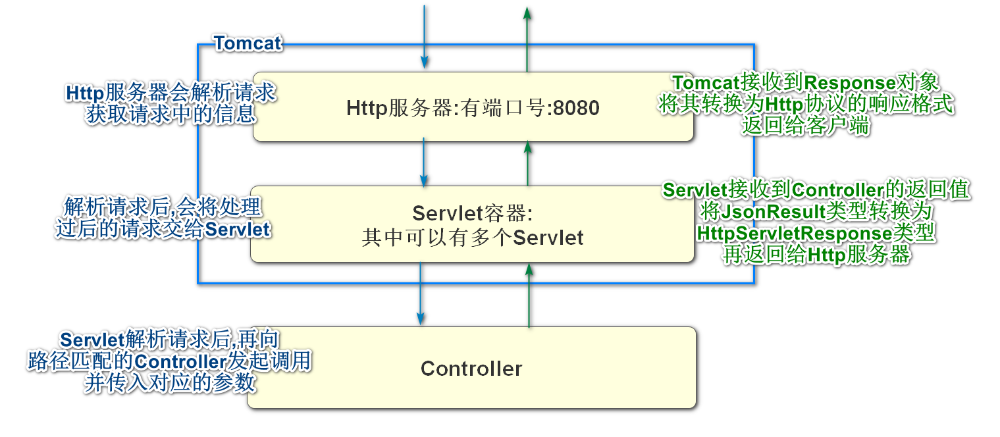

# Tomcat简介

Tomcat是一个java开发中非常常见的Web应用服务器

我们创建的SpringBoot项目除了网关项目之外,启动服务时,本质上启动的就是Tomcat

咱们设置的端口号,就是Tomcat的端口号

我们前面阶段接触了webserver项目这个项目学习了解析客户端请求和对客户端作出响应

但是我们现在的项目是没有编写解析请求和作出响应代码的

我们只需编写编写控制器,就能自动解析请求和作出响应

那么现在项目底层负责请求和响应的就是Tomcat

Tomcat同时还是Servlet容器

所谓Servlet就是java语言原生的控制器,相当于连接数据库的JDBC

Tomcat是可以保存\管理\控制Servlet的

我们创建的项目关于Tomcat的结构可以理解为下图



大多数情况,我们创建的项目都会内置使用Tomcat作为服务器

Tomcat在上面结构中发挥了非常巨大的功能

但是Tomcat的缺点是不能承受很大的并发

常规情况下,一个Tomcat并发上限在100多一点

一般情况下一个网站1000人在线,是20~50人的并发

# Nginx

Nginx ("engine x") 是一个高性能的 HTTP 和 [反向代理](https://so.csdn.net/so/search?q=反向代理&spm=1001.2101.3001.7020) 服务器，也是一个IMAP/POP3/SMTP 代理服务器。 Nginx 是由 Igor Sysoev 为俄罗斯访问量第二的Rambler.ru 站点开发的，第一个公开版本 0.1.0 发布于 2004 年 10 月 4 日。其将源代码以类 BSD 许可证的形式发布，因它的稳定性、丰富的功能集、示例配置文件和低系统资源的消耗而闻名。

Nginx也是一个Web服务器,也就是它和Tomcat的部分功能一致,也是可以解析请求,作出响应的软件

只不过不是java编写的

我们java程序员在开发时,可能会因为Nginx的优势,使用它专门做某些事情

**Nginx优势**

1. 高并发响应性能非常好，官方 Nginx 处理静态文件并发 5万/秒
2. 反向代理性能非常强。（可用于负载均衡）
3. 内存和 cpu 占用率低。（为 Apache(也是一个服务器) 的 1/5-1/10）

Nginx快速的原因

> 常见面试题:Nginx为什么快

Nginx内部是一个主进程(Master)多个工作进程(Worker)

Master负责统筹管理配置和Worker的分工

Worker来负责处理请求,作出响应

而且使用非阻塞式的,异步的

简单来说,就是一个Worker接到一个请求后,对请求进行处理,处理后在响应返回前,这个Worker还会处理别的请求,直到请求返回响应时,才会处理响应,也就是Worker这个进程全程无阻塞

**反向代理**

要想了解反向代理,首先了解正向代理


正向代理服务器像我们生活中的网络加速器,如果直接访问目标服务器慢,或访问不了的话,可以使用正向代理服务器加速

类似于人际关系中的介绍人

那么反向代理又是什么呢


请求反向代理服务器的特点是,我们请求的是代理服务器的地址,真正提供服务的服务器地址我们不需要知道,这样做的好处是反向代理服务器后可能是一个集群,方便负载均衡

有点类似于生活中的代理人,有什么事情直接找这个人就能完成需求,它怎么完成的我们不用管


在我们实际工作中,Nginx经常用于反向代理服务器

而实际处理请求的服务器可能是tomcat


因为Nginx优秀的静态内容并发性能

我们常常使用它做静态资源服务器

在Nginx中保存图片,文件视频等静态资源

经常和FastDFS组合使用

> *FastDFS*是一个开源的轻量级分布式文件系统，它对文件进行管理，功能包括：文件存储、文件同步、文件访问（文件上传、文件下载）等，解决了大容量存储和负载均衡的问题。特别适合以文件为载体的在线服务，如相册网站、视频网站等等。

Nginx和Gateway的区别

首先明确Nginx和Gateway并不冲突

他们都是统一入口的概念,它们可以同时开启

也可以开启其中一个

只不过Nginx不属于java程序,而Gateway是java程序

Nginx是的服务器程序我们不可编辑,

Gateway是我们自己创建的项目,依赖和配置都由我们自己完成

最终如果想做反向代理服务器,就使用Nginx

如果是微服务项目的网关就是Gateway

# 配置中心

## 什么是配置中心

所谓配置中心:将项目需要的配置信息保存在配置中心,需要读取时直接从配置中心读取,方便配置管理的微服务工具

我们可以将部分yml文件的内容保存在配置中心

一个微服务项目有很多子模块,这些子模块可能在不同的服务器上,如果有一些统一的修改,我们要逐一修改这些子模块的配置,由于它们是不同的服务器,所以修改起来很麻烦

如果将这些子模块的配置集中在一个服务器上,我们修改这个服务器的配置信息,就相当于修改了所有子模块的信息,这个服务器就是配置中心

**使用配置中心的原因就是能够达到高效修改各模块配置的目的**

## 配置中心的使用

Nacos既可以做注册中心,也可以做配置中心

Nacos做配置中心,支持各种格式\类型的配置文件

properties\yaml(yml)\txt\json\xml

## Nacos 数据结构


### 命名空间

上面图片时Nacos软件的数据结构

最外层的结构叫Namespace(命名空间),一个Nacos可以创建多个命名空间


上图可以新建命名空间

Nacos默认命名空间public不能删除,所有操作没有指定命名空间时,默认都使用public

新建命名空间后可以在配置列表和服务列表中切换显示


一个Nacos如果注册或配置有多个项目时,可能使用命名空间来分别管理

多个命名空间互不干扰

### 分组

我们在创建注册或配置时还可以指定group(分组)

一个命名空间可以创建多个group

我们在创建配置时,默认的group为:DEFAULT_GROUP

### 服务或配置

确定了命名空间和分组后,就可以创建服务或配置了

一个分组中能够保存多个服务或配置(Service\DataId)

我们配置中心主要使用DataId

Nacos>Namespace\Group\DataId

## Nacos添加配置

Nacos首页->配置管理->配置列表->添加配置(右侧的大"＋"号)


添加cart模块数据库连接配置


点击发布,Nacos中就保存这个配置了

## 项目读取配置

要想读取配置中心的内容,首先要添加依赖

```xml
<!-- 配置中心的依赖 -->
<dependency>
    <groupId>com.alibaba.cloud</groupId>
    <artifactId>spring-cloud-starter-alibaba-nacos-config</artifactId>
</dependency>
<!--  SpringCloud支持加载系统配置文件的依赖  -->
<dependency>
    <groupId>org.springframework.cloud</groupId>
    <artifactId>spring-cloud-starter-bootstrap</artifactId>
</dependency>
```

像其他程序一样,在添加完依赖之后,还需要添加yml文件的配置

我们使用过application.properties和application.yml两种配置文件添加配置

实际上这两个配置文件加载是有顺序的

先加载yml

后加载properties

如果两个配置文件同时设置了同一个属性,后加载的覆盖掉先加载的

在SpringCloud环境下,我们还可以多出一组配置文件

它们是bootstrap.yml和bootstrap.properties

这一组的加载时间整体早于application这一组

所以一个SpringBoot项目最终的配置文件加载顺序可以理解为


必须是SpringCloud项目,才能支持bootstrap这组配置文件的加载

我们添加的依赖

```xml
<dependency>
    <groupId>org.springframework.cloud</groupId>
    <artifactId>spring-cloud-starter-bootstrap</artifactId>
</dependency>
```

就是专门支持加载bootstrap这组配置文件的

注意SpringCloud早于2020之前的版本,不是这个依赖,可以自行查询

bootstrap这组配置文件常用于加载一些系统级别的配置,可以将一些不会轻易修改的配置添加到这个配置文件中

我们即将添加的配置中心的配置信息,在开发时一般都会添加到这组配置文件中

在cart-webapi项目的resources文件夹下创建bootstrap.yml

编写配置如下

```yaml
spring:
  cloud:
    nacos:
      config:
        # 指定配置中心的位置
        server-addr: localhost:8848
        # 指定配置文件设置的组名
        # 命名空间默认可以不写
        group: DEFAULT_GROUP
        # 设置配置文件的后缀名
        # 它默认情况下会读取[服务器名].[后缀名]的文件
        # 当前服务器名称nacos-cart.yaml这就是自动读取的DataId
        file-extension: yaml
```

如果一切顺利,那么就可以读取前面我们添加在Nacos中的数据库的配置信息了

我们可以删除application-dev.yml文件中的数据库相关配置文件后再启动服务

会发现能够正常连接数据库,证明配置中心中的配置生效了


# Ribbon简介

Ribbon是Netflix提供的一个SpringCloud组件

能够实现RPC远程服务调用

而且不限制生产者的开发语言

在java语言中需要调用其他语言开发的服务时,就需要使用Ribbon

咱们在实际开发中使用的类型RestTemplate类型来实现这个功能

我们可以在现有程序中,实现一个Ribbon调用

每一个控制器方法(Controller中可以请求访问到的方法)都可以视为生产者

一般情况下,在业务逻辑层可以编写对指定生产者的调用

使用步骤如下

1.在发起调用的一方也就是服务的消费者的Spring容器中保存一个RestTemplate对象

​	可以在任何标记有@Configuration注解的配置类中编写如下代码SpringBoot启动类也可以

```java
@Bean
@LoadBalanced
public RestTemplate restTemplate(){
    return new RestTemplate();
}
```

2.确定咱们要调用的方法,如果这个方法还不存在的话需要先开发

我们的目标是csmall-stock-webapi的控制器方法/base/stock/reduce/count

确定好了以后就可以进行下一步了

3.在远程调用消费者的业务逻辑层编写代码调用生生产者方法

CartServiceImpl

```java
// Ribbon调用,必须通过RestTemplate对象
@Autowired
private RestTemplate restTemplate;

@Override
public JsonResult callStock(StockReduceCountDTO stockReduceCountDTO) {
    // Ribbon调用 stock模块的方法
    // 要调用Ribbon先调用路径
    String url="http://localhost:20003/base/stock/reduce/" +
            "count?commodityCode={1}&reduceCount={2}";
    // 调用远程控制器方法
    JsonResult jsonResult=restTemplate.getForObject(url,JsonResult.class,
            stockReduceCountDTO.getCommodityCode(),
            stockReduceCountDTO.getReduceCount());
    return jsonResult;
}
```

为了运行再编写一个控制器方法

cart模块CartController

```java
@PostMapping("/reduce/count")
@ApiOperation("Ribbon调用商品库存减少方法")
public JsonResult ribbonReduceCount(StockReduceCountDTO stockReduceCountDTO){
    JsonResult jsonResult=cartService.callStock(stockReduceCountDTO);
    return jsonResult;
}
```


# @Autowired和@Resource区别

基本功能:将Spring容器中的对象注入到当前的属性中

## @Autowired:

获得对象的方式称之为byType(通过类型)

在spring容器中寻找注解标定的类型的对象

1.没有任何类型匹配的对象-------------发生异常

2.有且只有一个匹配类型的对象-------注入成功

3.有两个以及两个以上匹配类型的对象

* 多个匹配类型对象中有匹配当前变量名为对象名称的       ---注入成功
* 多个匹配类型对重中没有匹配当前变量名为对象名称的   ---注入失败


## @Resource

获得对象的方式称之为byName(通过名称)

1.有和指定要获得的名称的对象匹配的Spring容器中的对象

* 类型也匹配,注入成功
* 类型不匹配,注入失败

2.没有和指定要获得的名称的对象匹配的Spring容器中的对象

* 如果有唯一一个类型匹配的对象,则注入成功
* 如果没有唯一匹配类型对象,则注入失败

## 其他不同

此外

@Autowired是由Spring框架提供的

@Resource是由java提供的


# 六原则一法则

在软件设计时,我们需要遵循一些原则

遵循这些原则设计出的软件会有良好的复用性,扩展性和可维护性,程序间的耦合较低

## 类与类之间关系

1.泛化

类A继承了类B(或实现了接口B) 就是泛化关系

2.关联

类A中包含B类型的属性,称之为类A关联类B

3.依赖

类A中的方法参数或方法体中使用到类B对象,称之为类A依赖类B

## 单一职能原则

任何类在编写设计时,尽量只设计编写单一的职能

一个类干一件事

## 开闭原则

开指对扩展开放,闭指对修改关闭

当一个类编写好之后,经过测试没有问题后,当一个新的需求出现,需要修改这个类代码时

尽量不要修改代码,而适用扩展的方式实现

所谓扩展就是创建一个子类,继承当前类,然后对当前类需要修改的方法进行重写

## 里氏代换原则

我们编写的程序,为了方便扩展和更新,任何子类对象,都可以替换掉父类对象

而且保证替换后,程序仍然能够正常运行

## 依赖倒转(倒置)原则

在声明对象时,尽量使用对象的抽象类型来声明,而不是具体类型

这样能够有效的降低程序的耦合性

## 合成复用原则

如果我们需要一个类中的一个方法

尽量不要使用继承,而使用关联

因为过于复杂的继承关系,会提供项目整体的耦合性,和更复杂的项目结构

## 接口隔离原则

我们在设计接口时,要"小而专",不要"大而全"

如果接口大而全,每个实现类都要实现所有方法

而真正有用的可能只是个别的几个,这样会有大量的接口空实现,造成接口污染


## 迪米特法则

法则最终结论指一个类尽量少的和其他类发生通信

也就是"不要和陌生人说话"


# 随笔

powerDesigner


