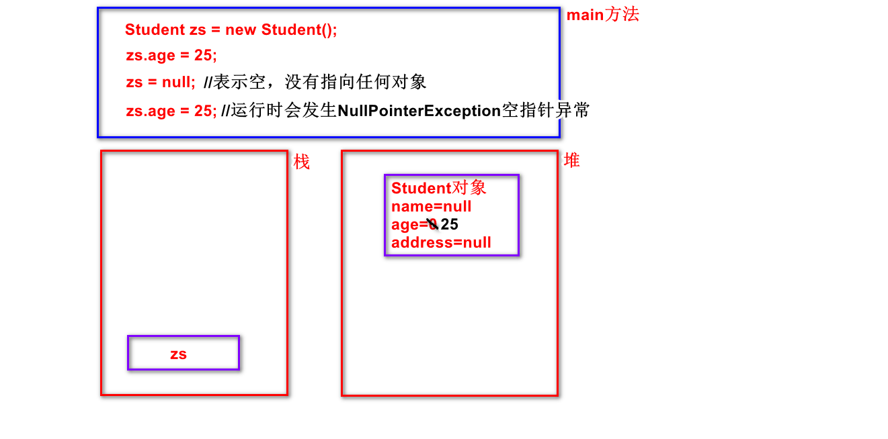
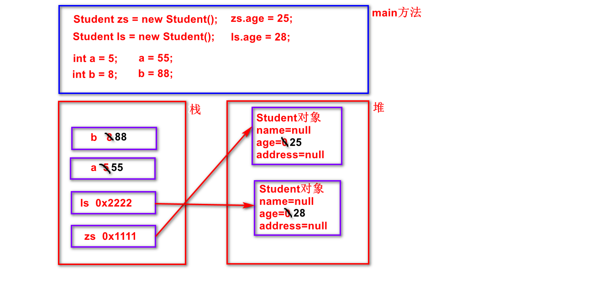

# 面向对象第二天：


## 潜艇游戏第一天：

1. 创建7个类，创建World类并测试

## 潜艇游戏第二天：

1. 给7个类添加构造方法，并测试


## 回顾：

1. 什么是类？什么是对象？
2. 如何创建类？如何创建对象？如何访问成员？
   - 创建类：class  类名{  }
   - 创建对象：类名   引用  =  new  类名();
   - 访问成员：引用点


## 笔记：

1. 方法的签名：方法名+参数列表

2. 方法的重载(overload/overloading)：---------------更方便用户的调用

   - 发生在同一类中，方法名相同，参数列表不同
   - 编译器在编译时会根据方法的签名自动绑定调用的方法

   ```java
   public class OverloadDemo {
       public static void main(String[] args) {
           Aoo o = new Aoo();
           o.show();
           o.show("zhangsan");
           o.show(25);
           o.show("zhangsan",25);
           o.show(25,"zhangsan");
       }
   }
   
   class Aoo{
       void show(){}
       void show(String name){}
       void show(int age){}
       void show(String name,int age){}
       void show(int age,String name){}
       //int show(){ return 1; } //编译错误，重载与返回值类型无关
       //void show(String address){} //编译错误，重载与参数名称无关
   }
   ```

3. 构造方法：构造函数、构造器、构建器----复用给成员变量赋初值代码

   - 作用：给成员变量赋初始值

   - 与类同名，没有返回值类型(连void都没有)

   - 在创建(new)对象时被自动调用

   - 若自己不写构造方法，则编译器默认提供一个无参构造方法，

     若自己写了构造方法，则不再默认提供

   - 可以重载

   ```java
   //演示笔记中的前4句
   class Student{
       String name;
       int age;
       String address;
       //给成员变量赋初始值
       Student(String name1,int age1,String address1){
           name = name1;
           age = age1;
           address = address1;
       }
   }
   class StudentTest{
       public static void main(String[] args){
           //Student zs = new Student(); //编译错误
           Student zs = new Student("zhangsan",25,"LF");
           Student ls = new Student("lisi",26,"JMS");
           Student ww = new Student("wangwu",24,"SD");
       }
   }
   
   //演示笔记中的第5句
   class Student{
       String name;
       int age;
       String address;
       Student(){
       }
       //给成员变量赋初始值
       Student(String name1,int age1,String address1){
           name = name1;
           age = age1;
           address = address1;
       }
   }
   class StudentTest{
       public static void main(String[] args){
           Student zs = new Student();
           Student zs = new Student("zhangsan",25,"LF");
       }
   }
   ```

4. this：指代当前对象，哪个对象调用方法它指的就是哪个对象

   ​          只能用在方法中，方法中访问成员变量之前默认有个this.

   > 规定：
   >
   > 1. 成员变量和局部变量是可以同名的
   >    - 访问的时候默认采取的是就近原则
   >    - 若想访问成员变量则this不能省略
   >
   > 小结：
   >
   > 1. 当成员变量与局部变量同名时，若想访问成员变量this不能省略
   >
   >    当不同名时，一般情况下this都省略

   代码演示如下：
   ```java
   class Student {
       String name; //成员变量(整个类中)
       int age;
       String address;
       //局部变量(当前方法中)
       Student(String name,int age,String address){
          this.name = name;
          this.age = age;
          this.address = address;
       }
       void study(){
          System.out.println(this.name+"在学习...");
       }
   }
   ```

5. null：表示空，没有指向任何对象，若引用的值为null，则该引用不能进

   ​          行任何点操作了，若操作则发生NullPointerExceptionp空指针异常




补充：

1. 内存管理：由JVM来管理的，分为三块区域

   - 堆：new出来的对象(包括成员变量)
   - 栈：局部变量(包括方法的参数)
   - 方法区:------今天不讨论，第5天讲

2. 堆栈内存图：

   

3. 异常：
   - ArrayIndexOutOfBoundsException数组下标越界异常
   - NullPointerException空指针异常


作业：------------------需上传

1. 堆栈内存图


练习：---------在昨天晚课的基础之上将今天的功能最少做两遍

1. 给7个类添加构造方法，并测试
