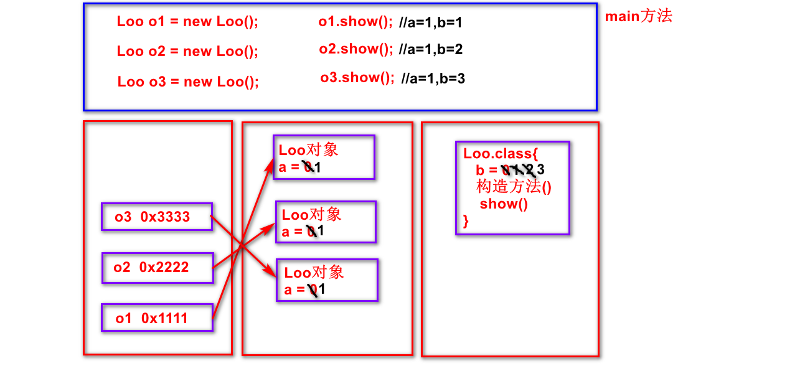

# 面向对象第五天：


## 潜艇游戏第一天：

1. 创建7个类，创建World类并测试

## 潜艇游戏第二天：

1. 给7个类添加构造方法，并测试

## 潜艇游戏第三天：

1. 设计侦察潜艇数组、鱼雷潜艇数组、水雷潜艇数组、鱼雷数组、水雷数组、深水炸弹数组，并测试
2. 设计SeaObject超类，设计7个类继承超类
3. 在SeaObject中设计两个构造方法，在派生类中分别调用

## 潜艇游戏第四天：

1. 将侦察潜艇、鱼雷潜艇、水雷潜艇统一组合为SeaObject数组，并测试

   将鱼雷、水雷统一组合为SeaObject数组，并测试

2. 在7个类中重写move()移动

3. 画窗口：-------在World类中不需要理解，晚上CV大法

   - import JFrame+JPanel
   - 设计World类继承JPanel
   - main中：CV大法

## 潜艇游戏第五天：

1. 给类中成员添加访问控制修饰符
2. 设计Images图片类


## 回顾：

1. 向上造型：
   - 超类型的引用指向派生类的对象
   - 能点出来什么，看引用的类型--------------规定
2. 方法的重写(override)：
   - 发生在父子类中，方法名相同，参数列表相同
   - 重写方法被调用时，看对象的类型----------规定
3. 重写与重载的区别：面试题
   - 重写：发生在父子类中，方法名相同，参数列表相同
   - 重载：发生在同一类中，方法名相同，参数列表不同


## 正课：

1. package和import：

   - package：
     - 作用：避免类的命名冲突
     - 同包中的类不能同名，不同包中的类可以同名
     - 包名常常有层次结构，类的全称：包名.类名
     - 建议：包名所有字母都小写
   - import：
     - 同包中的类可以直接访问，不同包的类不能直接访问，若想访问：
       - 先import声明类再使用类--------建议
       - 类的全称------------------------------太繁琐，不建议

2. 访问控制修饰符：---------------------保护数据的安全

   ```java
   //通过如下代码来理解保护数据安全的必要性
   class Card{ //银行卡
       private String cardId;
       private String cardPwd;
       private double balance;
       
       public boolean payMoney(double money){ //支付金额
           if(balance>=money){
               balance-=money;
               return true;
           }else{
               return false;
           }
       }
       
       public boolean checkPwd(String pwd){ //检测密码
           if(pwd与cardPwd相同){
               return true;
           }else{
               return false;
           }
       }
   }
   ```

   - public：公开的，任何类
   - private：私有的，本类
   - protected：受保护的，本类、派生类、同包类
   - 默认的：什么也不写，本类、同包类-----------------------java不建议

   > 1. 权限规则：成员变量私有化，方法公开化，
   >
   > ​                        超类中想让派生类访问的就受保护
   >
   > 2. 类的访问权限只能是public或默认的
   >
   >    类中成员的访问权限如上4种都可以

   ```java
   package ooday05;
   //访问控制修饰符的演示
   public class Aoo {
       public int a;    //任何类
       protected int b; //本类、派生类、同包类
       int c;           //本类、同包类
       private int d;   //本类
       void show(){
           a = 1;
           b = 2;
           c = 3;
           d = 4;
       }
   }
   
   class Boo{ //-----------演示private
       void show(){
           Aoo o = new Aoo();
           o.a = 1;
           o.b = 2;
           o.c = 3;
           //o.d = 4; //编译错误
       }
   }
   
   package ooday05_vis;
   import ooday05.Aoo;
   public class Coo { //------演示同包的
       void show(){
           Aoo o = new Aoo();
           o.a = 1;
           //o.b = 2; //编译错误
           //o.c = 3; //编译错误
           //o.d = 4; //编译错误
       }
   }
   
   class Doo extends Aoo{ //跨包继承--------演示protected
       void show(){
           a = 1;
           b = 2;
           //c = 3; //编译错误
           //d = 4; //编译错误
       }
   }
   ```
   
3. final：最终的，不可改变的---------------单独应用几率低

   - 修饰变量：变量不能被改变
   - 修饰方法：方法不能被重写
   - 修饰类：类不能被继承

   ```java
   //演示final修饰类
   final class Hoo{}
   //class Ioo extends Hoo{} //编译错误，final的类不能被继承
   class Joo{}
   final class Koo extends Joo{} //不能当老爸，但能当儿子
   
   //演示final修饰方法
   class Foo{
       final void show(){}
       void test(){}
   }
   class Goo extends Foo{
       //void show(){} //编译错误，final的方法不能被重写
       void test(){}
   }
   
   //演示final修饰变量
   class Eoo{
       final int num = 5;
       void test(){
           //num = 55; //编译错误，final的变量不能被改变
       }
   }
   ```

4. static：静态的

   - 静态变量：

     - 由static修饰
     - 属于类，存储在方法区中，只有一份
     - 常常通过类名点来访问
     - 何时用：所有对象所共享的数据(图片、音频、视频等)

     ```java
     //static的演示
     public class StaticDemo {
         public static void main(String[] args) {
             Loo o1 = new Loo();
             o1.show();
             Loo o2 = new Loo();
             o2.show();
             Loo o3 = new Loo();
             o3.show();
         }
     }
     
     //演示静态变量
     class Loo{
         int a;
         static int b;
         Loo(){
             a++;
             b++;
         }
         void show(){
             System.out.println("a="+a+"，b="+b);
         }
     }
     ```

     

   - 静态方法：
   
     - 由static修饰
     - 属于类，存储在方法区中，只有一份
     - 常常通过类名点来访问
     - 静态方法中没有隐式this传递，所以不能直接访问实例成员
     - 何时用：方法的操作与对象无关
   
     ```java
     //演示静态方法
     class Moo{
         int a; //实例变量(对象点来访问)
         static int b; //静态变量(类名点来访问)
     
         void show(){ //有隐式this
             System.out.println(this.a);
             System.out.println(Moo.b);
         }
         static void test(){ //没有隐式this
             //静态方法中没有隐式的this传递
             //没有this就意味着没有对象
             //而实例变量a必须通过对象点来访问
             //所以如下语句发生编译错误
             //System.out.println(a); //编译错误
             System.out.println(Moo.b);
         }
     }
     
     //演示静态方法何时用
     class Noo{
         int a;
         //因为需要操作对象的数据a，意味着与对象有关，所以不能设计为静态方法
         void show(){
             System.out.println(a);
         }
         //因为不需要操作对象的数据和行为，意味着与对象无关，所以适合设计为静态方法
         static void test(int num1,int num2){
             int num = num1+num2;
             System.out.println(num);
         }
     }
     
     public class StaticDemo {
         public static void main(String[] args) {
             Noo.test(3,6); //常常通过类名点来访问
         }
     }
     ```
   
   - 静态块：
   
     - 由static修饰
     - 属于类，在类被加载期间自动执行，一个类只被加载一次，所以静态块也只执行一次
     - 何时用：加载/初始化静态资源(图片、音频、视频等)
   
     ```java
     public class StaticDemo {
         public static void main(String[] args) {
             //输出一次静态块、三次构造方法
             Poo o4 = new Poo();
             Poo o5 = new Poo();
             Poo o6 = new Poo();
         }
     }
     //演示静态块
     class Poo{
         static{
             System.out.println("静态块");
         }
         Poo(){
             System.out.println("构造方法");
         }
     }
     ```


补充：

1. 静态变量与实例变量的区别：重点(面试题)

   - 实例变量：没有static修饰，属于对象，存储在堆中，有几个对象就有

     ​                   几份，通过对象点来访问

   - 静态变量：有static修饰，属于类，存储在方法区中，只有一份，常常

     ​                    通过类名点来访问


2. 内存管理：由JVM来管理
   - 堆：new出来的对象(包括实例变量)
   - 栈：局部变量(包括方法的参数)
   - 方法区：.class字节码文件(包括静态变量、所有方法)


作业：-----------------------需上传

1. 完成Images图片类


练习：

1. 给类中成员添加访问控制修饰符
2. 设计Images图片类


